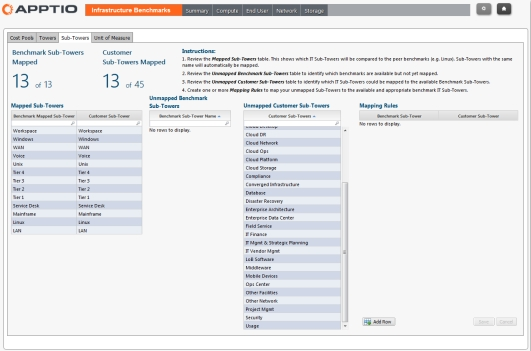

# Map the sub-towers

Standard sub-towers have been defined for the benchmark data provided by the Apptio Benchmarking
Infrastructure application. To light up the Benchmarking reports, you must map your sub-towers to
the application sub-towers.

When you created the Costing Standard project, you defined the sub-towers in your IT
infrastructure. If you accepted the default sub-tower definitions, these match the standard
sub-towers defined in the benchmark data. Where possible, you need to match the sub-towers in the
benchmark data to the sub-towers in your IT infrastructure. Complete sub-tower mapping gives the
most complete benchmarking data in the reports. You map the sub-towers using the instructions in the
application, as shown below.

**Prerequisites**

Before you can map the sub-towers and cost pools, you must have:

Imported the AIB benchmarking .

Installed the CTF-Benchmarking component (see ).

Appended the AIB benchmarking data to the Benchmarking master data .

**To map the sub-towers**

1. Select the  Reporting  tab.
2. On the Home page, select  Benchmarking  .
3. In the Benchmarking navigation toolbar, select the Map icon highlighted below.

1. Select the  Sub-Towers  tab.
2. Follow the instructions on the  Mapping  page.

**To map the cost pools**

To map the cost pools, select the  Cost Pools  tab and follow the same procedure used
to map the sub-towers.

When mapping cost pools, each benchmark cost pool must be mapped to a single customer cost pool.
