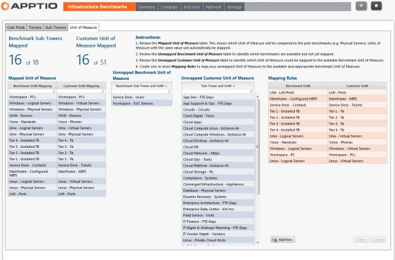

# Map the units of measure

Standard units of measure have been defined for the benchmark data provided by the Apptio
Benchmarking Infrastructure application. To light up the Benchmarking reports, you must map your
units of measure to the application unit of measure.

When you created the Costing Standard project, you defined the units of measure in your IT
infrastructure. If you accepted the default project definitions, these match the standard units of
measure defined in the benchmark data. Where possible, you need to match the units of measure in the
benchmark data to the unit of measure in your Costing Standard project. Complete unit of measure
mapping gives the most complete benchmarking data in the reports. You map the units of measure using
the instructions in the application, as shown below.

**Prerequisites**

Before you can map the sub-towers and cost pools, you must have:

Imported the AIB benchmarking .

Installed the CTF-Benchmarking component ( [https://www.ibm.com/docs/en/apptio-commercial/costing-standard/saas?topic=costing-standard-foundation-module-configuration](https://www.ibm.com/docs/en/apptio-commercial/costing-standard/saas?topic=costing-standard-foundation-module-configuration "(Opens in a new tab or window)") ).

Appended the AIB benchmarking data to the Benchmarking master data .

**To map the Benchmark Unit of Measure column in the Cost Source Master Data data set**

Open the  Cost Source Master Data  data set.

1. In the  Data Sources  tab, edit the  Benchmark Composition Master Data  data
   source.
2. Map the  Benchmark Unit of Measure  column to  =Unit of Measure  .

**To map the units of measure**

Select the  Reporting  tab.

1. On the Home page, select  Benchmarking  .
2. In the Benchmarking navigation toolbar, select the Map icon highlighted below.

1. Select the  Unit of Measure  tab.
2. Follow the instructions on the  Mapping  page.

The mapping must be one-to-one.
