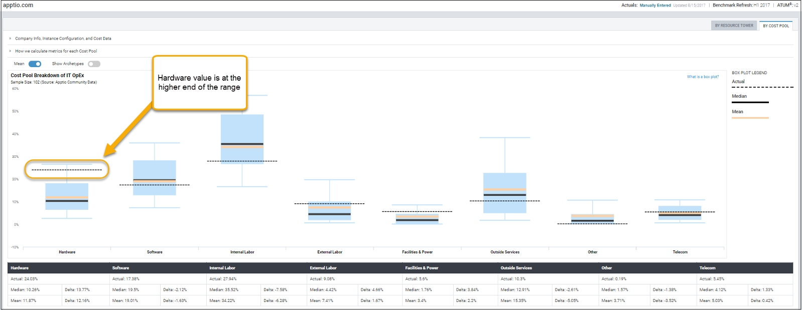
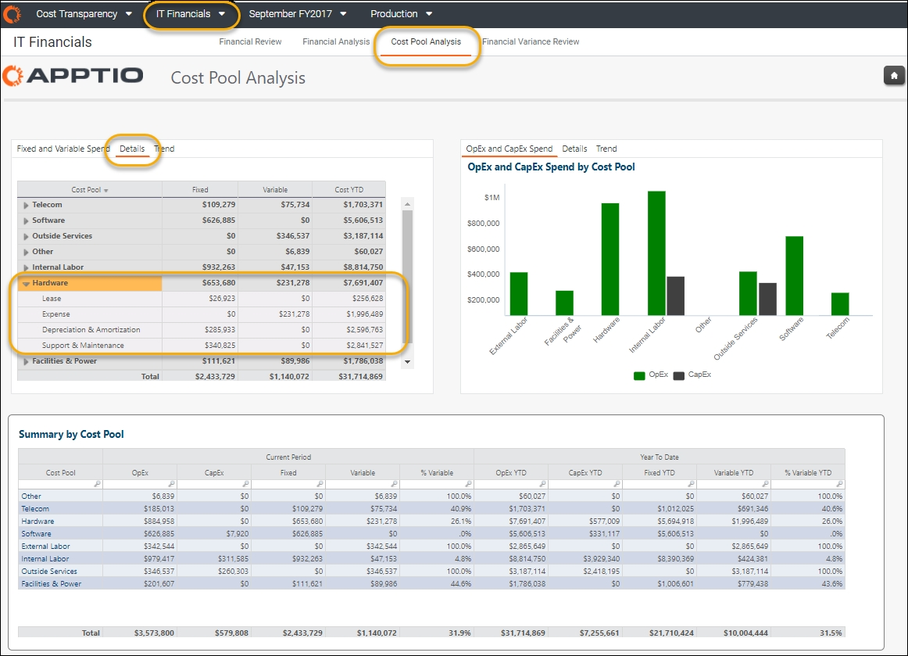
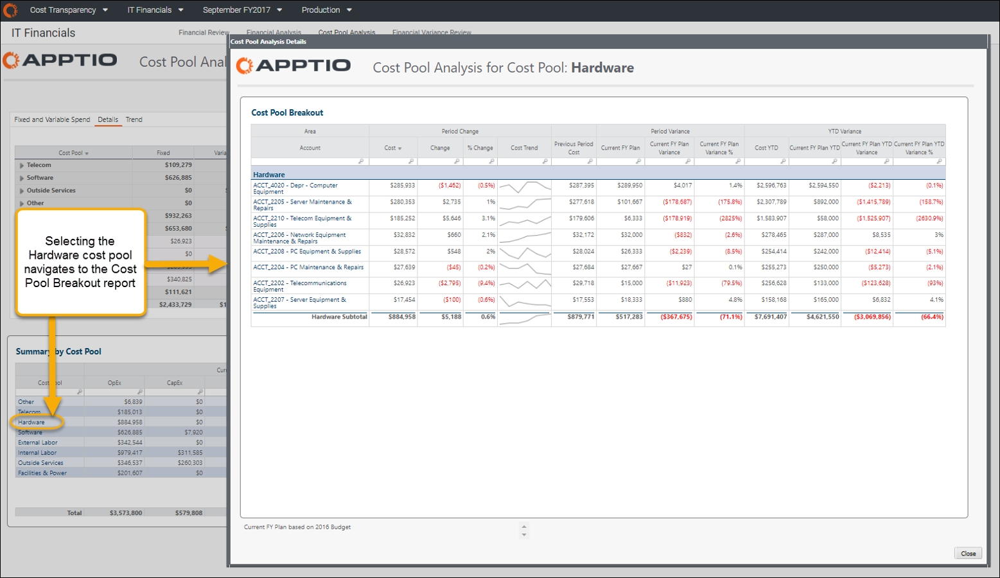
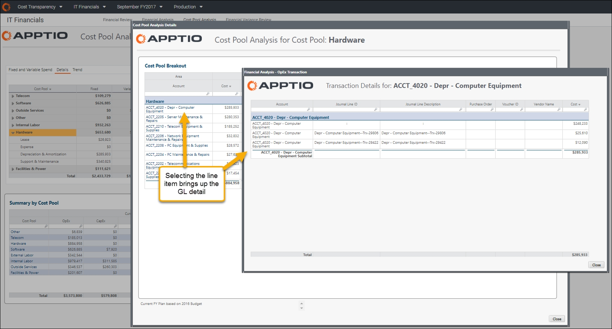

# Analyze and Validate ATUM Cost Pools

**Summary**

You can use Benchmarking to analyze and validate the cost pool distribution for an ATUM-aligned
Cost Source or as a free-standing analysis in interactive benchmarking.

**Beyond benchmarking**

The Benchmarking product can be leveraged in a number of distinct ways, starting with an
introduction to Apptio, through the deployment process and continuing into day-to-day operations,
such as helping defend your IT budget. This article focuses on the ATUM cost pool validation aspect
of using Interactive Benchmarking.

**Using Interactive Benchmarking for cost pool validation**

You can use Interactive Benchmarking to support the confirmation of cost pool allocations. By
comparing an organization’s mapping of accounts to cost pools against the Apptio Community Data
(ACD), a TBMA can demonstrate that the mappings are aligned well with ATUM, or identify areas where
the model allocations might need to be improved.

**Cost pool validation**

Using an Interactive Benchmarking cost pool report (see image below), some cost pools in this
example are above or below the colored rectangle. The rectangle represents the first through third
quartile, comprising 50% of the data. While the highlighted value, hardware, is not outside of the
range (a clear indicator that the mapping is likely wrong), it is still up towards the higher range
of all values.

Based on the elevated value when comparing to the Hardware cost pool range, the next step is to
navigate to the Cost Transparency Cost Pool Analysis report. The Details sub-element is selected
(see image below) to view the Hardware cost pool for analysis. Note that “Depreciation &
Amortization” and “Support & Maintenance” are the two areas with the highest spend.

The user, while investigating these costs, can select Hardware from the Summary by Cost Pool
report (see image below) to study line-item costs. The user can study the details to learn if there
is an inaccurate cost pool mapping or if the costs are simply above range.

The user can select the line item for the general ledger detail from the OpEx transaction view.
Next, the user can make note that there is a significant charge for deprecation. This completes the
analysis regarding why the value is higher. The higher value is not related to a mapping issue, but
rather to actual costs that are higher than most. The follow-on step, which is out of scope for this
article, is to leverage other Cost Transparency reports to complete the cost picture.

**Conclusion**

Using the Benchmarking product, the user can employ the Interactive Benchmarking capabilities
for Cost Transparency cost pool mapping validation. By comparing the mapped and allocated values
against the body of Apptio Community Data (ACD), a customer can analyze and validate the accuracy of
their mappings and examine more fully the details to provide supporting evidence.
