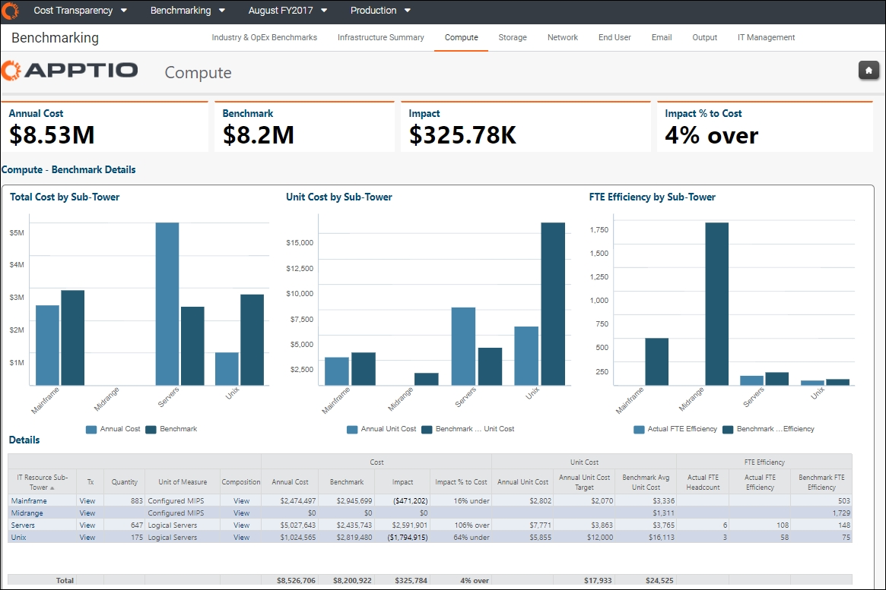
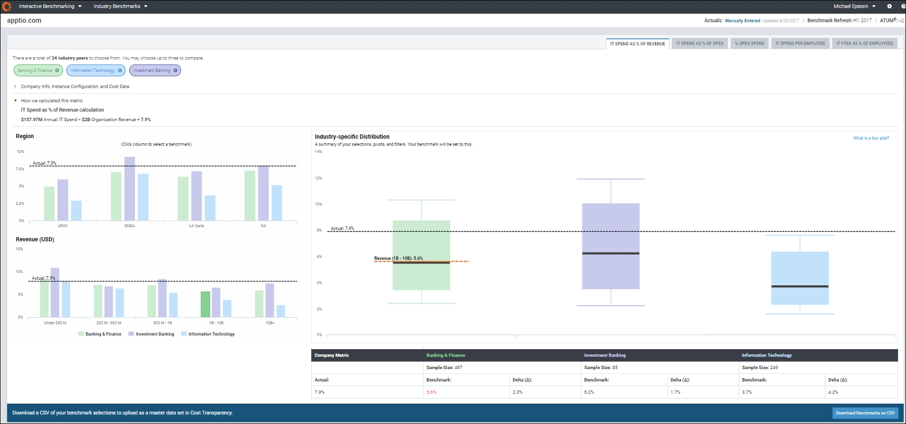
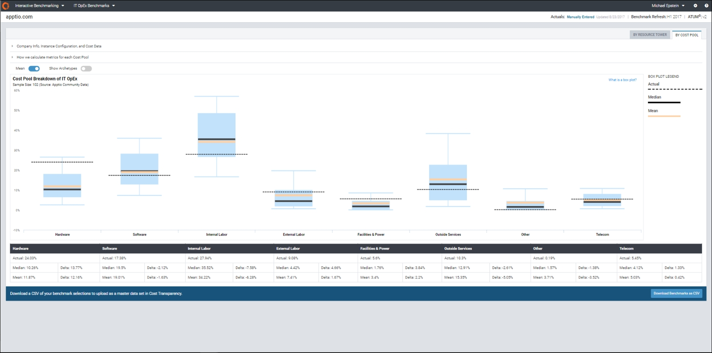
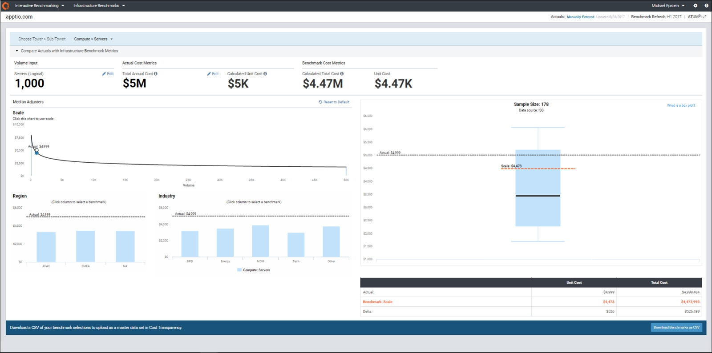
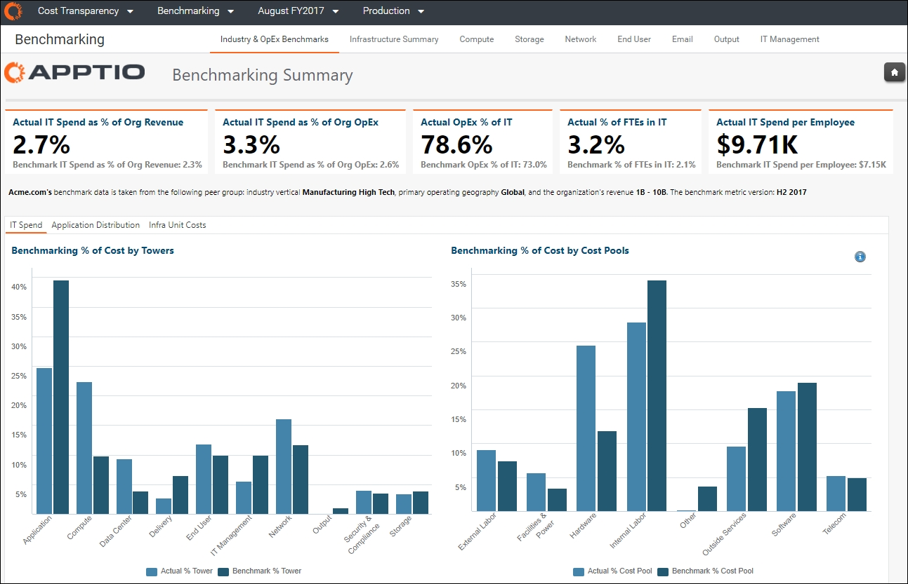
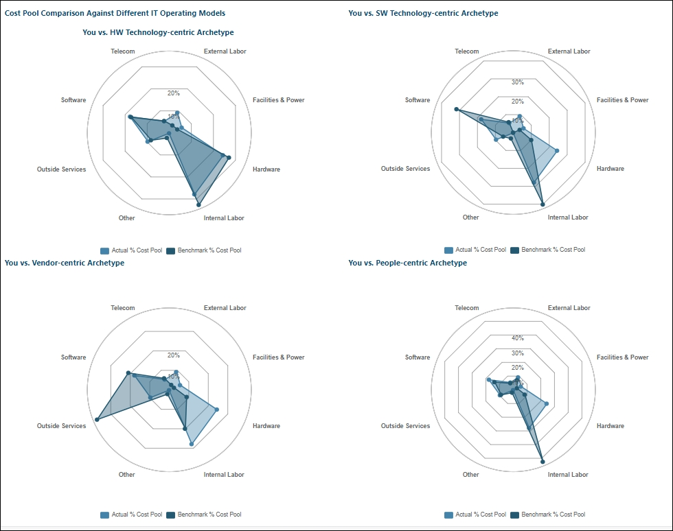

# What you can do with Benchmarking

Benchmarking provides self-service peer comparisons of your IT spend over time, enabling an
ongoing process for tracking performance, validating decisions, and identifying areas for
improvement.

**Validate spending levels**  : Get a view of actuals vs. self-selected
benchmarks to know where you stand relative to peers.

**Track progress**  : Identify areas of risk, set targets, and monitor
improvement efforts.

**Identify improvement areas**  : Use relevant, credible benchmark data as
objective reference points.

**Overview of the Benchmarking application**

Apptio Benchmarking is a SaaS application that extends the capabilities of Costing Atandard to
view IT costs side-by-side with trusted peer benchmarks.

The Benchmarking application includes one module: Infrastructure Benchmarks and includes a set
of interactive features that allow you to explore your comparisons to peers and self-select your
peer group.

**Key Benefits**

You can use the information provided by the Benchmarking application to:

Know where you stand vs. your peers

Justify IT spend

Defend budgetary decisions

Demonstrate efficiency

Validate costs based on spend characteristics

Inform budgeting and resourcing

Identify areas of focus for improvement

Set targets and track progress

**3 Benchmark Types**

| Type | Industry |
| --- | --- |
| **Industry** | Industry spend & labor metrics |
| **IT OpEx** | IT OpEx by IT Tower & Cost Pool |
| **Infrastructure** | Infrastructure cost & efficiency metrics |

**Data Partners**

Data used in the Benchmarking application is provided in partnership with Rubin Worldwide and
ISG. The IT OpEx metric data is sourced from the Apptio Community (aggregated, opt-in, anonymized
customer data), and the Infrastructure metric data is sourced from ISG.

**Introduction to Benchmarking**

The Apptio Benchmarking product consists of two parts: Interactive Benchmarking and Cost
Transparency reports. The combined functionality makes up a single product called Benchmarking .

**Interactive Benchmarking**

Interactive Benchmarking---the full benchmark data set that does not require a Costing Standard
project to use---allows the customer to compare their own data against the range of benchmark data
and explore the peer benchmark values.

Interactive Benchmarking provides the ability for customers to self-select their comparative
peer group by adjusters, such as industry, region, revenue size, and scale. In addition to the
median or mean, Interactive Benchmarking allows the customer to see greater detail behind each
metric, including maximum and minimum values and quartile distributions.

Interactive Benchmarking is also the source for the benchmark profile information that is loaded
into the benchmarking reports along with Cost Transparency. This process replaces the survey that
had been in use with previous releases.

**Cost Transparency benchmarking**

Benchmarking reports are available along with Cost Transparency (which require a cost model for
a benchmark to actual comparison).

The Cost Transparency benchmarking reports and benchmarking model allow the customer to compare
a specific benchmark data point against their own data that is traceable down to the cost source and
General Ledger line items.

**Cost Transparency infrastructure benchmarks**

The infrastructure summary report and the infrastructure sub reports, such as Compute and
Storage, provide access to unit cost, overall Sub-Tower cost, FTE Efficiency and trended benchmarks,
composition- and transaction-level detail. Using these reports, you can trace a benchmark cost to
the cost source by line item and account.

**Industry benchmark reports**

Industry benchmarks provide access to 25 industries to compare five industry benchmark metrics.
For more information about the industry definitions, see  [Industry Sectors for Industry
Metrics](benchmarking-guides/metrics-sectors.html)  .

IT OpEx benchmarks compare a customer’s data to Apptio Community Data. The Apptio Community Data
is a look into other anonymized Apptio customer cost sources to see how accounts are mapped to the
ATUM v2 cost pools.

**IT OpEx benchmark reports**

The Apptio Community Data is not segregated by region, industry, or revenue.

**IT Infrastructure benchmark reports**

IT Infrastructure benchmarks compare a customer’s data at the infrastructure level by ATUM v2 IT
Tower and Sub-Tower. Comparisons include Servers, Storage, and Network.

The IT Infrastructure benchmark reports include the ability to review a subset of the benchmark
data by region and five different industries.

- Regions at the infrastructure level include APAC, EMEA, and NA.
- Industry comparisons include Banking/Finance, Energy, Manufacturing, Technology, and other.

  

**Industry & OpEx benchmarks**

The Industry & OpEx benchmark reports, using the benchmark information downloaded from
interactive benchmarking, compares the customer against an industry peer, region, or revenue bucket.

The top-level report also provides a spider graph that compares a customer’s cost pool
distribution against the four groupings within the Apptio Community Data archetypes.

**Conclusion**

Apptio Benchmarking , using both the Interactive Benchmarking and Cost Transparency reports,
provides a comprehensive benchmark analysis of ATUM v2-aligned IT costs. Interactive benchmarking,
which does not require a Cost Transparency model, can be used at the beginning of a project to
examine various aspects of the benchmark data and high-level customer data. The Cost Transparency
benchmarking reports then provide a deeper analysis of the costs as compared to the benchmark.

**Parent topic:** [How to access Benchmarking](../it-benchmarking/benchmarking-how-to-access.html)
