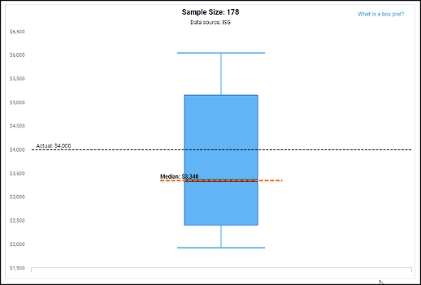
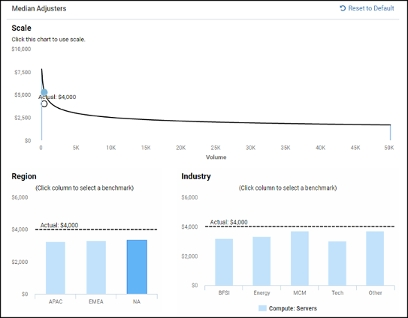
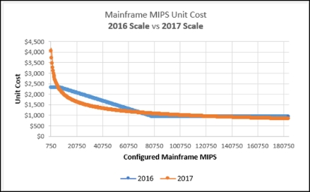
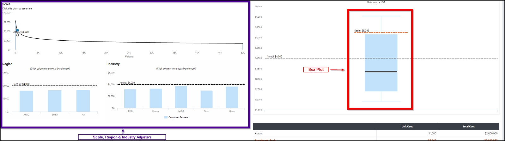
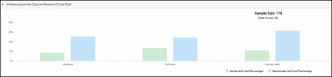
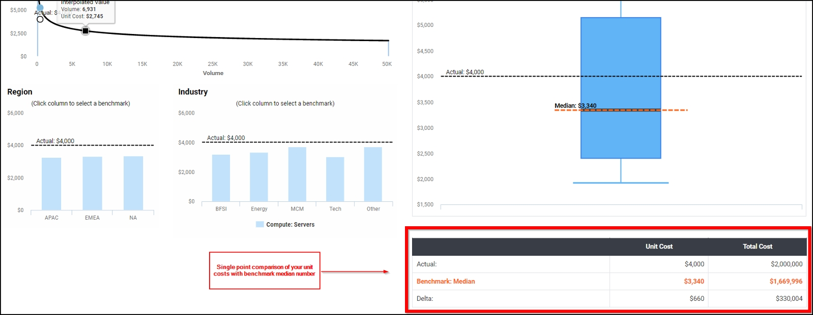
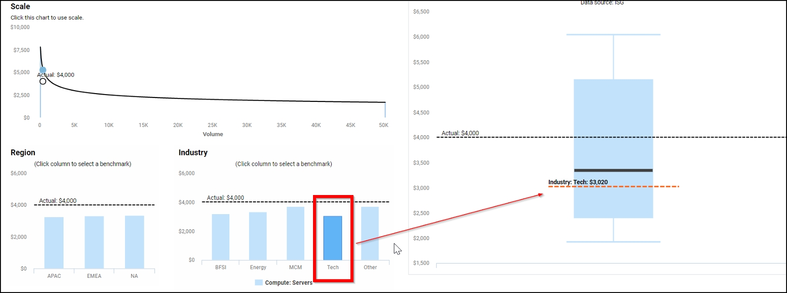
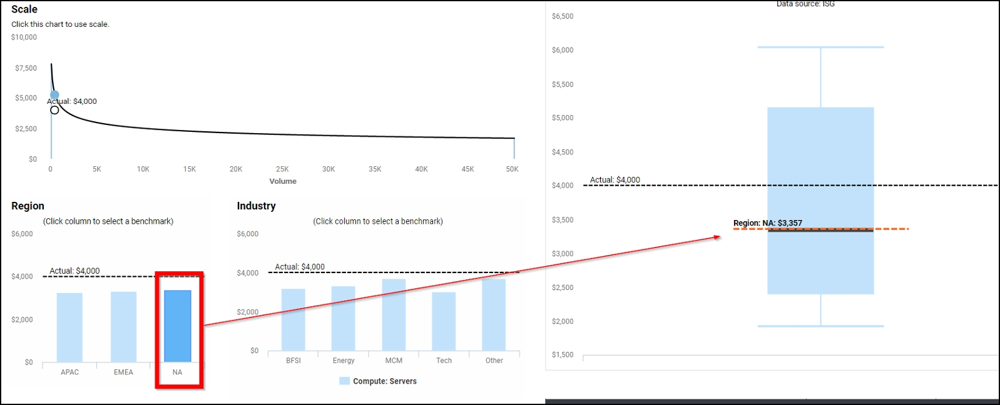
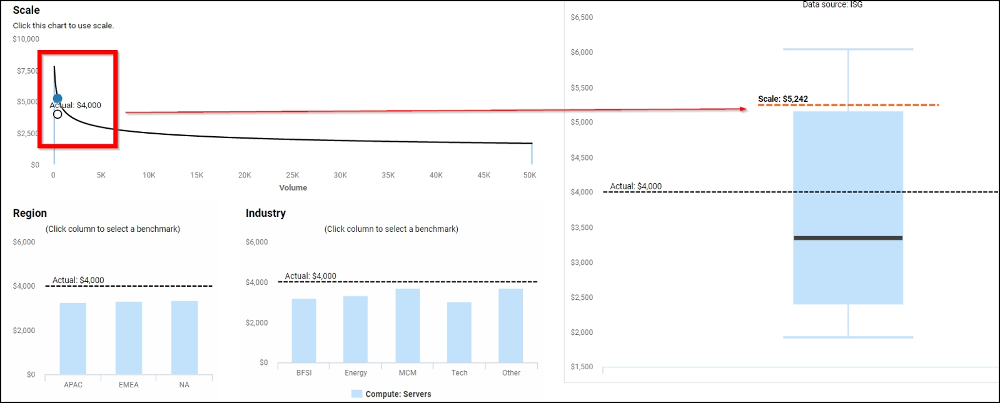

# Evaluación comparativa interactiva - Métricas de evaluación comparativa de infraestructuras

♦ Se aplica a: Evaluación comparativa interactiva

Este artículo describe la metodología de Benchmarking Interactivo aplicada a los Benchmarks de Infraestructura y recomienda cómo aprovechar las funciones de Benchmarking Interactivo. El objetivo de este artículo es explicar en qué se diferencia la metodología actual de la utilizada en Benchmarking v1.

**Contexto**

Antes de la evaluación comparativa interactiva, las dos peticiones más importantes de los clientes de Apptio eran:

- Detalles adicionales sobre los datos de referencia, como el tamaño de la muestra, el cuartil superior y la mediana, en lugar de un único punto de datos
- Una mejor comprensión de los impulsores de los datos de referencia

A partir de esta información, Apptio ha trabajado con los proveedores de los índices de referencia para mejorar la fidelidad de los datos. Con la publicación de Apptio Interactive Benchmarking, se han incorporado los siguientes cambios:

- Datos de referencia en forma de distribución, con el tamaño de la muestra, mostrados por cuartiles, utilizando una representación estadística estándar de diagrama de caja.
- Identificación de los principales influyentes para cada tipo de métrica. Por ejemplo, las métricas de Industria e Infraestructuras tienen sus propias características y, por tanto, sus propios factores de influencia.
- Mejora de la fidelidad de escala utilizando una función de potencia para las métricas de Infraestructura.

Además, la Comparación Interactiva proporciona tres niveles de métricas con los siguientes niveles de granularidad:

- **Puntos de referencia de la industria** : las métricas de referencia de la industria proporcionan cinco métricas de alto nivel para las finanzas de la organización, como "Gasto de TI como porcentaje de los ingresos de la organización", que lo ayudan a comparar su rendimiento y eficiencia generales de TI con sus pares.
- **Puntos de referencia de TI OpEx** - Los parámetros de referencia de TI OpEx proporcionan una orientación de alto nivel sobre las características de su organización OpEx.
- **Puntos de referencia de infraestructura** : los puntos de referencia de infraestructura incluyen puntos de referencia de pares al nivel más granular, lo que le permite comparar sus costes unitarios de subtorre y eficiencias de ETC con sus pares.

Interactive Benchmarking proporciona datos de distribución con ajustadores para los tres niveles de métricas. El principal impulsor de las métricas de la industria es el sector, con influencias secundarias como la región y los ingresos. Por otra parte, las métricas de infraestructura se ven muy afectadas por las economías de escala. La región y la industria tienen una influencia secundaria. Para más información sobre estas métricas, consulte la [Base de conocimientos sobre evaluación comparativa](https://community.apptio.com/community/apptio/product-central/it-benchmarking "(se abre en una pestaña o una ventana nueva)").

**Comparación**

Las principales diferencias entre las métricas de Infraestructura en Benchmarking v1 (2016) y las métricas de Infraestructura en Benchmarking Interactivo son:

- **Distribución basada en diagramas de caja** - En Benchmarking interactivo, los costes unitarios de las subtorres y las métricas de eficiencia de los ETC se presentan como datos de distribución completa, en forma de diagramas de caja que muestran la mediana, el cuartil superior, el cuartil inferior y el cuartil medio de los datos de referencia, con información sobre el tamaño de la muestra y el proveedor de los datos de referencia (Figura 1). En cambio, Benchmarking v1 presenta las referencias de infraestructura como datos puntuales sin visibilidad de la distribución de la muestra.

  

  Figura 1: Datos de referencia del coste unitario del servidor en forma de diagrama de cajas
- **Ajustadores adicionales** : los ajustadores de escala, región e industria están disponibles en la Evaluación comparativa interactiva.
  - Los ajustadores de escala permiten analizar la influencia de la economía de escala en las cifras de referencia de los costes unitarios y la eficiencia de los ETC.
  - Los ajustadores por región e industria le permiten elegir los grupos de pares por región e industria apropiados para comprender su impacto y comparar sus cifras de coste unitario y eficiencia ETC.

    Sólo se puede seleccionar uno de estos reguladores a la vez (Figura 2).

  Por el contrario, Benchmarking v1 aplicó previamente ajustadores de escala, región e industria y los presentó como una única métrica de referencia. El alcance real de su impacto no se expuso en el producto.

  

  Gráfico 2: Ajustes por escala, región e industria para los indicadores de referencia de infraestructuras
- **Mayor fidelidad de** los ajustadores de escala: en la evaluación comparativa interactiva, los ajustadores de escala se calculan utilizando una función de potencia para mejorar la fidelidad y la precisión. La fidelidad de escala mejorada para el coste unitario del Mainframe MIPS se muestra en la Figura 3, en naranja. La prueba comparativa v1, mostrada en azul, tiene una función escalonada de baja fidelidad.

  

  Figura 3: Ajustador de escala

**Uso de las funciones de evaluación comparativa interactiva**

Esta sección describe cómo utilizar la Comparación Interactiva, que hace hincapié en la comparación de los datos reales con la distribución completa utilizando el diagrama de caja. Los factores que influyen en los costes son la escala, la región y la industria (Figura 4).

Figura 4: Ajustadores de escala, región e industria a la izquierda, gráfico de cajas a la derecha

**Comparar los costes reales con los datos de referencia**

Una vez rellenados los campos Volumen de entrada y **Coste anual total**, puede evaluar cómo se comparan sus costes unitarios reales con la distribución utilizando el diagrama de cajas. Compare sus datos reales con la mediana y compruebe si se sitúan en el intervalo intercuartílico o constituyen un valor atípico. A continuación, compare los datos reales desglosados por generador de costes y con las cifras de referencia correspondientes, como se muestra a continuación. Esto pone de manifiesto cualquier diferencia significativa en las características de los costes.

Figura 5: Coste unitario por impulsores del Pool de Costes

**Comparación en un solo punto**

Para una comparación puntual, recomendamos utilizar la mediana como base. La tabla de la parte inferior de la página (Figura 6) muestra la diferencia entre sus datos reales y la mediana. Aunque reducir las comparaciones a un único punto facilita el seguimiento de los puntos de datos, distrae la vista de una distribución paritaria.

Figura 6: Comparación puntual del coste unitario con la mediana de referencia

**Impacto de las personas influyentes en las métricas**

Para comprender el impacto de la escala, la región y la industria, haga clic en los gráficos de la izquierda para ver su influencia en el diagrama de cajas.

Los gráficos 7 y 8 muestran la industria y la región, respectivamente. Para ver el impacto del sector o la región en la métrica de referencia, haga clic en uno de los grupos de sectores o regiones.

Figura 7: Influencia del ajustador del sector en los datos de referencia de los costes unitarios

Figura 8: Influencia del ajustador regional en los datos de referencia de los costes unitarios

**Impacto de las economías de escala**

El gráfico de la Figura 9 muestra las economías de escala. A volúmenes inferiores, los costes unitarios de referencia presentan una elevada varianza. A medida que aumenta el volumen, los costes unitarios de referencia disminuyen y se estabilizan tras alcanzar un determinado umbral. Esto indica que, debido a las economías de escala, los costes unitarios son significativamente más altos en volúmenes bajos. Haga clic en un gráfico de influencia de escala para ver el impacto de escala en un contexto de diagrama de caja.

*Figura 9: Influencia del ajustador de escala en los datos de referencia de los costes unitarios*

**Conclusión**

La evaluación comparativa interactiva cuenta con funciones mejoradas que proporcionan datos de evaluación comparativa más ricos y precisos. Para obtener más información sobre los datos de referencia o las funcionalidades de Interactive Benchmarking, visite la [Base de conocimiento de benchmarking](https://community.apptio.com/community/apptio/product-central/it-benchmarking "(se abre en una pestaña o una ventana nueva)").
