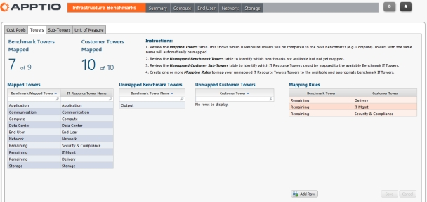

# Mapa de las torres

Se han definido torres estándar para los datos de referencia proporcionados por la aplicación Costing Standard Benchmarking Infrastructure. Para iluminar los informes de Benchmarking, debe asignar sus torres a las torres de la aplicación.

Las torres estándar son:

Aplicación

Comunicación

Computación

Entrega

Usuario final

Gestión de TI (Gestión)

Red

Resultado

Seguridad y conformidad

Almacenamiento

Cuando creó el proyecto Costing Standard , definió las torres de su infraestructura informática. Si ha aceptado las definiciones de torre por defecto, coincidirá con las torres estándar definidas en los datos de referencia. En la medida de lo posible, debe hacer coincidir las torres de los datos de referencia con las torres de su infraestructura informática. La cartografía completa de las torres proporciona los datos de evaluación comparativa más completos de los informes. Las torres se asignan siguiendo las instrucciones de la aplicación, como se muestra a continuación.

En la pestaña de torres mostrada, Remaining es una torre que ha sido asignada a Delivery, IT Mgmt, y Security & Compliance. No se trata de una asignación automática, sino de normas recomendadas.

**Requisitos previos**

Antes de poder mapear las subtorres y las piscinas de costes, debes tener:

Importado el benchmarking AIB.

Instalado el componente CTF-Benchmarking ( [https://www.ibm.com/docs/en/apptio-commercial/costing-standard/saas?topic=costing-standard-foundation-module-configuration](https://www.ibm.com/docs/en/apptio-commercial/costing-standard/saas?topic=costing-standard-foundation-module-configuration "(se abre en una pestaña o una ventana nueva)") ).

Incorporación de los datos de evaluación comparativa de AIB a los datos maestros de evaluación comparativa.

**Para cartografiar las torres**

Seleccione la pestaña Informes.

1. En la página de inicio, seleccione Evaluación comparativa.
2. En la barra de herramientas de navegación de Benchmarking, seleccione el icono Mapa resaltado a continuación.

1. Seleccione la pestaña Torres.
2. Siga las instrucciones de la página de mapas.

Puede asignar una torre de referencia a una o más torres de cliente, pero no puede asignar varias torres de referencia a la misma torre de cliente

1. Si ha asignado una torre de referencia a muchas torres de clientes, debe modificar el modelo de referencia.

**Para modificar el modelo Benchmark**

Navegue hasta el modelo Benchmark.

1. Seleccione la línea de asignación entre los objetos Fuente de costes y Torre de recursos de TI.
2. En la pestaña Asignación seleccionada, seleccione la opción Crear automáticamente una relación de muchos a muchos.
