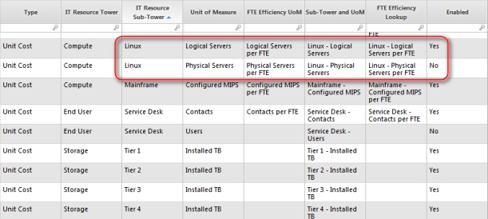

# Elija los puntos de referencia que se muestran en los informes

Los informes de pruebas comparativas muestran 13 subtorres de pruebas comparativas diferentes. Cinco de las subtorres tienen dos o más unidades de medida que pueden utilizarse. Debes elegir qué unidad de medida quieres utilizar para esas cinco subtorres.

Las subtorres son:

Espacio de trabajo

Windows

Unix

Centro de servicio al usuario

Linux

**Para elegir las subtorres de referencia que se muestran en los informes de referencia**

Abra el conjunto de datos de la lista de referencia de unidades de medida de referencia.

1. Seleccione Sí o No en la columna Activado.

En este ejemplo, hay dos opciones de unidad de medida para la subtorre Linux : Servidores Lógicos y Servidores Físicos. Se ha seleccionado Servidores lógicos como unidad de medida, tal y como indica el valor Sí de la columna Activado.

Para facilitar la selección de las unidades de medida, ordene la tabla por la columna Subpotencia de recursos informáticos.
