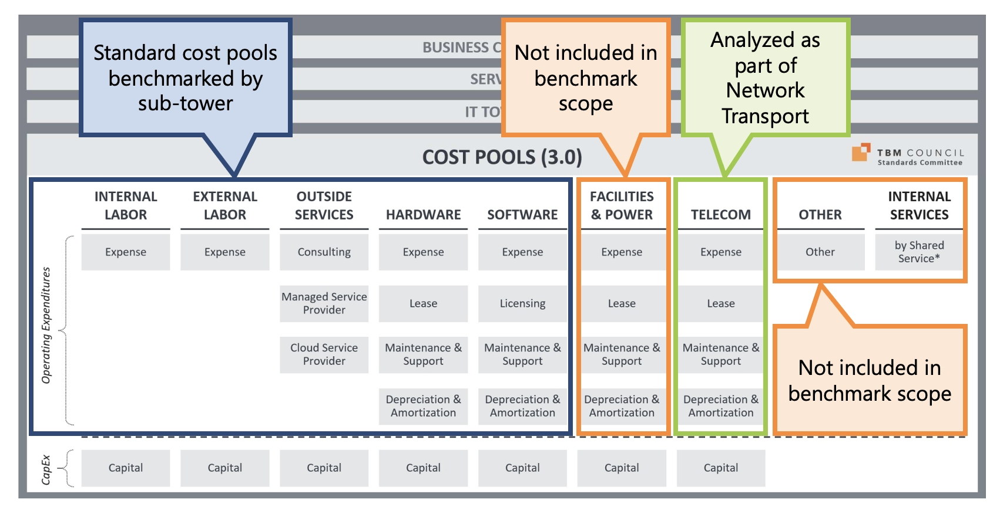

# Preguntas frecuentes sobre evaluación comparativa

**P. ¿Qué gastos debo excluir del gasto global en TI?**

Es necesario excluir dos tipos de cargas para el Benchmarking :

1. Hardware o software específico del sector, por ejemplo, equipos de fabricación robotizados:

- Equipos construidos o adquiridos para fines distintos del tratamiento de datos, pero que tienen componentes informatizados, como máquinas de fabricación robotizadas, dispositivos especializados para el usuario final de operaciones bursátiles, como auriculares para operadores, cajeros automáticos, dispositivos especializados para puntos de venta, escáneres y tensiómetros y sensores en un sistema de control y adquisición de datos (SCADA).
- Equipos de procesamiento de datos de tipo electrodoméstico o propietario que tienen una única finalidad (normalmente vertical a la industria) que no puede utilizarse para otros fines generales, como un ordenador que sólo puede controlar el flujo de electricidad a través de la red eléctrica. Como no puede reutilizarse, no se incluye en nuestro modelo. Obsérvese que otros sistemas que recogen datos de este tipo de ordenadores que pueden utilizarse para otros fines no se consideran tecnología operativa y, por tanto, entran en el ámbito de nuestro modelo.

2. Gastos que escapan al control de TI, por ejemplo, TI en la sombra

- Costes de tecnología o servicios que se revenden, como los salarios de los desarrolladores que participan en la creación de software comercial o los empleados cualificados en TI que prestan servicios a clientes externos de la organización.
- Los "gastos cruzados" internos y las asignaciones corporativas relacionadas con gastos puntuales grandes, significativos o inusuales, como reducciones de plantilla, despidos, traslados, jubilaciones, recursos humanos y salario del presidente.
- Suscripciones y servicios de datos empresariales, como Bloomberg, aunque estén gestionados por la organización de TI.
- Servicios de externalización de procesos empresariales (BPO) en los que las organizaciones externalizan funciones empresariales completas, como la gestión de nóminas o beneficios. Esto incluye los casos en los que el proveedor de BPO proporciona acceso al software, y también garantiza que los resultados de sus servicios cumplirán los requisitos de la empresa, como la normativa fiscal y de retenciones. El software como servicio proporcionado por un proveedor ( SaaS ), que sólo garantiza que el software funcionará según lo especificado, entra dentro del ámbito del gasto en TI. La externalización tradicional de funciones informáticas, como servidores y correo electrónico, también entra dentro del ámbito de aplicación.
- Shadow IT, que es el gasto estándar en TI que está fuera del control y el apoyo del departamento de TI.

**P. ¿Qué gastos debo excluir de los indicadores de infraestructuras?**

Los datos de nuestro estudio comparativo sobre infraestructuras proceden de ISG. Para garantizar una comparación similar, no incluya ninguno de los gastos de los 4 grupos de costes siguientes en ninguno de sus costes al comparar su rendimiento con las métricas de referencia de la infraestructura:

- Instalaciones y energía
- Servicios internos
- Otros
- Telecomunicaciones

Nota: Asigne todos los gastos del pool de costes de Telecomunicaciones a Red - Transporte, ya que es allí donde ISG los analiza.

**P. ¿Incluye la red de transporte todos los gastos de telecomunicaciones en las referencias de infraestructura de ISG?**

Sí. ISG asigna todos los gastos relacionados con el pool de costes Telecom a Red - Transporte. No incluya los gastos del fondo de costes de telecomunicaciones para ninguna otra referencia de infraestructura.

**P. ¿Cómo se contabilizan las amortizaciones?**

Referencias del sector: Las métricas de rendimiento (procedentes de Rubin) sólo incluyen los desembolsos en efectivo. El indicador de gastos debe incluir todos los gastos de capital y los gastos operativos del ejercicio en curso. No incluya D&A en las referencias del sector.

IT OpEx Puntos de referencia: Las métricas de rendimiento (extraídas de los datos de Apptio ) sólo incluyen los gastos operativos. Incluya los gastos de D&A pero no incluya los gastos capitalizados en TI OpEx Puntos de referencia

Referencias de infraestructuras: Las métricas de rendimiento (procedentes de ISG) incluyen los desembolsos en efectivo, así como la depreciación. Incluya los gastos D&A así como los gastos capitalizados en los Benchmarks de Infraestructura.

Nota: Si ha configurado el Benchmarking en Transparencia de Costes, su programa de gastos D&A se introducirá automáticamente. Si utiliza la evaluación comparativa interactiva, sus gastos de D&A se calculan utilizando un programa de amortización lineal de tres años de sus gastos de capital.

**P. ¿Cómo se contabilizan los costes de la nube pública en Opex e infra BM?**

Referencias del sector: Todos los gastos en nube pública se incluyen en el gasto en TI.

OpEx Puntos de referencia: Todos los gastos en nube pública se incluyen en el grupo de costes Servicios externos y se asignan a Torre de TI y Aplicaciones posteriormente.

Puntos de referencia de infraestructura: los puntos de referencia de infraestructura se refieren únicamente a los gastos in situ. Hay que excluir todos los gastos de la nube pública. Esto se gestiona automáticamente en el modelo de costes Apptio asignando todos los costes de la nube a Delivery = "Public Cloud" y excluyendo estos costes de los costes de infraestructura a nivel de torre que se comparan con los Infra Benchmarks.

**P. ¿Puedo realizar una evaluación comparativa de unidades de negocio o regiones concretas por separado?**

La mejor manera de comparar unidades de negocio o regiones individuales es rellenar los datos financieros específicos de la unidad de negocio o región y los volúmenes de unidades en la evaluación comparativa interactiva. El programa le ofrece la posibilidad de ajustar los arquetipos o compararlos con diferentes sectores según le convenga.

Nota: No existe ninguna funcionalidad para que los datos persistan para diferentes BUs/Regiones. Tendrá que actualizar los datos a medida que analice diferentes BUs/Regiones. Los clientes pueden modificar los informes de Benchmark de Costing Standard para mostrar y comparar diferentes benchmarks basados en BU/Región. Esto requiere la creación de informes personalizados para crear estas vistas y no se proporciona fuera de la caja.

**P. ¿Incluyo los gastos de los contratistas?**

Sí. La única razón para no incluir los gastos de contratistas es si forman parte de los servicios de externalización de procesos empresariales (BPO).

**P. ¿Dónde asigno el gasto en TI específico del sector, como máquinas de resonancia magnética, robots de cadenas de montaje y su software, bombas de infusión andPOS dispositivos en el comercio minorista?**

El gasto en TI específico del sector no se incluye en las referencias de costes de TI y debe excluirse.

**P. ¿Qué debo hacer si los datos de costes subyacentes están expresados en distintas monedas?**

Primero querrá consolidar las distintas monedas de los datos de costes en una única vista de moneda. A continuación, puede asignar sus datos de costes en una sola divisa a las referencias, tal y como se detalla en la guía de configuración. Por defecto, el modelo de costes Apptio requiere que se configure una "moneda base" para estandarizar todos los costes en los modelos de costes. Se pueden mostrar diferentes divisas a través de la interfaz de usuario mediante la configuración multidivisa preferida.

Nota: Se admiten las principales divisas.

**P. ¿Dónde asigno las suscripciones de datos e información empresarial?**

Los datos empresariales y las suscripciones de información deben asignarse al grupo de costes Otros. Sin embargo, la evaluación comparativa de costes de TI no incluye las suscripciones a datos e información empresariales, por lo que es necesario excluir estos gastos para realizar comparaciones similares.

**P. ¿Puedo cambiar las métricas en las que se miden los puntos de referencia, por ejemplo, dividir por dispositivos en lugar de por usuarios?**

Núm. Todos los KPI disponibles aparecen en el producto. No obstante, siempre estamos buscando ampliar los KPI que presentamos, por lo que le rogamos que se ponga en contacto con su gestor de cuentas o de éxito de clientes y comparta las opiniones y métricas que le interesan.

**P. ¿Incluyo en la evaluación comparativa los gastos de TI relacionados con el cambio/crecimiento y transformación?**

Sí. Todos los gastos operativos se incluyen en los tres indicadores de referencia de la industria, TI OpEx e infraestructura. Los gastos de capital no se incluyen en las referencias de TI OpEx.

**P. Si se cambian los volúmenes/cantidades en la pantalla de Benchmarks de Infraestructura, ¿se supone que se sobrescriben los volúmenes/cantidades que se extraen de CT?**

No, los cambios de coste y volumen realizados directamente en la aplicación Benchmark de Infraestructuras son exclusivos de Benchmarking Interactivo. No se envían al modelo de costes Costing Standard y. Sin embargo, los costes de torre / subtorre y los volúmenes unitarios asociados en el objeto Torres de recursos de TI en Costing Standard pueden integrarse con Benchmarks interactivos.

**P. Cuando se selecciona el periodo para extraer los datos de CT en la evaluación comparativa, ¿se utilizan las cifras YTD y luego se anualizan, o se anualizan basándose sólo en el mes seleccionado?**

Los datos de Costing Standard Benchmarking utilizan un total móvil de 12 meses para los costes anuales y los costes unitarios.

**P. ¿Qué debe incluir la subtorre de bases de datos?** 

- Incluya sus sistemas de gestión de bases de datos (SGBD) basados en servidor, como Oracle y MS SQL.
- No incluya los gastos de hardware en la gestión de datos, ya que se asignan a la informática y el almacenamiento.
- Incluya los gastos de personal para la asistencia operativa y de segundo nivel, incluida la administración, la configuración y las actualizaciones.
- También incluye cualquier software de bases de datos, así como servicios gestionados para bases de datos de servidores

**P. ¿De dónde proceden los datos de la evaluación comparativa?**

Los tres segmentos diferentes de la evaluación comparativa se basan en tres fuentes de datos distintas:

- Las referencias del sector proceden de Rubin Worldwide
- IT OpEx Las referencias proceden de Apptio
- Los indicadores de infraestructuras proceden de ISG

**P. ¿Cómo puedo garantizar comparaciones por similitud?**

Hay varias formas de garantizar la comparabilidad:

Referencias del sector: Ajuste por

- Sector
- Región
- Tamaño

IT OpEx Puntos de referencia: Ajuste por arquetipos de modelos operativos para ambos

- Aplicaciones (construcción frente a compra)
- Grupos de costes (personal, hardware, software, proveedor)

Puntos de referencia de infraestructuras: Ajuste por

- de transacciones
- Región
- Sector

Nota: En el caso de las infraestructuras de referencia, el volumen es el principal impulsor debido a las economías de escala; la región y la industria tienen un impacto menor.

**P. ¿Cómo funciona el producto con CT y cómo configurarlo adecuadamente para, por ejemplo, cambiar los volúmenes en IBX a través de CT?**

[Consulte la sección sobre configuración](configuration/config-guide.html) para saber cómo configurar la evaluación comparativa

Las opciones de la Comparación interactiva no sobrescriben los datos de volumen o coste de CT
