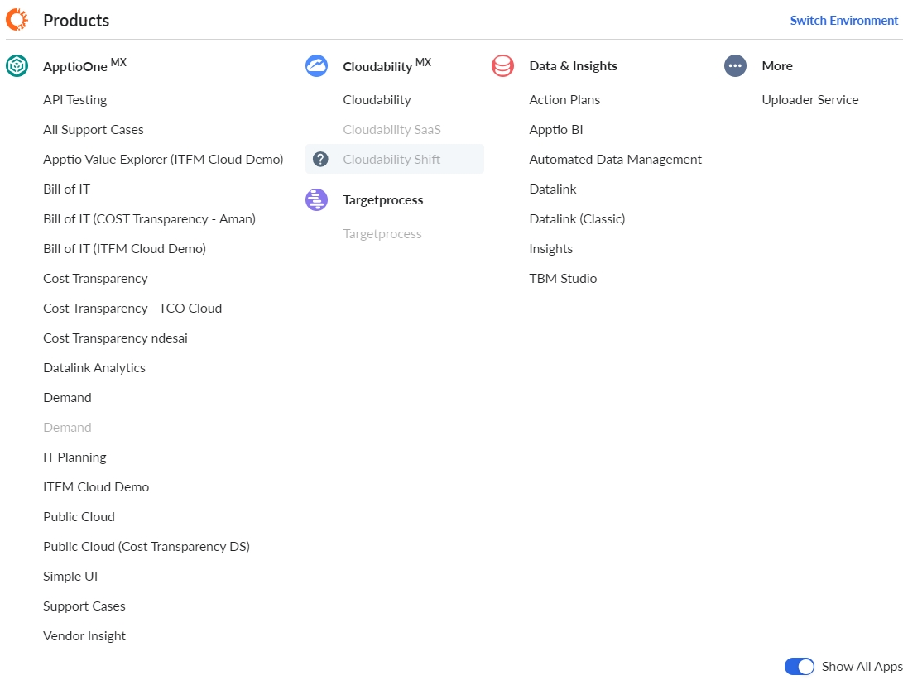
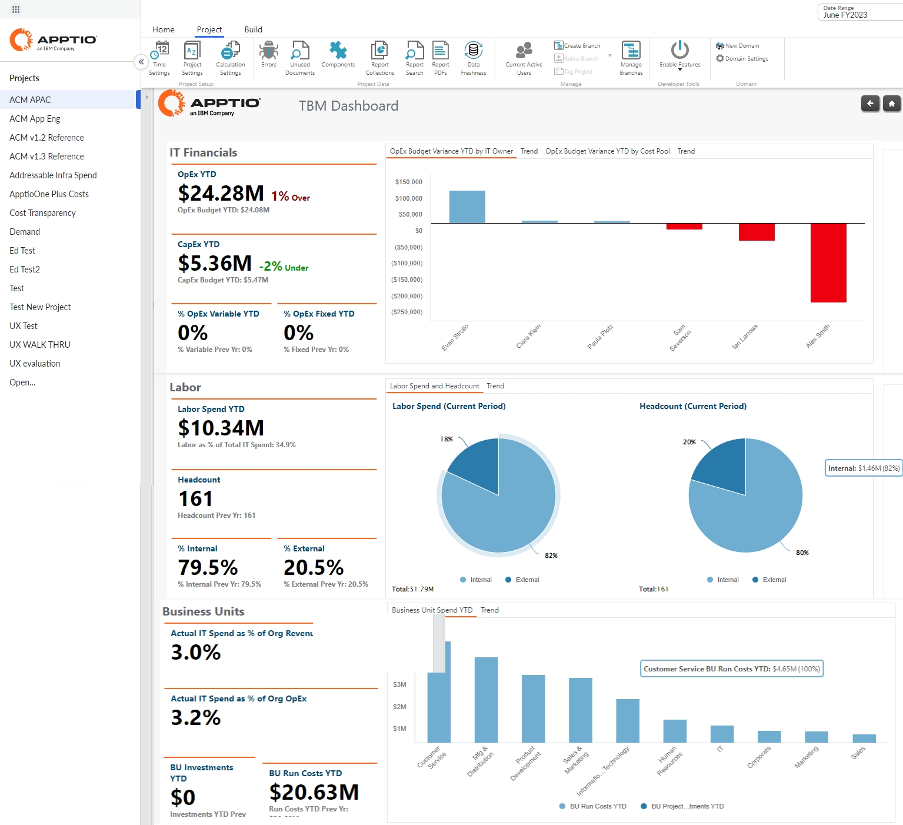

# Acessar seus aplicativos com Apptio Experience (Apex)

Apptio Experience ( Apex ) oferece uma interface moderna e limpa com padrões consistentes de interface de usuário que trazem consistência de produto para a plataforma e permitem que os usuários acessem seus aplicativos por meio de uma navegação de produto unificada.

Por que a Apex?

O Apex oferece aos usuários as seguintes vantagens:

- traz todos os produtos para uma experiência de usuário consistente
- reforça o aspecto comum da plataforma Apptio
- oferece recursos de plataforma compartilhada, como comentários e colaboração, marcadores e notificações

O Apex afeta a navegação e a arquitetura de informações dos produtos. Não há alterações funcionais nos recursos dos produtos.

Design e navegação do Apex

O design do Apex facilita a navegação dos usuários pelos produtos e a localização dos dados que eles estão procurando.

- Você pode navegar facilmente no Apex usando o painel de navegação esquerdo recolhível. Abra o painel de navegação esquerdo para navegar entre os produtos e, em seguida, feche-o para se concentrar na tela atual.
- Mova-se rapidamente entre os produtos usando o alternador de aplicativos no canto superior esquerdo da tela.
- Inicie a ajuda contextual do produto ou gerencie suas preferências usando a barra de ferramentas na parte superior da tela.

**Tópico dos pais:** [Como acessar o Benchmarking](it-benchmarking/benchmarking-how-to-access.html)
