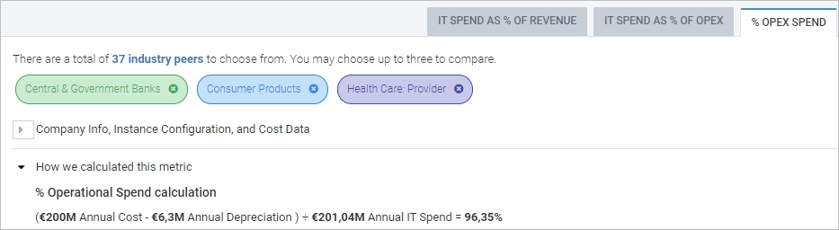

# Depreciação em benchmarks

Esta página descreve como a depreciação é incluída nos benchmarks, tornando as previsões mais precisas para prever os gastos futuros com ativos de TI.

O Benchmarking interativo inclui a depreciação dos ativos de TI de forma diferente para os três tipos de benchmark:

Benchmarks do setor: você pode ver detalhes de qualquer depreciação calculada em uma métrica selecionando a guia e expandindo a seção Como calculamos essa métrica, como no exemplo a seguir para % Opex Spend :

Você pode expandir a seção Company Info, Instance Configuration e Cost Data e passar o mouse sobre os itens com hiperlink para ver uma descrição do que cada item contém e se ele inclui depreciação.

[Saiba mais sobre as definições das métricas de Benchmark do setor](metrics-definitions.html)

OpEx benchmarks: a depreciação mensal é considerada em OpEx, mas o investimento de capital inicial não está incluído.

Referências de infraestrutura: esses dados incluem CapEx e OpEx. CapEx os custos pressupõem uma depreciação linear de três anos.
