# Preencha a guia Dados de custo

A guia Cost Data (Dados de custo) destina-se à entrada manual de informações do modelo Cost Transparency (Transparência de custos).

Há 3 seções na guia Dados de custo:

- Dados anuais de custos de TI
- Dados do pool de custos anuais
- Dados anuais das torres/subtorres de recursos de TI

**Dados anuais de custos de TI**

Benchmarking calcula valores com base na métrica de custo anual. Para obter detalhes adicionais, consulte a própria fórmula da métrica encontrada na guia Métricas. A fórmula calcula os 12 meses anteriores de rolagem. Ao inserir dados manualmente no Interactive Benchmarking, selecione o mês após o mês final que representa o fim do período anual para as comparações desejadas.

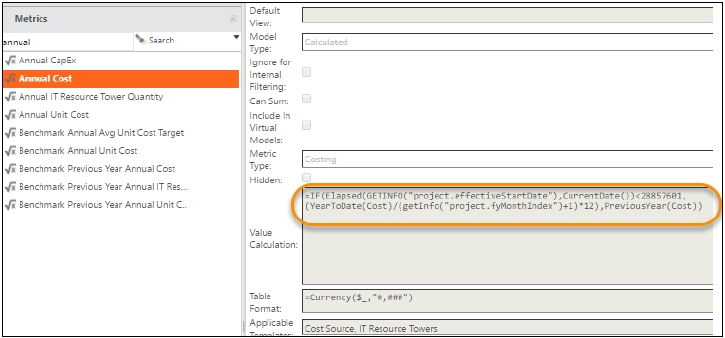

Por exemplo, selecionar Jan FY17 exibirá o valor do mês de janeiro anterior FY16-Dec FY16. A seleção de junho do ano fiscal de 17 exibirá o valor anual do mês de junho anterior FY16-MayFY17.

Em seguida, filtre por "anual" na pesquisa de métricas. Selecione **Annual Cost (Custo anual** ) e, em seguida, selecione **Cost Source (Fonte de custo** ) no menu Properties (Propriedades), conforme mostrado abaixo na Fig. 1.

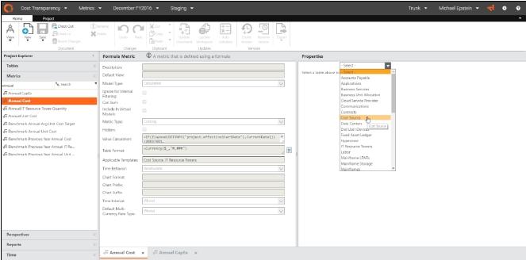

(Fig. 1)

Após selecionar a **fonte de custo**, confirme a data e anote o total da coluna de custo anual (Fig. 2) e insira esse valor na entrada Annual Cost (Custo anual) no site Interactive Benchmarking (Fig. 3):

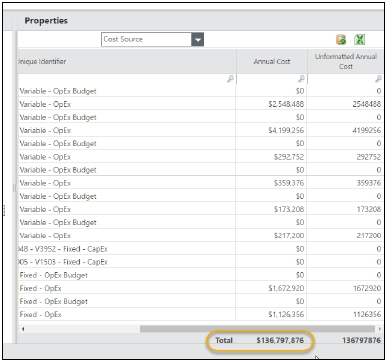

(Fig. 2)

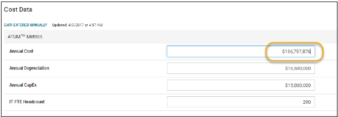

(Fig. 3)

Repita esse processo para a depreciação anual selecionando a métrica de **custo anual** e o objeto **do Ledger de ativos fixos**. Copie o total da coluna **Custo anual** do modelo Transparência de custos para o campo **Depreciação anual** no site interativo Benchmarking.

Por fim, repita esse processo para o Annual CapEx selecionando a métrica **Annual CapEx** no modelo Cost Transparency, o objeto **Cost Source** na seção Properties e anotando o total do Annual CapEx.

**Dados do pool de custos anuais**

Os valores do pool de custos também estão disponíveis na mesma guia Métricas na Transparência de custos. Confirme se a métrica **Custo anual** está selecionada e se **a Fonte de custo** está selecionada nas Propriedades. Em seguida, clique com o botão direito do mouse e exiba/oculte as colunas para mostrar a coluna Pool de custos dos dados mestre de origem de custos (consulte a Fig. 4).

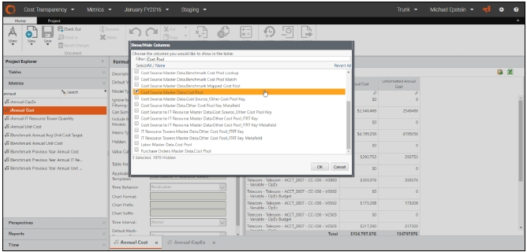

(Fig. 4)

Com a coluna Pool de custos visível, filtre por cada Pool de custos e observe o total da coluna **Custo anual**. Copie esse valor para o site interativo Benchmarking.

Por exemplo, para Hardware, filtre por Hardware e copie o total da coluna Custo anual da Transparência de custos para o site interativo Benchmarking (Fig. 5).

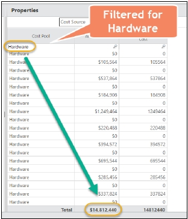

(Fig. 5)

Continue esse processo para cada pool de custos ATUM ™.

**Dados anuais das torres/subtorres de recursos de TI**

Esse processo é idêntico ao do Pool de custos, mas, em vez de selecionar Custo anual na Origem de custos e trazer a coluna Pool de custos, selecione o objeto **Torre de recursos de TI** e selecione as colunas **Torre** e **Subtorre**.

Alterne para o modo Studio e navegue até a guia **Metrics (Métricas** ). Selecione a métrica de **custo anual**. Em seguida, selecione o objeto **IT** Resource Tower para examinar o custo de cada IT Resource Tower e Sub-Towers (consulte a Fig. 6).

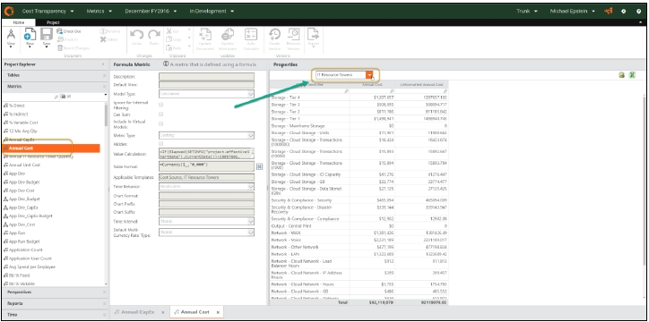

(Fig. 6)

Nessa tela, clique com o botão direito do mouse e selecione **Show/Hide Columns** (veja a Fig. 7).

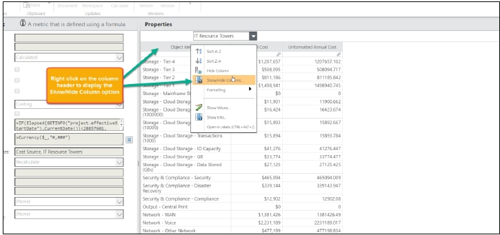

(Fig. 7)

Selecione as colunas **IT Resource Tower** e **Sub Tower** na caixa de diálogo e clique em OK (veja a Fig. 8).

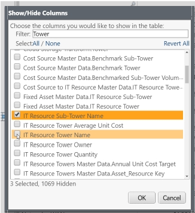

(Fig. 8)

Depois de selecionar as colunas, filtre a combinação de **Torre de Recursos de TI** e **Subtorre** para encontrar o Custo Anual (veja a Fig. 9).

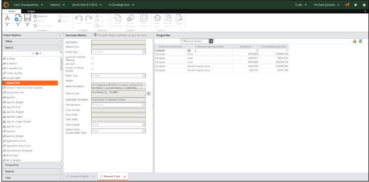

(Fig. 9)

Copie o valor na tela de entrada de dados do benchmark interativo (consulte a Fig. 10).

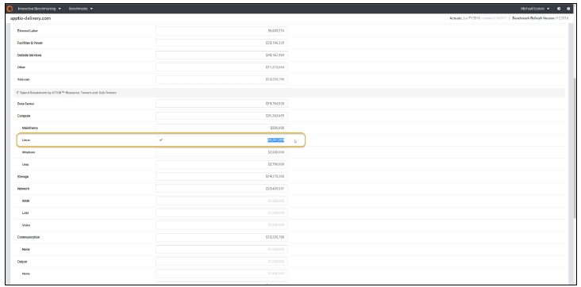

(Fig. 10)

Conclua esse processo para cada Torre e Subtorre de recursos de TI filtrando cada valor respectivo na guia Métrica de transparência de custos.
