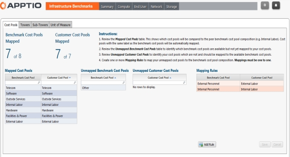

# Mapear os pools de custos

Foram definidos pools de custos padrão para os dados de benchmark fornecidos pelo aplicativo Apptio Benchmarking Infrastructure. Para ativar os relatórios de Benchmarking, você deve mapear seus pools de custos para os pools de custos do aplicativo.

Os pools de custos padrão são:

Mão de obra externa

Instalações e energia

Hardware

Mão de obra interna

Serviços externos

Software

Telecomunicações

Outros

Ao criar o projeto Costing Standard , você definiu os pools de custos em sua infraestrutura de TI. Eles podem ou não corresponder aos pools de custos padrão definidos nos dados de benchmark. Sempre que possível, você precisa combinar os pools de custos dos dados de benchmark com os pools de custos da sua infraestrutura de TI. O mapeamento completo do pool de custos fornece os dados de benchmarking mais completos nos relatórios. Você mapeia os pools de custos usando as instruções no aplicativo, conforme mostrado.

**Pré-requisitos**

Antes de mapear os pools de custos, você precisa ter:

Importou o benchmarking da AIB.

Instalou o componente CTF-Benchmarking (consulte ).

Anexou os dados de benchmarking da AIB aos dados mestre de Benchmarking.

**Para mapear os pools de custos**

Selecione a guia Relatórios.

1. Na página inicial, selecione IT Benchmarks.
2. Na barra de ferramentas de navegação do Benchmarking, selecione o ícone Mapa destacado abaixo.

1. Selecione a guia Pools de custos.
2. Siga as instruções na página de mapeamento.

Ao mapear os pools de custos, cada pool de custos de benchmark deve ser mapeado para um único pool de custos do cliente.
