# Integração do cálculo de custos padrão

Este documento fornece informações sobre (1) a seleção de uma versão do ATUM para o Benchmarking interativo (2) as configurações para obter dados reais do aplicativo Costing Standard . A primeira seção do documento concentra-se em Costing Standard R12 e a segunda seção aborda a obtenção de dados reais de um projeto Costing StandardR11. A terceira seção descreve o fluxo para configurar quando um cliente faz login no Interactive Benchmarking pela primeira vez.

**IMPORTANTE** Nessa versão, os valores reais da subtorre não são recuperados. A obtenção de dados de subtorres será ativada em uma versão posterior.

**Costing Standard em TBM Studio v12**

**Pressupostos**

- Seu produto Apptio está habilitado para Front Door.
- O aplicativo R12 Costing Standard e o Benchmarking interativo estão no mesmo ambiente.

Veja na figura abaixo um exemplo de um ambiente com Costing Standard e Benchmarking interativo.

OBSERVAÇÃO Você pode ter mais de um aplicativo Costing Standard , bem como outros aplicativos em um ambiente.

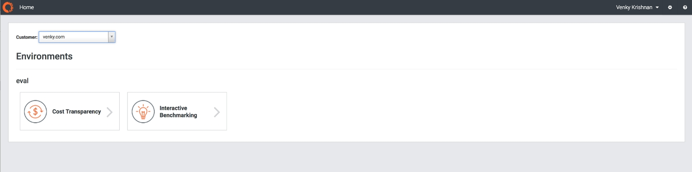

**Uso de Settings para configuração**

Esta seção abordará a configuração das versões do ATUM e a obtenção de dados reais usando as páginas Settings (Configurações).

A sequência recomendada é selecionar primeiro a versão do site ATUM. Para isso, clique no volante de configurações no canto superior direito do aplicativo Interactive Benchmarking. Você verá a página de configurações com um conjunto de guias.

- Clique na guia Advanced (Avançado). Aqui você verá a seção da versão ATUM (veja a imagem abaixo com V2 selecionado).

  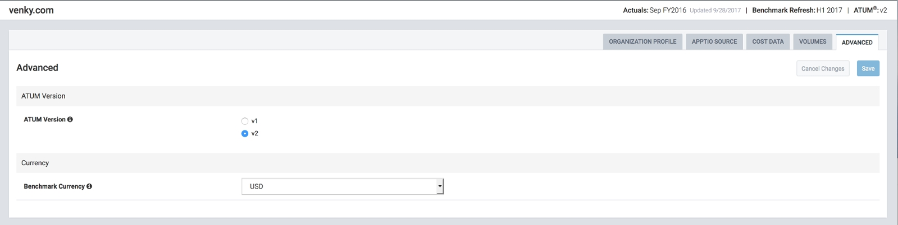
- Você pode alterar a versão do ATUM. Ao fazer isso, você verá uma faixa de aviso amarela que fornece informações sobre:
  - Impacto da alteração da versão do site ATUM :
    - As torres e subtorres são diferentes entre V1 e V2, portanto, você verá essa alteração na lista de torres e subtorres
    - Devido a essa diferença, os volumes, os dados de custo real e as seleções de referência para torres e subtorres serão descartados.
  - Próximas etapas recomendadas depois que você fizer essa alteração:
    - Recupere seus dados de custo real ou insira-os manualmente
    - Atualize seus volumes
    - Analise suas seleções nas camadas de benchmark (setor, TI OpEx e infraestrutura).

  A imagem abaixo mostra um exemplo de mudança para V1. O banner amarelo com o impacto e as recomendações está à direita.

  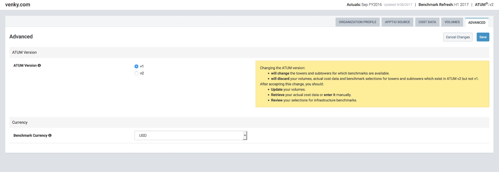
- Em seguida, você pode prosseguir com essa seleção clicando em Save (Salvar). Isso resulta em uma caixa de diálogo que lista os dados com a mesma faixa de aviso amarela. **IMPORTANTE:** esta etapa ainda não busca os dados reais do projeto Costing Standard . Ele apenas alterna os dados atuais para a versão alterada do site ATUM. Você precisa fazer um Fetch from Actuals explícito, conforme indicado nas próximas etapas.

  Você precisa clicar em "Continue with these actuals" para fechar essa caixa de diálogo.

  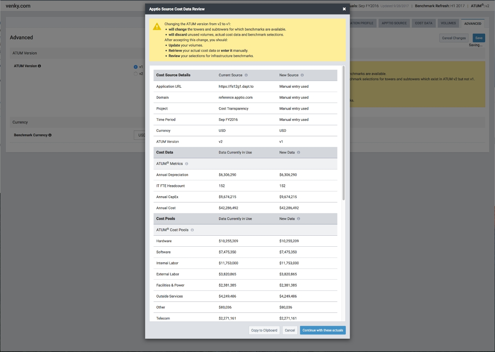
- A próxima etapa é definir as configurações para Fetching from Costing Standard. Para isso, clique na **guia APPTIO Source** nas configurações (veja a imagem abaixo). Isso fornecerá uma lista suspensa de aplicativos Costing Standard em seu Apptio (Front Door Environment). Na tela abaixo, há apenas um aplicativo Costing Standard (com o nome Costing Standard). Em seguida, clique no botão **Validate Connection (Validar conexão** ).

  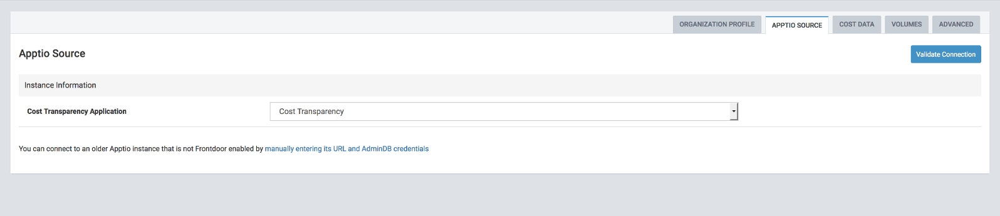
- Depois que a conexão for validada, você verá uma tela na qual poderá selecionar um projeto Costing Standard e um mês específico. Na imagem de exemplo abaixo, você vê que o projeto selecionado é: reference.apptio.com: Costing Standard. IMPORTANTE: Escolha o projeto específico de CT que você deseja obter os dados de custo real. A faixa amarela à direita é uma nota de advertência. Ele informa que você precisa garantir que o projeto do CT esteja aberto (pois a seleção de um projeto fechado acionará um cálculo no CT).

  Agora, clique em "Retrieve Cost Data" (Recuperar dados de custo) para obter os dados reais do projeto Costing Standard e do mês/ano selecionados.

  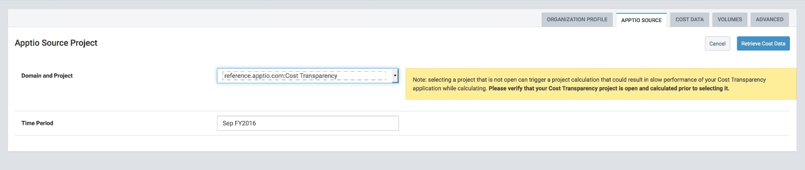
- Agora você verá os dados obtidos em uma caixa de diálogo (veja a imagem abaixo como exemplo). A coluna New Source contém os dados obtidos do projeto selecionado.

  Clique em **Continuar com esses valores reais**. Isso resulta em salvar os dados de custo recuperados do projeto.

  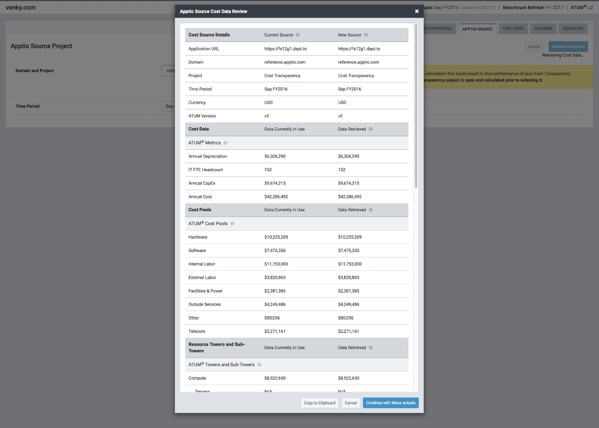
- Você também pode visualizar os dados de custo recuperados selecionando a guia Cost Data (Dados de custo) em Settings (Configurações). A imagem abaixo é uma captura de tela dos dados de custo. Ele mostra os custos gerais, os custos do pool de custos e os custos da torre preenchidos. Os custos das subtorres estão em branco e precisam ser digitados manualmente.

  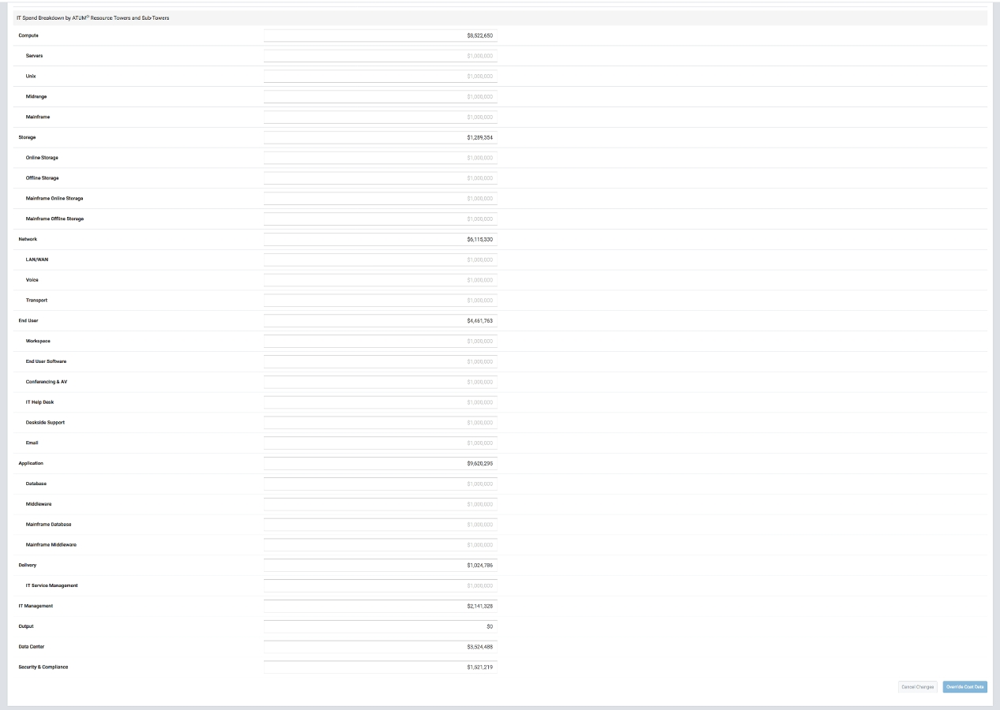
- Por fim, como antes, o Perfil da Organização é inserido manualmente (já que não faz parte do projeto Costing Standard ), pois é específico do benchmarking. Você pode entrar no Organization Profile selecionando a guia Organization Profile.

  Para Sub-tower Annual Costs & Volumes, você pode inseri-los da seguinte forma:

  - Na seção de configurações; Custos anuais da subtorre na guia Cost Data (Dados de custo) e Volumes na guia Volumes, ou
  - Nas páginas das subtorres individuais, em Métricas de infraestrutura.

Agora você está pronto para fazer suas comparações de benchmark com os dados reais.

**Costing Standard em TBM Studio v11**

Para projetos Costing Standard em v11, não há integração com o Frontdoor. Isso significa que você precisará criar/usar um usuário administrador (em v11 ) e digitar o nome de usuário/senha no Interactive Benchmarking. Na guia Apptio Source (consulte a imagem abaixo), você tem a opção de inserir manualmente as credenciais URL (o hiperlink é: manually entering the URL and AdminDB ). Clique nesse hiperlink.

Na próxima etapa, você verá caixas de texto de entrada nas quais precisará fornecer a instância URL, o nome de usuário AdminDB e a senha AdminDB. Este [vídeo](https://community.apptio.com/videos/1516 "(Abre em uma nova guia ou janela)") fornece informações adicionais sobre como usá-lo.

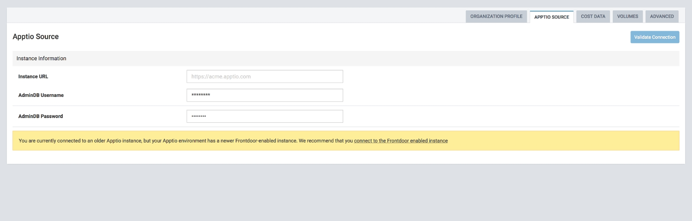

As outras etapas para selecionar versões do ATUM e definir volumes etc. são as mesmas do R12.

**Primeira configuração de experiência do usuário**

O aplicativo Interactive Benchmarking oferece uma experiência de primeiro uso aos clientes quando eles fazem login pela primeira vez. Isso serve para orientá-los na configuração inicial.

- Se nenhum usuário tiver feito login no Interactive Benchmarking para um cliente e o tiver configurado, a primeira tela que você verá (se for o primeiro usuário) é uma página de introdução. Veja um exemplo na imagem abaixo. Ele identifica as etapas que você precisa seguir para configurá-lo. Observação: ele também oferece uma opção para ignorar a configuração caso você queira (1) configurá-lo mais tarde usando o fluxo de configurações mencionado acima ou (2) configurá-lo manualmente.

  Para continuar, clique no botão **Lets Get Started (Vamos começar)**.

  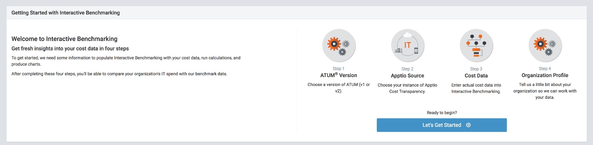
- As próximas etapas são semelhantes às etapas descritas nas seções acima, mas com uma experiência mais guiada. Por favor, revise as duas primeiras seções para se familiarizar com os detalhes. O primeiro passo é selecionar a versão do seu ATUM. Aqui você deve escolher a versão do seu ATUM. Clique em **Next**.

  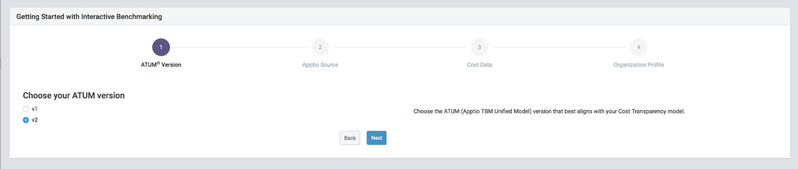
- Em seguida, selecione sua fonte Costing Standard . A tela que você verá será como a mostrada abaixo. Escolha seu aplicativo Costing Standard e clique em Connect (Conectar). **OBSERVAÇÃO:** Aqui você tem a opção de ignorar essas etapas e ir para a tela Benchmarking (clicando em **inserir os dados de custo manualmente** ) ou buscar em R11 (clicando em **inserir manualmente as credenciais URL e AdminDB** ).

  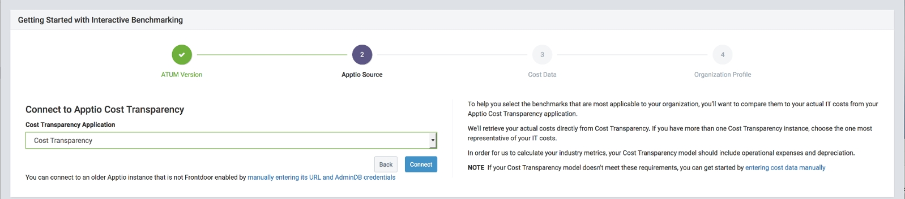
- Depois de clicar em **Connect (Conectar** ), você será solicitado a selecionar o projeto e o período de tempo corretos. A faixa amarela é igual à descrita na primeira seção.

  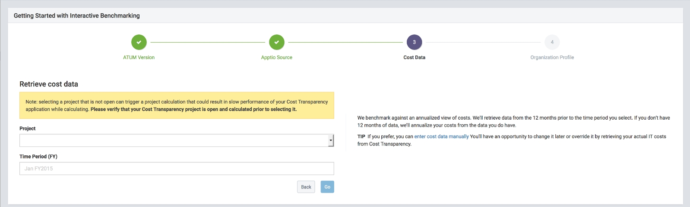
- Você pode selecionar seu projeto e período de tempo e clicar em "Go" (Ir). Veja abaixo um exemplo: screen.This recupera dados reais do projeto.

  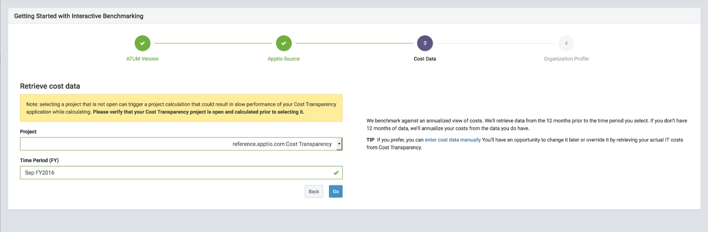
- A última etapa da configuração é digitar o perfil da organização. Veja um exemplo na tela abaixo. Digite os dados do perfil de sua organização e clique em **Next**.

  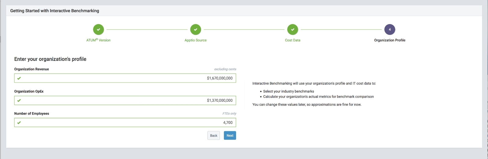
- Neste ponto, você configurou o Benchmarking interativo. Você verá uma tela "Done" (Concluído), como a mostrada abaixo. Ao clicar em "Explorar", você será levado a um aplicativo de Benchmarking interativo configurado.

  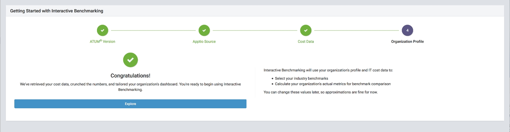

A qualquer momento, você pode fazer modificações em sua configuração clicando no botão Configurações no canto superior direito da tela e seguindo as etapas mencionadas na primeira seção.
