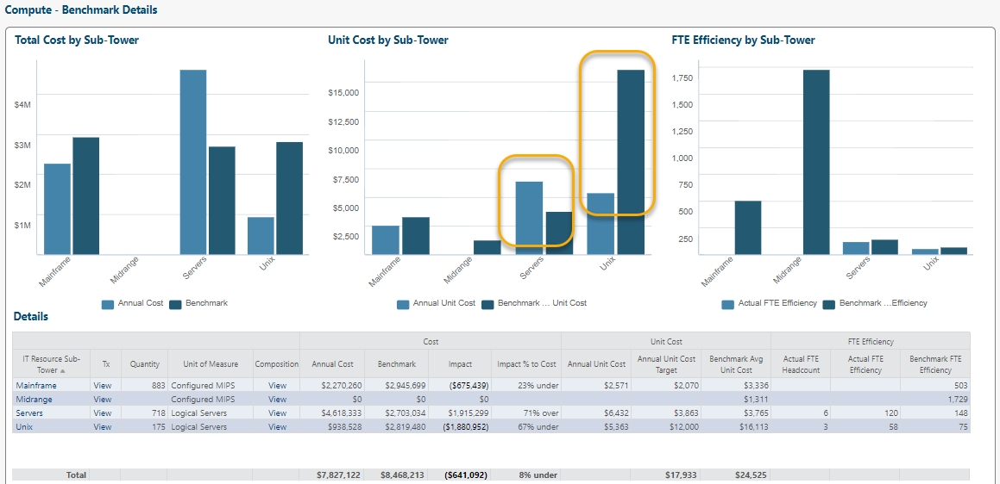
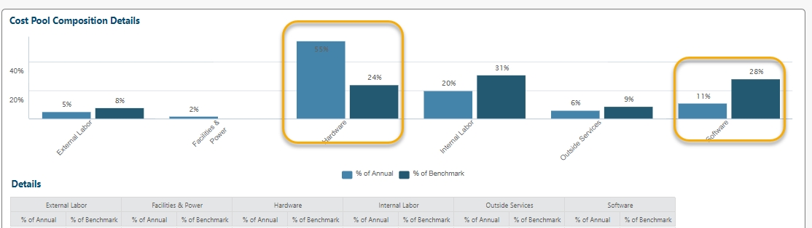
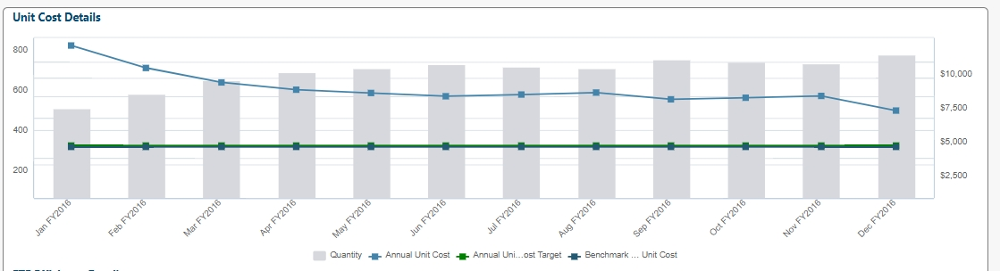
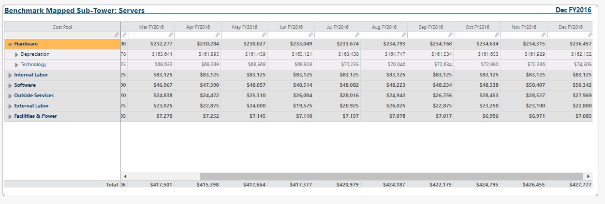
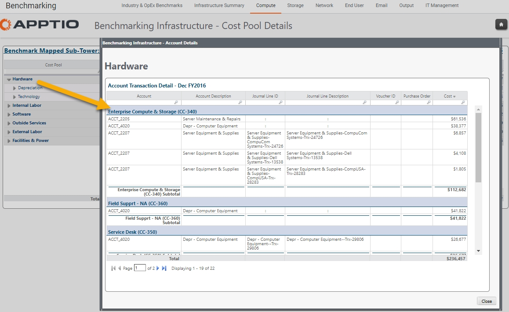

# Explore os custos com o Benchmarking

aplica-se a projetos que executam Benchmarking e ATUM v2 ou superior.

**Introdução**

Com o site Benchmarking , você pode explorar os custos de uma organização e como esses custos se comparam a um benchmark de colegas. Se um custo estiver acima ou abaixo do valor de referência, como explorar os fatores de custo e identificar os insumos de custo? Benchmarking oferece várias maneiras de explorar e identificar os geradores de custos de forma defensável.

**Revisar e rastrear os custos de TI**

Para revisar e rastrear os custos de TI na Transparência de custos ao comparar com um benchmark, siga estas etapas:

1. Comparar o custo organizacional com uma referência para identificar os valores que estão acima ou abaixo da referência.
2. Selecione pools de custos para restringir a área de foco.
3. Selecione os detalhes e inspecione a tendência quanto a alterações significativas.
4. Revise os detalhes em nível de transação.

**1. Comparar o custo organizacional com a referência**

A primeira etapa é comparar os custos organizacionais com uma referência para identificar os custos que estão acima ou abaixo da referência. Isso ajudará a determinar onde concentrar seu tempo e esforço.

Começando com a computação no exemplo a seguir, podemos ver que o custo unitário está acima da referência para servidores e significativamente abaixo da referência para Unix. Frequentemente, quando uma subtorre está abaixo e outra está acima em uma torre de recursos de TI, isso sugere que uma estratégia de alocação pode ser a causa principal ou que alguma forma de cobrança agrupada que afeta várias subtorres está sendo enviada apenas para uma subtorre em vez de ser alocada para ambas.

**2. Selecionar pools de custos para restringir a área de foco**

Agora que identificamos a(s) subtorre(s) para análise adicional, a próxima etapa é selecionar a visualização de composição para ver qual(is) pool(s) de custos está(ão) fora da faixa típica de referência. A visualização da composição está disponível diretamente no relatório de avaliação comparativa da computação ou selecionando a subárvore de recursos de TI para navegar até a visualização detalhada da avaliação comparativa da subárvore. Para este exemplo, o caminho de clique é selecionar a subnível de recursos de TI.

Neste exemplo, dentro da distribuição do pool de custos, há duas áreas que têm um delta maior em relação à referência. Em seguida, investigaremos o hardware e o software.

**3. Selecionar detalhes e inspecionar a tendência de mudanças significativas**

A próxima etapa é examinar os dados de tendência na exibição de detalhes para determinar se há alguma alteração significativa nos meses posteriores que afetaria o custo. Uma mudança repentina em um determinado mês indicaria uma alocação significativa ou uma mudança de dados que poderia afetar negativamente o cálculo do custo unitário. Neste exemplo, uma análise dos dados de tendência ao longo do tempo mostra um declínio no custo unitário, mas sem grandes mudanças.

A seleção da visualização da transação fornece um detalhamento mês a mês dos custos por pool de custos, com a capacidade de selecionar e detalhar o nível de transação desse pool ou subconjunto de custos.

**4. Revisar detalhes em nível de transação**

Como os pools de custos de hardware e software apresentam o maior delta em relação ao benchmark, a seleção de qualquer uma dessas áreas fornecerá informações sobre os geradores de custos específicos.

Ao examinar os custos de hardware, os maiores custos parecem ser um item de linha de manutenção e reparo de servidor e depreciação. Isso indica a necessidade de uma análise adicional. O item de linha de manutenção e reparo do servidor representa apenas os custos associados aos servidores Windows ou Linux, ou inclui serviços adicionais ou serviços relacionados a outras torres de recursos? O segundo maior custo é a depreciação. Da mesma forma, esse custo de depreciação incorpora apenas o custo do servidor ou inclui outros custos de depreciação, como desktops, equipamentos de rede ou outros itens?

**Conclusão**

Ao se munir de uma análise detalhada e eliminar mudanças significativas na estratégia de alocação, o usuário pode revisar os detalhes do item de linha com os proprietários dos dados para rastrear, identificar e entender os geradores de custos subjacentes. Essa quantidade de detalhes garante um nível de confiança nos dados de custo e também fornece custos defensáveis e de referência.
