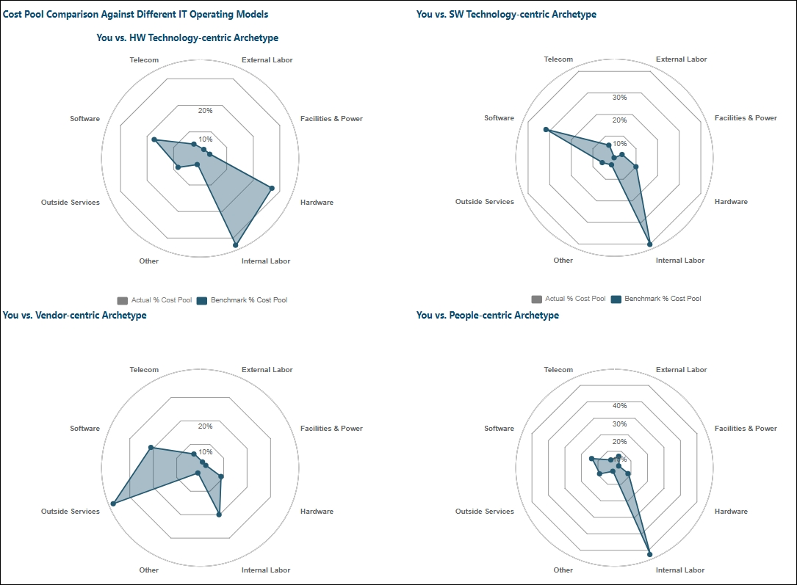
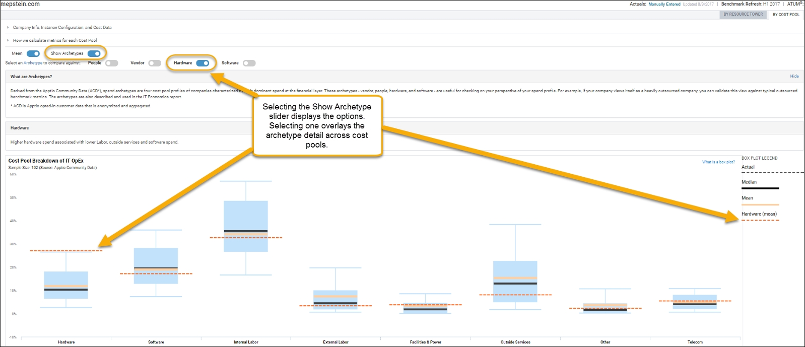
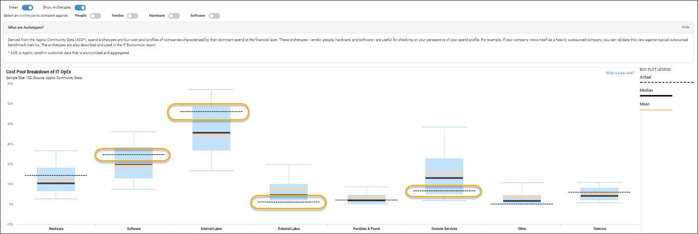
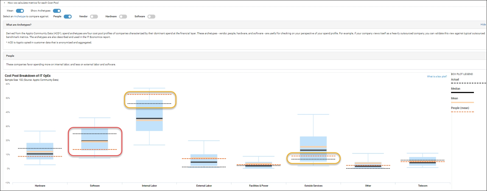

# Entendendo os arquétipos de benchmarking

**Resumo**

Uma organização pode usar o site Benchmarking para comparar seus próprios dados com os dados da comunidade Apptio (ACD). Apptio identificou quatro arquétipos nos dados que demonstram quatro modelos operacionais distintos.

**Apptio arquétipos**

O que é um arquétipo? Nesse contexto, um arquétipo é definido como um exemplo típico do modelo operacional de TI de uma organização. Os dados do ACD estão alinhados com o site ATUM, o que ajuda a revelar pontos em comum entre os dados anônimos das organizações. A análise dos dados produz quatro arquétipos comuns nos padrões de gastos do pool de custos de TI e dois arquétipos nas distribuições do pool de custos de aplicativos.

Dentro dos padrões de gastos de TI, o foco das organizações é centrado na tecnologia de hardware, na tecnologia de software, no fornecedor ou nas pessoas.

Os dois arquétipos focados em tecnologia, hardware e software, demonstram um padrão de gastos do departamento de TI da organização que tem um grau mais alto de gastos com hardware ou software, mas que é comparativamente menor na maioria dos outros pools de custos fora da mão de obra interna (que tradicionalmente é um componente mais alto de gastos para qualquer organização). Por outro lado, os arquétipos centrados no fornecedor e nas pessoas têm principalmente serviços externos ou mão de obra interna como os principais geradores de despesas.

Isso é ilustrado nos gráficos de aranha encontrados no relatório Cost Transparency (CT) Industry & OpEx Benchmark (veja a imagem abaixo).

Esses mesmos dados também estão disponíveis no site interativo Benchmarking, porém, com uma aparência diferente: O detalhe sobrepõe os intervalos do pool de custos dos dados dos pares (veja a imagem abaixo).

No exemplo a seguir, esse conjunto de dados mostra uma organização que pode parecer muito superior em várias áreas e excepcionalmente inferior em outras.

A seleção do controle deslizante do arquétipo centrado nas pessoas sobrepõe o subconjunto de DAC em que os padrões de gastos mostram um nível mais alto de gastos com mão de obra interna, mas um nível comparativamente mais baixo de gastos com mão de obra externa ou serviços externos. Nesse exemplo, a organização está mais alinhada ao arquétipo centrado nas pessoas na forma como gasta seus recursos de TI. Além disso, essa organização está gastando comparativamente mais em software e hardware do que o subgrupo. Isso deve impulsionar um novo vetor de análise, especialmente com software, porque esse gasto é maior do que o subgrupo arquetípico e está no quartil superior do ACD geral. Essa mesma avaliação pode ser feita em relação ao hardware, mas em um grau menor.

**Conclusão**

As informações arquetípicas podem ser úteis para uma organização como uma forma de demonstrar visualmente à liderança de negócios ou de TI os padrões atuais de gastos do departamento de TI e de organizações alinhadas de forma semelhante, além de destacar áreas que estão claramente fora do padrão típico de gastos. Ao revelar esses padrões, a análise de benchmarking destaca as áreas com potencial de melhoria de custos.
