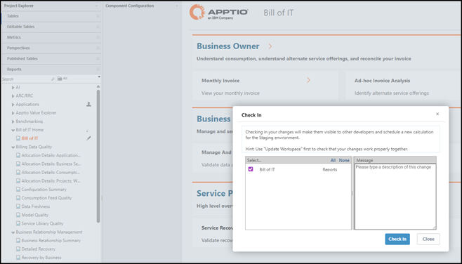

# Check-out, check-in, and build creation

Configuration changes for Billing follow the same pattern as Costing:

1. **Check out**
   - Admins or Analysts check out the relevant items in In Development:
     - Models related to Billing.
     - Datasets, tables, or metrics that Billing depends on.
     - Report definitions or templates for Billing.
2. **Edit**
   - Changes are made in In Development:
     - Adjusting logic in models.
     - Adding or modifying tables and fields.
     - Updating report layouts or new reports.
3. **Check in**
   - When changes are complete, the items are checked in.
   - The system automatically:
     - Creates a new **In Development build**.
     - Creates a corresponding **Staging build** based on the same changes.

Fig #: Checking in the “Bill of IT” report

Practical tips:

- Group related changes into a small number of check-in sets so they are easier to track and
  test.
- Use meaningful build notes at check-in so it is clear which builds contain which Billing
  changes.
