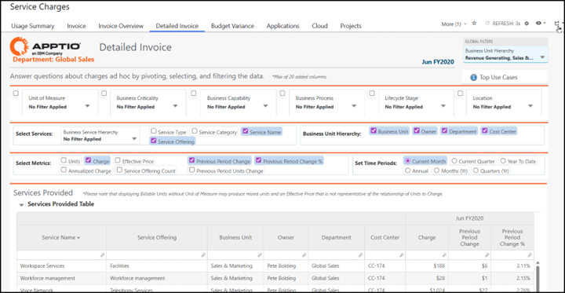
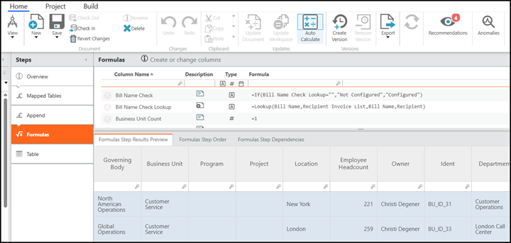

# Onboarding path for Admins & Analysts

This is the most intensive training path and should be structured, not ad
hoc.

## Phase 1 - Foundations

**Goal**: Understand the landscape before touching any configuration.

**Topics**:

- Billing concepts and relationship to Costing.
- Editions and capabilities (Essentials vs Standard).
- Architecture and dependencies (Section 6).
- Environments and release management (Section 7).
- Overview of the Billing cycle (Section 9).

**Activities**:

- Walkthrough of the live or Staging environment:
  - Show where Billing reports live.
  - Show high level data flows and model diagrams.

## Phase 2 - Data and reports

**Goal**: Understand how data shows up in reports before editing models.

**Topics**:

- Data requirements and integration patterns (Section 8).
- Working with Billing reports (Section 10).
- Basic use case recipes (Section 15) for:
  - PxQ showback.
  - Chargeback with journals.
  - Unit rate investigation.

**Activities**:

- Hands-on exercises:
  - Filter and export key Billing reports.
  - Compare Billing outputs to known test cases or legacy bills.
  - Perform a unit rate investigation for one service.

Fig #: Detailed Invoice report in Billing Standard with cursor over Export button

## Phase 3 - Configuration and model changes

**Goal**: Safely make changes in In Development and understand their impact.

**Topics**:

- Configuring Billing Essentials and/or Billing Standard (Sections 11 and 12).
- Component structure and key tables.
- How to check out, edit, and check in documents in TBM Studio.
- How builds flow from In Development to Staging to Production.

**Activities**:

- Guided exercises in In Development:
  - Add or modify one offering and its rate.
  - Load sample consumption and run models.
  - Validate the effect in a Staging-like test build.

Fig #: In TBM Studio, editing formulas in the Business Unit Allocation Master Data
table

## Phase 4 - Owning the billing cycle

**Goal**: Admins and Analysts can run the full cycle and handle typical issues.

**Topics**:

- Detailed monthly runbook based on Section 9 and Section 16.
- QA patterns and exception handling.
- Communications to Service Owners and Finance on each billing cycle.

**Activities**:

- Shadow, then lead, one or more real billing cycles:
  - First with an experienced guide, then independently with spot checks.
