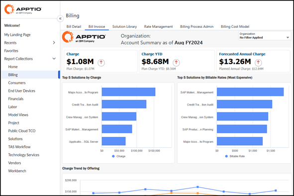

# Patrones de acceso para Billing Essentials

Nota: Se aplica únicamente a Billing Essentials.

Billing Essentials se instala en el mismo proyecto que ejecuta Costing Essentials. No hay un punto final de facturación independiente; los usuarios acceden a la facturación a través de la interfaz de cálculo de costes existente.

**Patrones típicos:**

- **TAS y socio**
  - Tenga acceso frontal a la colección de informes de «Facturación».
  - Puede ejecutar y validar informes de Billing Essentials (facturas, detalles, resúmenes).
  - Tenga acceso a TBM Studio para la configuración del back-end y los ajustes de datos.
- **Propietarios de servicios o productos, altos directivos, partes interesadas y consumidores.**
  - Acceda a los informes de facturación a través de la misma entrada frontal que utilizan para Costing Essentials.
  - Ver solo los informes y datos relevantes para ellos, basándose en la seguridad y el filtrado a nivel de fila.

## Puntos clave:

- La mayor parte del acceso diario se gestiona a través del mismo modelo de gestión de usuarios y permisos que se utiliza para Costing Essentials.
- Los cambios en los modelos, conjuntos de datos o tablas de Billing Essentials en TBM Studio los realiza un recurso de TAS o un socio.

Fig. n.º: Informe de facturas mostrado con el menú de navegación visible a la izquierda
