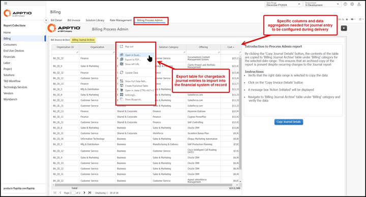

# Últimos lanzamientos

Esta sección describe únicamente los cambios en el contenido de facturación listo para usar, no en la plataforma subyacente. Para las actualizaciones a nivel de plataforma, como el comportamiento de TBM Studio y el servidor cliente, los lectores deben revisar las notas de la versión de TBM Studio y tener en cuenta los cambios aplicables junto con lo que se documenta aquí.

Los cambios enumerados en esta sección se limitan a las actualizaciones proporcionadas a través de las plantillas de componentes para facturación. Billing Essentials está asociado exclusivamente con la plantilla de componentes versión 200, mientras que Billing Standard está asociado con la plantilla de componentes versión 120 y anteriores. Al revisar un cambio, confirme siempre qué versión de la plantilla de componentes o edición de facturación utiliza su entorno para comprender si ese cambio se aplica a su implementación de facturación.

## Anuncios importantes

Ninguna

## Fundamentos de facturación (plantilla versión 200) - 28 de febrero de 2025

- Se ha añadido compatibilidad con el idioma japonés para mejorar la accesibilidad de los usuarios.
- El informe de gestión de tarifas ahora incluye una nueva métrica de impacto del ajuste de tarifas, que proporciona información adicional sobre los cambios en las tarifas.
- Se ha añadido un nuevo informe denominado «Modelo de costes de facturación» a la colección de informes «Facturación» para proporcionar un resumen de los flujos de asignación de facturación.

## Fundamentos de facturación (plantilla versión 200) – 17 de enero de 2025

Esta versión ofrece las siguientes mejoras para optimizar la experiencia general del usuario y proporcionar una gestión más eficiente de los procesos de facturación y carga de datos.

- **Informes mejorados** : el informe administrativo del proceso de facturación se ha integrado en la colección de facturación, con permisos de control de acceso basados en roles (RBAC) configurados para restringir el acceso a los propietarios autorizados del proceso de facturación.
- **Exportación y archivo de asientos contables** : La pestaña Archivo de asientos contables de facturación ahora permite a los usuarios exportar asientos contables a un archivo Excel (.xlsx) y crear una tabla simplificada para fines de informes de auditoría, utilizando un script CopyTable para garantizar la integridad de los datos.

Fig. n.º: IBM Apptio Informe «Administración del proceso de facturación» de Billing que muestra la función de exportación de asientos contables.

- **Archivado de facturas** : La pestaña Archivo de facturas cuenta con un botón Copiar detalles de la factura, que facilita el archivado de las facturas creando una copia duplicada de la factura original, lo que garantiza un registro permanente para fines de auditoría y cumplimiento normativo.
