# Informes de facturación en Billing Standard

Billing Standard incluye vistas específicas del dominio, facturas e informes resumidos. Los informes se agrupan en secciones que se muestran en la página de inicio del informe. A menos que se indique lo contrario, los informes se instalan a través del componente « “BoIT- Foundation».

Nota: Se aplica únicamente a la norma de facturación.

## Propietario de la empresa

**Informe resumido de uso**

- Objetivo: Proporcionar una visión única y fácil de interpretar para los ejecutivos sobre lo que se consume y se factura, cómo cambia ese uso a lo largo del tiempo y qué está impulsando el cambio en todas las unidades de negocio, incluidas las tendencias de servicio, la actividad de las unidades, la concentración de gastos por una dimensión seleccionable (ejemplo mostrado: ubicación) y la variación presupuestaria.
- Preguntas respondidas:
  - ¿Cuál es el cargo total para el período actual y cómo ha variado de un mes a otro?
  - ¿Cuál es el cambio con respecto al período anterior?
  - ¿Cuál es el cargo correspondiente al período actual, trimestre o año hasta la fecha (YTD)?
  - ¿Cuál es el coste por departamento, unidad de negocio, ubicación y centro de costes, y tiende al alza o a la baja?
  - ¿Qué servicios están creciendo más rápidamente (en MoM %) y probablemente impulsando el aumento del gasto?
  - ¿Cuál es la tendencia de los cargos en los últimos 13 periodos por tipo de servicio (entrega, compartido, usuario final, etc.)?
  - ¿Cuál es la variación presupuestaria para el mes, trimestre o año en curso, en general y por tipo de servicio?
  - ¿Qué tipos de servicios son los que más contribuyen al exceso o déficit presupuestario (detalles del mapa de árbol y de la variación)?
- Usuarios objetivo: Consumidor, alto directivo, propietario de servicio o producto, parte interesada, analista

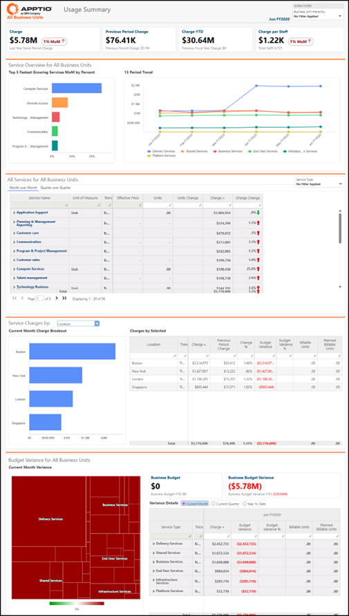

Fig. n.º: Informe resumido de uso en la norma de facturación

**Informe de facturación** (también conocido como factura mensual)

- Objetivo: Proporcionar una vista de la factura del periodo de facturación que muestre lo que se ha cobrado frente al presupuesto, la tendencia de los cargos (mensual y trimestral) y, lo más importante, una explicación basada en los factores determinantes de por qué han cambiado los cargos (servicios nuevos o interrumpidos, cambios en los precios, cambios en las tarifas, cambios en el consumo y cambios en la asignación).
- Preguntas respondidas:
  - ¿Cuál es el cargo total del mes actual? ¿Ha aumentado o disminuido con respecto al mes anterior?
  - ¿Cuál era el presupuesto para el mes? ¿Estamos por encima o por debajo del presupuesto?
  - ¿Cuáles son los gastos del trimestre actual y cómo se comparan trimestre a trimestre?
  - ¿Cuál es el presupuesto acumulado del trimestre (QTD) y cuál es la variación QTD?
  - ¿Cómo evolucionan los gastos anualizados, los gastos acumulados en el año y el presupuesto anual a lo largo del ejercicio fiscal (tendencia de variación)?
  - ¿Se ha empezado a cobrar algún servicio este mes o se ha dejado de cobrar algún servicio este mes (servicios añadidos y eliminados)?
  - ¿Qué impacto tuvieron los cambios efectivos en los precios?
  - ¿Qué impacto en los cargos se produjo por los cambios en las tarifas unitarias (cambios en las tarifas utilizando las unidades del mes anterior)?
  - ¿Qué impacto en los cargos se produjo por los cambios en el consumo (cambios unitarios utilizando el precio efectivo del mes pasado)?
  - ¿Qué impacto tuvo en los cargos el cambio en la asignación de las ofertas de servicios en curso?
  - ¿Qué servicios específicos contribuyeron más al aumento o la disminución, y en qué medida?
  - Si alguien pregunta «¿por qué ha cambiado mi factura?», ¿Cuáles son las principales categorías de factores impulsores y su impacto en dólares?
- Usuarios objetivo: Consumidor, alto directivo, propietario de servicio o producto, parte interesada, analista, administrador

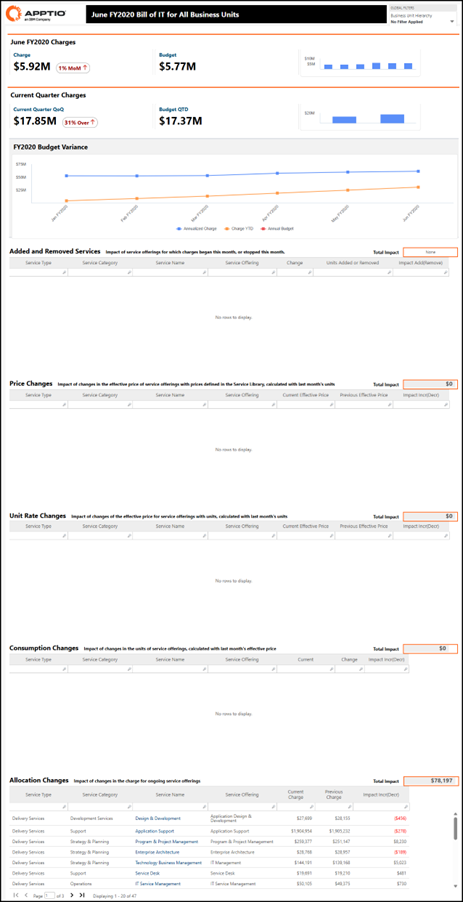

Fig. #: Informe de facturas en el estándar de facturación

**Informe de resumen de facturas**

- Objetivo: Proporciona un resumen de facturación de alto nivel para el período y el alcance seleccionados (ejemplo mostrado: todas las unidades de negocio) que destaca los cargos actuales, los totales del trimestre hasta la fecha y del año hasta la fecha, muestra dónde se concentra la factura (principales servicios y tipos de servicios a lo largo del tiempo) y ofrece un desglose en forma de tabla por servicio, incluyendo unidades, precio efectivo, unidades previstas, cambio en los cargos y variación presupuestaria, con un fácil acceso a la factura detallada cuando se necesita una explicación más profunda.
- Preguntas respondidas:
  - ¿Cuál es el cargo total para el período actual?
  - ¿Cuáles son los totales de cargos QTD y cargos YTD?
  - ¿Cuáles son los principales servicios por cargo mensual actual y cuánto aportan?
  - ¿Cuál es la tendencia de los cargos en los últimos meses por tipo de servicio (entrega, compartido, usuario final, etc.)?
  - Dentro de un tipo de servicio, ¿qué categorías de servicios y servicios componen el gasto?
  - Para un servicio determinado, ¿cuáles son las unidades, la unidad de medida y el precio efectivo que determinan el cargo?
  - ¿Existen unidades planificadas y cómo se comparan las unidades reales (cuando están pobladas)?
  - ¿Qué servicios han experimentado el mayor cambio al alza o a la baja con respecto al periodo anterior (indicador de tendencia en la tabla)?
  - ¿Cuál es el presupuesto, la variación presupuestaria y el porcentaje de variación por servicio (cuando se completa el presupuesto)?
  - ¿Qué servicios son los que más contribuyen al exceso o déficit presupuestario?
  - ¿Dónde debería perforar a continuación para explicar «¿por qué ha cambiado esto?»? (¿A través de «Ver factura detallada»?)
- Usuarios objetivo: Consumidor, alto directivo, propietario de servicio o producto, parte interesada, analista

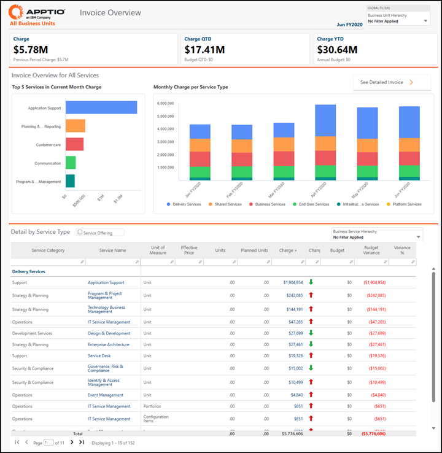

Fig. n.º: Informe de resumen de facturas en Facturación estándar

**Informe detallado de facturas** (también conocido como análisis ad hoc)

- Objetivo: Proporcionar un entorno de trabajo interactivo y específico para facturas que permita a los usuarios pivotar, filtrar y desglosar los cargos entre los servicios y las jerarquías de las unidades de negocio, así como ver las métricas clave de facturación (cargo, unidades, precio efectivo, cargo anualizado, recuento de ofertas de servicios y diferencias con respecto al periodo anterior) para las vistas del mes actual, el trimestre, el año hasta la fecha y el año completo. Es el informe que utilizas para responder a las preguntas «¿qué estoy pagando exactamente, de dónde proviene y qué ha cambiado?» con precisión, sin necesidad de salir del contexto de la factura.
- Preguntas respondidas:
  - ¿Cuáles son mis cargos para el ámbito seleccionado (todas las unidades de negocio, una unidad de negocio, un centro de costes, etc.)? ¿Para el mes actual / trimestre / acumulado anual / anual?
  - ¿Qué tipos de servicios, categorías, servicios u ofertas de servicios componen la factura y cuánto contribuye cada uno?
  - Para cada segmento, ¿cuáles son las unidades, la unidad de medida y el precio efectivo asociados al cargo?
  - ¿Cuál es el cargo anualizado por un servicio o grupo, basado en la tasa de ejecución del período actual?
  - ¿Cuántas ofertas de servicios contribuyen al total?
  - ¿Qué ha cambiado con respecto al periodo anterior?
  - ¿Han cambiado las unidades con respecto al periodo anterior?
  - ¿Qué servicios u organizaciones son los principales impulsores del cambio interperiodal?
  - ¿Cómo se desglosan los cargos según atributos empresariales como la ubicación, la etapa del ciclo de vida, el proceso empresarial, la capacidad empresarial o la importancia crítica para el negocio?
  - ¿En qué se diferencian los cargos cuando se pivota por unidad de negocio, propietario, departamento o centro de costes?
  - Si alguien impugna una factura, ¿puedo aislar la parte exacta de los datos que lo explica (servicio + organización + atributo + período de tiempo)?
- Usuarios objetivo: Consumidor, alto directivo, propietario de servicio o producto, parte interesada, analista

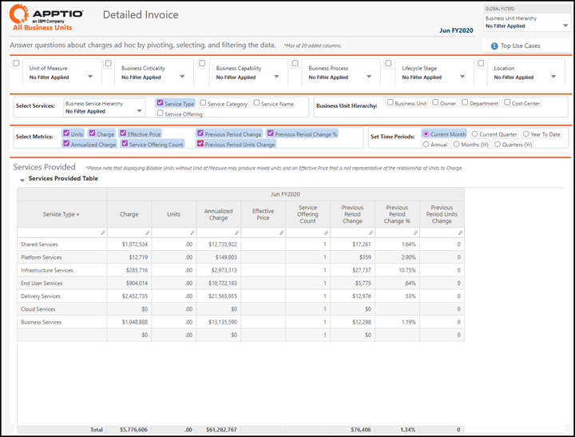

Fig. #: Informe detallado de facturas en el estándar de facturación

**Informe de variación presupuestaria**

Nota: Instalado a través del componente «Variación del plan»

- Objetivo: Proporcionar un único lugar para supervisar cómo se están comportando los gastos reales con respecto al presupuesto y las previsiones para el ámbito seleccionado (ejemplo mostrado: todas las unidades de negocio), mostrar la tendencia a lo largo del ejercicio fiscal e identificar los servicios que generan los mayores excesos o déficits para el mes actual, el trimestre actual o el año hasta la fecha.
- Preguntas respondidas:
  - ¿Cuál es la variación presupuestaria para el período actual y cuál es la variación acumulada en lo que va de año?
  - ¿Cuál es el presupuesto mensual y el presupuesto acumulado hasta la fecha, y cómo se compara con los datos reales?
  - ¿Cuál es el cargo real del mes y cuál es el cargo acumulado en lo que va de año?
  - Durante el año fiscal actual, ¿cómo evolucionan mes a mes los gastos, el presupuesto empresarial y las previsiones empresariales?
  - ¿Estamos tendiendo a superar el presupuesto o a quedarnos por debajo de él, y cuándo comenzó a ampliarse la diferencia?
  - ¿Qué servicios son los principales impulsores de la variación (servicios principales por encima del presupuesto del mes actual)?
  - Para cada servicio, ¿cuáles son el presupuesto, el cargo, la previsión y la variación presupuestaria resultante?
  - ¿Qué servicios tienen la tendencia al alza/a la baja más clara que podría explicar la variación recurrente?
  - ¿Cómo cambian las variaciones al cambiar la perspectiva temporal entre el mes actual, el trimestre actual y el año hasta la fecha?
  - ¿En qué debería centrarme primero para reducir la varianza, basándome en los factores que más contribuyen a ella?
- Usuarios objetivo: Consumidor, alto directivo, propietario de servicio o producto, parte interesada, analista

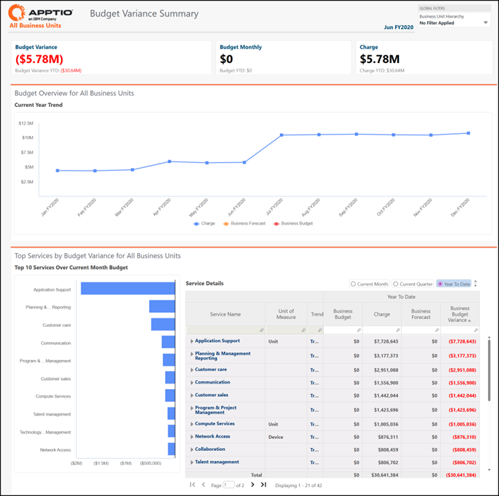

Fig. n.º: Informe de variaciones presupuestarias en la norma de facturación

**Informe de aplicaciones**

Nota: Instalado a través del componente « “BoIT- o de aplicaciones»

- Objetivo: Proporcionar una visión consolidada de los cargos y el uso a nivel de aplicación para que pueda comprender qué aplicaciones generan los cargos de facturación, cómo evolucionan esos cargos a lo largo del tiempo y cómo se desglosa el gasto según las dimensiones comunes de las aplicaciones (jerarquía de servicios, tipo de aplicación, ciclo de vida, jerarquía, propietario del negocio, criticidad del negocio). Es esencialmente «la factura, pero a través de una lente de aplicación», incluyendo detalles detallados por nombre de aplicación.
- Preguntas respondidas:
  - ¿Cuál es el cargo total relacionado con la aplicación para el mes actual y cómo ha cambiado MoM?
  - ¿Qué son los cargos QTD y los cargos YTD para las aplicaciones?
  - ¿Cuántas aplicaciones hay en el ámbito (recuento de aplicaciones) y cuál es el recuento de licencias de aplicaciones (si se ha rellenado)?
  - ¿Qué dominios o agrupaciones de aplicaciones están aumentando o disminuyendo de un período a otro (vista de cambios en el mapa de árbol)?
  - ¿Cuáles son las aplicaciones más utilizadas por cargo y cuál es su evolución a lo largo del tiempo (gráfico de las 5 tendencias principales)?
  - ¿Qué aplicaciones tienen los mayores aumentos o disminuciones de cargos en comparación con el período anterior?
  - Para una solicitud individual, ¿cuáles son las unidades facturables, la unidad de medida y el cargo?
  - ¿Qué propietarios de aplicaciones tienen las tarifas más altas y cuáles son las tarifas que más están cambiando?
  - ¿En qué se diferencian los cargos según el tipo de aplicación, la etapa del ciclo de vida, la importancia para el negocio o la jerarquía de la aplicación?
  - ¿Qué servicios (de la jerarquía de servicios) están asociados a cada aplicación y cuáles son sus tarifas?
  - ¿Dónde tenemos posibles candidatos para revisión basados en combinaciones como alto coste + baja criticidad, o coste creciente + fin del ciclo de vida útil?
- Usuarios objetivo: Consumidor, alto directivo, propietario de servicio o producto, parte interesada, analista

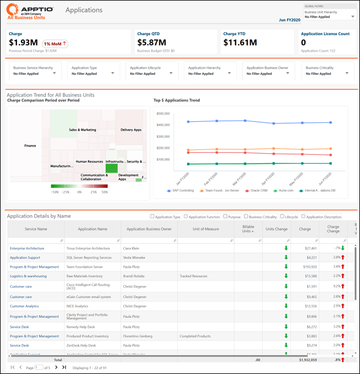

Fig. n.º: Informe de aplicaciones en el estándar de facturación

**Informe sobre la nube**

Nota: Instalado a través del componente « “BoIT- Cloud»

- Objetivo: Proporcionar una visión de la facturación centrada en la nube que compare los cargos brutos de los proveedores de nube con los cargos totales por la prestación de servicios en la nube, y luego desglose ese gasto por servicio, proveedor/línea de productos y dimensiones clave del negocio (jerarquía de servicios, ubicación, criticidad del negocio, ciclo de vida). Está diseñado para ayudarte a ver cuánto cuesta la nube, cuánto facturas/recuentas y qué es lo que impulsa los cambios a lo largo del tiempo.
- Preguntas respondidas:
  - ¿Cuál es el cargo actual por uso de la nube y cuál es su tendencia a lo largo del tiempo?
  - ¿Qué parte del coste de la nube corresponde al cargo del proveedor y qué parte al cargo total de la prestación (el aumento derivado de las asignaciones, los servicios compartidos, los gastos generales, etc.)?
  - ¿Qué servicios en la nube están generando más costes en este momento (desglose de cargos por servicio)?
  - ¿Cómo ha cambiado la diferencia entre el proveedor y el cargo completo en los últimos períodos?
  - ¿Qué tipos de servicio (entrega, compartido, usuario final, etc.)? ¿Qué son los cargos por nube y cuáles son sus tarifas y cambios?
  - Para cada servicio en la nube, ¿cuáles son las unidades asociadas, la unidad de medida, el precio efectivo y el cambio en el cargo?
  - ¿Dónde se concentran los cargos por nube al dividirlos por:
    - Jerarquía de servicios
    - Ubicación
    - Criticidad empresarial
    - Etapa del ciclo de vida
  - ¿Qué proveedores (por ejemplo, AWS, Azure, GCP, etc.)? ¿Dependiendo de sus datos?) ¿Son los que impulsan los cargos?
  - ¿Qué productos/líneas de productos (servicios informáticos, de almacenamiento, de bases de datos, productos de SaaS, etc.)? ¿Están impulsando los cargos de los proveedores?
  - ¿Qué elementos del proveedor muestran el mayor cambio en las unidades o el mayor movimiento en los cargos entre un período y otro?
- Usuarios objetivo: Consumidor, alto directivo, propietario de servicio o producto, parte interesada, analista

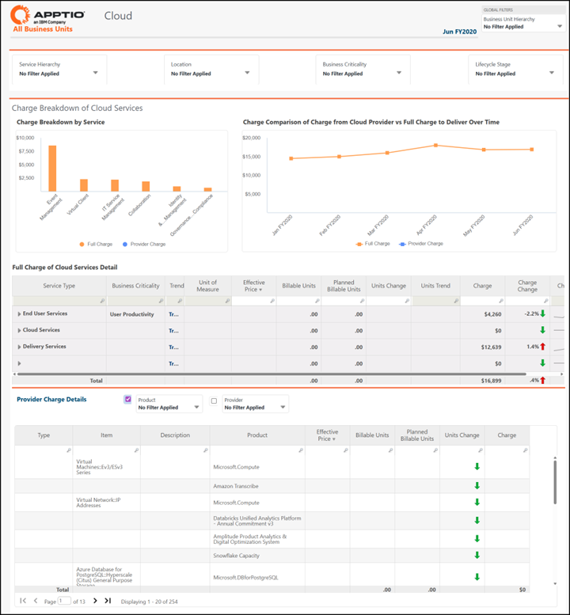

Fig. n.º: Informe de nube en Billing Standard

**Informe de proyectos**

Nota: Instalado a través del componente « “BoIT- Proyectos»

- Objetivo: proporcionar una visión de la facturación centrada en los proyectos para que pueda ver qué proyectos generan gastos, cómo evoluciona el gasto de los proyectos a lo largo del tiempo y cómo se desglosa ese gasto según las dimensiones comunes de los proyectos (jerarquía de servicios, tipo de proyecto, ciclo de vida, iniciativa empresarial, tipo de gasto). Básicamente, se trata de «la factura, pero desde la perspectiva de una cartera de proyectos», con suficiente detalle como para respaldar las revisiones de la cartera y las conversaciones sobre los cargos.
- Preguntas respondidas:
  - ¿Cuál es el cargo total relacionado con el proyecto para el mes actual y cómo ha cambiado MoM?
  - ¿Qué son los cargos QTD y los cargos YTD para los proyectos?
  - ¿Cuántos proyectos hay en el ámbito (y cuántos están activos, si hay alguno)?
  - ¿Cuál es la tendencia general del gasto del proyecto en los últimos períodos?
  - ¿Qué proyectos tienen los cargos más altos en el período actual?
  - ¿Qué proyectos tienen el mayor cambio en los gastos entre períodos (en dólares y en porcentaje)?
  - ¿Cómo es la tendencia reciente de cada proyecto (gráfico de tendencia de 6 períodos)?
  - ¿Cómo se acumulan los cargos por cartera de proyectos / programa / iniciativa empresarial?
  - ¿Qué gestores de proyectos están asociados con los costes más elevados o el crecimiento más rápido?
  - ¿Cómo varían los cargos por proyecto según el tipo de proyecto, el ciclo de vida del proyecto o el tipo de gasto?
  - ¿Qué servicios (de la jerarquía de servicios empresariales) están vinculados a los cargos del proyecto y cuáles son esos cargos?
- Usuarios objetivo: Consumidor, alto directivo, propietario de servicio o producto, parte interesada, analista

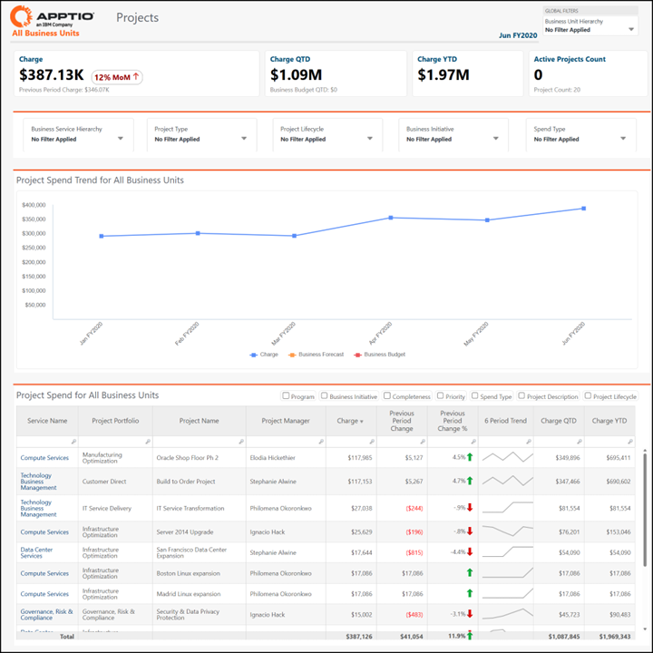

Fig. #: Informe de proyectos en el estándar de facturación

**Informe de la biblioteca de servicios**

- Objetivo: Proporcionar un catálogo oficial y filtrable de servicios facturables/showback y ofertas de servicios, incluyendo sus propietarios (gestor de servicios), precios, unidad de medida y atributos clave de clasificación (jerarquía de servicios, metodología de precios, capacidad empresarial, criticidad empresarial, procesos empresariales, descripciones, fechas de entrada en servicio y retirada). Este es el lugar al que acuden las personas para responder a preguntas como «¿qué servicios ofrecemos?, ¿quién es el propietario de los mismos y cuál es su precio?»
- Preguntas respondidas:
  - ¿Qué servicios y ofertas de servicios existen en el catálogo de facturación?
  - ¿Cómo se organizan los servicios en la jerarquía de la biblioteca de servicios (tipo de servicio, categoría, etc.)?
  - ¿Quién es el gestor de servicios (propietario) de cada servicio u oferta?
  - ¿Cuál es el precio de cada servicio ofrecido?
  - ¿Cuál es la unidad de medida para cada servicio ofrecido (cómo se factura)?
  - ¿Qué servicios utilizan qué metodología de fijación de precios (si se ha rellenado)?
  - ¿Qué servicios se asignan a una determinada capacidad o proceso empresarial?
  - ¿Qué servicios están etiquetados con un determinado nivel de criticidad empresarial?
  - ¿Cuál es la descripción del servicio (y otros campos descriptivos) para cada servicio/oferta?
  - ¿Qué servicios están en funcionamiento y cuáles están retirados o programados para su retirada (en funcionamiento, fechas de retirada)?
  - ¿Hay servicios con datos faltantes o sospechosos (sin propietario, precio de 0 $, sin UoM, sin descripciones) para que podamos corregir el catálogo?
- Usuarios objetivo: Consumidor, alto directivo, propietario de servicio o producto, parte interesada, analista, administrador

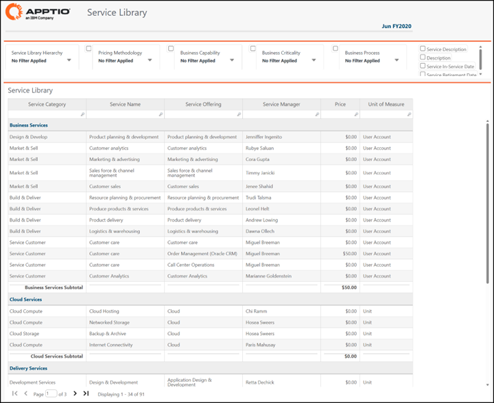

Fig. n.º: Informe de la biblioteca de servicios en el estándar de facturación

## Gerente de Relaciones Comerciales

**Informe resumido de relaciones comerciales**

- Objetivo: Proporcionar una vista única, de estilo ejecutivo, que relacione lo que se cobró, lo que costó la prestación del servicio y cuánto se recuperó de los consumidores, y luego destaque dónde la recuperación es superior o inferior por servicio. Se trata de «¿estamos recuperando lo que gastamos y qué servicios son los culpables?» Panel de control, con tendencias, principales movimientos y detalles analizables.
- Preguntas respondidas:
  - ¿Cuál es el cargo total para el período actual y cómo ha cambiado MoM?
  - ¿Cuál es el costo de prestar esos servicios (actual y acumulado en lo que va del año)?
  - ¿Qué es la variación de recuperación (cargo menos coste), actual y acumulada en el año?
  - ¿Disponemos de un presupuesto empresarial para este ámbito y cuál es el presupuesto acumulado hasta la fecha (si se ha completado)?
  - ¿Qué servicios son los que más rápido crecen MoM en porcentaje?
  - ¿Cuál es la tendencia de los cargos en los últimos 13 periodos por tipo de servicio?
  - ¿Qué servicios están recuperando menos (servicios principales por debajo, variación negativa de la recuperación)?
  - ¿Qué servicios están recuperando en exceso (servicios principales en exceso, variación positiva de la recuperación)?
  - Para un servicio determinado, ¿cuáles son el cargo, el coste, la variación de recuperación y el precio efectivo?
  - Para un servicio determinado, ¿cuáles son las unidades facturables, la unidad de medida y el coste por unidad (si se ha rellenado)?
  - ¿Dónde se encuentran las mayores variaciones presupuestarias (mes actual/trimestre actual/acumulado anual) y qué tipos de servicios las provocan?
  - ¿El problema es principalmente el precio/recuperación (diferencia entre el coste y el precio) o principalmente la gestión presupuestaria (variación presupuestaria)?
- Usuarios objetivo: altos directivos, analistas, administradores

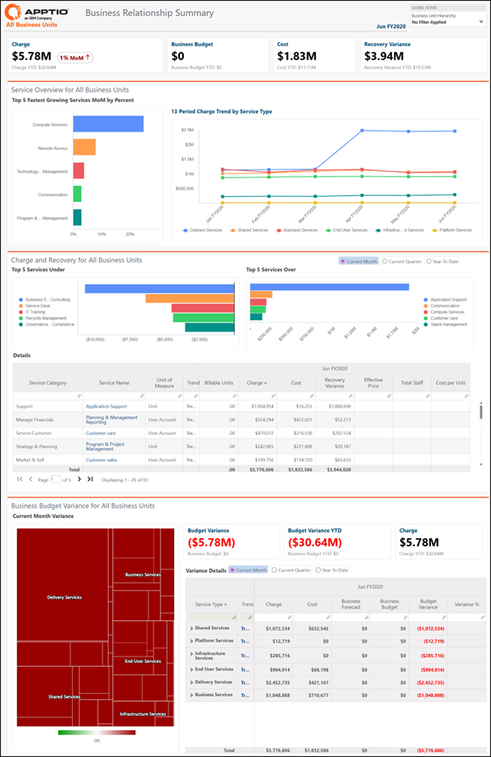

Fig. n.º: Informe resumido de relaciones comerciales en el estándar de facturación

**Informe de recuperación por empresa** (también conocido como recuperación de servicios por empresa)

Nota: Instalado a través del componente « “BoIT- Cost Variance» (Gestión de proyectos: Variación de costes)

- Objetivo: proporcionar una visión centrada en las unidades de negocio del rendimiento de la recuperación comparando los cargos con los costes (y, opcionalmente, con el presupuesto/previsión) a un nivel organizativo seleccionable (unidad de negocio, propietario, departamento, centro de costes), destacando dónde se está recuperando en exceso o por debajo de lo esperado, y proyectando las expectativas de ajuste (crédito/débito) para el resto del año basándose en los patrones acumulados hasta la fecha. Es la cuestión de «¿quién paga frente a quién cuesta, y qué ajuste se avecina?» informe.
- Preguntas respondidas:
  - En el nivel organizativo seleccionado (unidad de negocio/propietario/departamento/centro de costes), ¿en qué áreas estamos recuperando en exceso o en defecto este mes (mapa de variaciones)?
  - Para una determinada porción de la organización, ¿cuáles son los cargos frente a los costes (o los cargos acumulados en el año frente a los costes acumulados en el año)?
  - ¿Qué organizaciones son las que más contribuyen a la variación general de la recuperación (positiva o negativa)?
  - ¿Cómo se presenta la variación de la recuperación en lo que va de año por nivel organizativo seleccionado (línea de tendencia a lo largo del año)?
  - ¿Cuál es el porcentaje recuperado por cada organización (cuánto se recupera a través de los cargos)?
  - ¿Cómo cambian los resultados cuando la métrica principal es Carga frente a Coste frente a Carga acumulada frente a Coste acumulado, y la métrica de comparación es Coste/Presupuesto/Previsión (y sus versiones acumuladas)?
  - Según el comportamiento acumulado en lo que va de año, ¿cuál es el cargo previsto para todo el año y el coste previsto para todo el año por organización?
  - ¿Cuál es el crédito o débito de ajuste previsto por organización (cargo previsto menos coste previsto)?
  - ¿Qué organizaciones tienen un comportamiento mensual constante (buenos candidatos para el método de proyección) frente a las volátiles que pueden necesitar una revisión manual?
  - ¿Cómo cambian los resultados de la recuperación al filtrar por jerarquía de servicios (por ejemplo, solo servicios de entrega o solo servicios en la nube)?
  - ¿Dónde debo profundizar para realizar un análisis más detallado (enlace a la vista detallada de transparencia de costes)?
- Usuarios objetivo: altos directivos, analistas, administradores

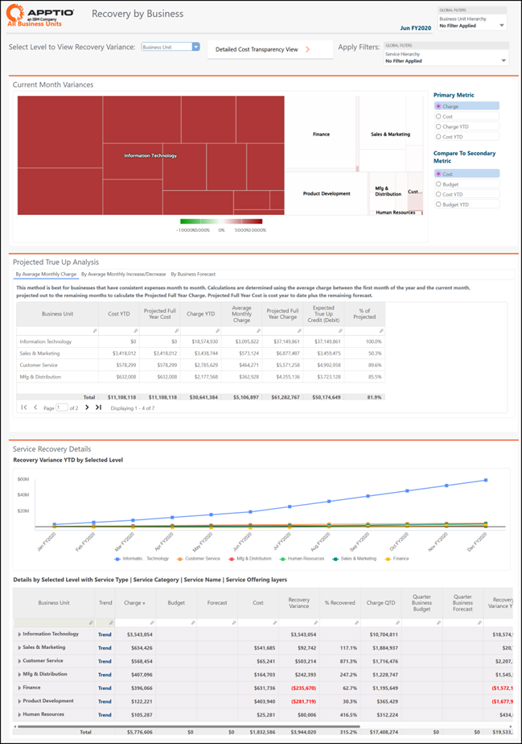

Fig. n.º: Informe de recuperación por negocio en el estándar de facturación

**Informe detallado de recuperación** (también conocido como recuperación de servicio ad hoc)

- Objetivo: Proporcionar un banco de trabajo interactivo y ad hoc para analizar la recuperación, permitiendo a los usuarios pivotar y filtrar cargos, costes, presupuestos, previsiones, unidades y variaciones de recuperación en todas las capas de la jerarquía de servicios y los niveles de la jerarquía de unidades de negocio, para múltiples perspectivas temporales (vistas del mes actual, trimestre, acumulado anual, anual y multipériodo). Es el informe que se utiliza cuando alguien pregunta: «¿Estamos recuperando nuestros costes? ¿Dónde estamos fallando exactamente y qué lo está provocando?»
- Preguntas respondidas:
  - Para el alcance seleccionado, ¿cuáles son los cargos frente a los costes y cuál es la variación de recuperación resultante?
  - ¿Qué servicios (por tipo de servicio, categoría, nombre, oferta) son los principales factores que provocan una recuperación insuficiente o excesiva?
  - ¿En qué nivel organizativo (unidad de negocio, propietario, departamento, centro de costes) estamos recuperando menos o más de lo debido, y en qué medida?
  - ¿Cuál es el porcentaje de recuperación implícito en la relación entre la carga y el coste para una porción determinada (carga dividida por coste)?
  - ¿Cómo cambian los resultados de la recuperación al filtrar por atributos como la importancia crítica para el negocio, la capacidad empresarial, el proceso empresarial, la etapa del ciclo de vida o la unidad de medida (cuando se rellena)?
  - Para cada segmento, ¿cuáles son las unidades y las unidades facturables previstas, y su tendencia explica las diferencias en la recuperación?
  - ¿Cómo se comparan el presupuesto y la previsión con los datos reales para la misma porción (y cuál es la variación del presupuesto empresarial)?
  - ¿Cómo se presenta la recuperación a lo largo del tiempo: mes actual frente a trimestre actual frente a acumulado anual, o a lo largo de meses (año) / trimestres (año)?
  - Si una unidad de negocio impugna la recuperación o el ajuste, ¿puedo aislar la combinación exacta de servicio + organización + atributo + tiempo que explica la variación?
- Usuarios objetivo: altos directivos, analistas, administradores

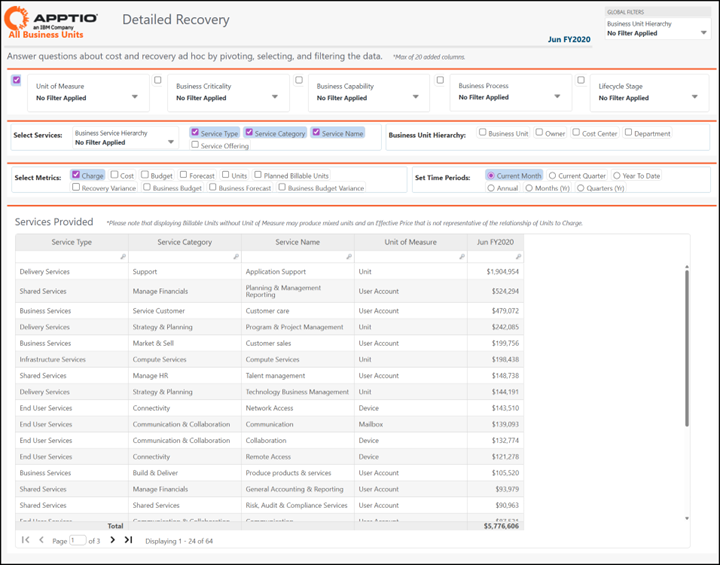

Fig. #: Informe detallado de recuperación en la norma de facturación

**Informe de distribución** (también conocido como «Gestionar y enviar facturas»)\*

- Objetivo: Proporcionar una consola operativa para distribuir facturas por correo electrónico para el período de facturación seleccionado, mostrando quién recibirá cada factura, el mensaje predefinido que se enviará y el estado del envío. Básicamente, es la parte del proceso de facturación mensual que consiste en «pulsar el botón, comprobar que se ha enviado y volver a enviarlo si es necesario».
- Preguntas respondidas:
  - ¿Qué facturas están en cola para ser enviadas por correo electrónico en este periodo de facturación (por unidad de negocio, departamento, ubicación, etc.)?
  - ¿A quién se envía cada factura (dirección de correo electrónico del destinatario)?
  - ¿Qué mensaje se incluirá en el correo electrónico para cada factura?
  - ¿Qué facturas no se han enviado y cuáles se han enviado (seguimiento del estado)?
  - Puede indicar operativamente: lo que aún está pendiente si oculto lo enviado y me centro en lo que queda.
  - ¿Puedo encontrar rápidamente un artículo de distribución de facturas específico (búsqueda)?
  - ¿Puedo enviar todos los correos electrónicos a la vez o enviarlos de forma selectiva (mediante los controles de acción)?
  - Después del envío, ¿a qué destinatarios puedo demostrar que han recibido un intento de envío del sistema (a través del estado)?
- Orientación adicional:
  - Las personas que pueden recibir una factura se introducen en la tabla Lista de destinatarios de facturas. Considere mantener la lista en un archivo Excel y cargarla según sea necesario.
  - Para incluir un mensaje global, un encabezado y un pie de página en todas las facturas, añada una entrada en los siguientes campos de la tabla Mensajes de facturas por correo electrónico:
    - Mensaje global (que aparece en la parte superior de cada factura, además del encabezado)
    - Mensaje de encabezado predeterminado (se muestra en la parte superior de cada factura si el campo del mismo nombre no está definido en la tabla Lista de facturas del destinatario)
    - Mensaje predeterminado del pie de página (se muestra en la parte superior de cada factura si el campo del mismo nombre no está definido en la tabla Lista de facturas del destinatario).
- Usuarios objetivo: Administrador, Analista

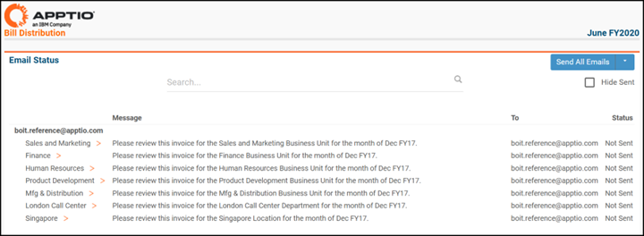

Fig. n.º: Informe de distribución en el estándar de facturación

## Proveedor de servicios

**Informe resumido del proveedor de servicios de TI**

- Objetivo: Proporcionar una visión del proveedor de servicios sobre la facturación que resuma los cargos, los costes, el presupuesto y la variación de la recuperación en toda la cartera de servicios (la perspectiva de «TI como proveedor»), destaque los servicios en tendencia y los que más se mueven, y revele dónde los servicios están recuperando en exceso o por debajo de lo previsto y superando o quedando por debajo del presupuesto a nivel de servicio, categoría y oferta.
- Preguntas respondidas:
  - ¿Cuál es el cargo total por todos los servicios de este periodo y cómo ha cambiado MoM?
  - ¿Cuál es el coste total de la prestación de todos los servicios (actual y acumulado en lo que va de año)?
  - ¿Qué es la variación total de recuperación (cargo menos coste), actual y acumulada en el año?
  - ¿Cuál es el presupuesto total (y el presupuesto acumulado en lo que va de año), y estamos por encima o por debajo del presupuesto (si se ha rellenado)?
  - ¿Qué servicios son los que más rápido crecen MoM en porcentaje?
  - ¿Cuál es la tendencia de los cargos en los últimos 13 periodos por tipo de servicio (entrega, compartido, usuario final, etc.)?
  - ¿Qué servicios son los principales factores de recuperación insuficiente (servicios con mayor déficit)?
  - ¿Qué servicios son los principales impulsores de la recuperación excesiva (servicios principales)?
  - Para cada servicio en detalle, ¿cuáles son las unidades facturables, el precio efectivo, el coste por unidad, el cargo, el coste y la variación de recuperación?
  - ¿Qué tipos/categorías/ofertas de servicios están provocando la variación entre los gastos previstos y los reales y la variación entre los costes previstos y los reales (diagrama de árbol + tabla)?
  - ¿El problema de la recuperación se debe al coste (aumento del coste) o al precio/tarifa (la tarifa no se ajusta al coste)?
- Usuarios objetivo: Propietario del servicio o producto, parte interesada, alto directivo, analista, administrador

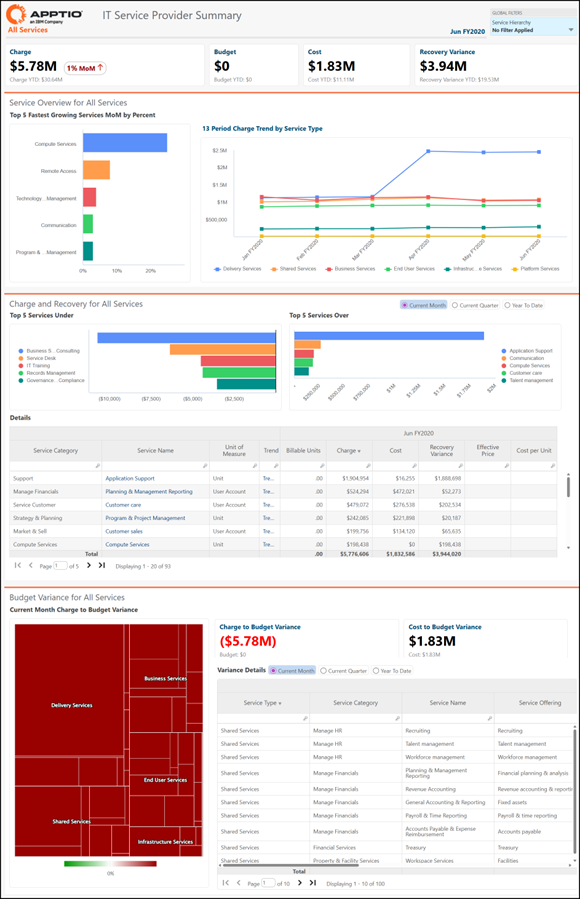

Fig. n.º: Informe resumido del proveedor de servicios de TI en el estándar de facturación

**Informe de análisis de recuperación** (también conocido como análisis de recuperación del servicio)

Nota: Instalado a través del componente « “BoIT- Cost Variance» (Gestión de proyectos: Variación de costes)

- Objetivo: Proporcionar una visión centrada en la salud de la recuperación de la cartera de servicios mostrando cómo se comparan los cargos con los costes (y, opcionalmente, con el presupuesto/previsión), cómo evoluciona la variación de la recuperación (mes actual frente a acumulado del año fiscal), dónde se concentra la recuperación por unidad de negocio y en qué medida los ajustes influyen en la factura. Es el panel de control para responder a las preguntas: «¿Estamos recuperando lo que gastamos? ¿Dónde estamos fallando? ¿Estamos mejorando o empeorando?»
- Preguntas respondidas:
  - ¿Cuáles son los totales actuales de cargo, coste, presupuesto y variación de recuperación (y sus valores acumulados en el año)?
  - ¿Estamos recuperando en exceso o en defecto en general, y en qué medida?
  - ¿Cuál es la tendencia de la variación de la recuperación a lo largo del año fiscal, para el mes actual y el acumulado del año?
  - ¿Qué servicios son los que más rápido crecen MoM en porcentaje (alerta temprana de presión de recuperación)?
  - ¿Dónde se concentra la recuperación por unidad de negocio (cargo del mes actual frente al mapa de árbol de costes)?
  - ¿Qué unidades de negocio generan más costes y cuáles generan más variaciones en la recuperación (tabla con el % de los costes)?
  - A nivel de servicio, ¿qué ofertas de servicio tienen el coste más elevado y cómo se comparan el presupuesto y la previsión (tabla de detalles de recuperación del servicio)?
  - ¿Qué servicios tienen los mayores ajustes y qué porcentaje del coste total se debe a los ajustes?
  - Si los ajustes están provocando variaciones en la recuperación, ¿qué servicios deberían revisarse primero en cuanto a la política de precios/ajustes?
  - ¿Dónde debo profundizar para obtener un seguimiento más detallado de los costes (enlace a la vista detallada de transparencia de costes)?
- Usuarios objetivo: Propietario del servicio o producto, parte interesada, alto directivo, analista, administrador

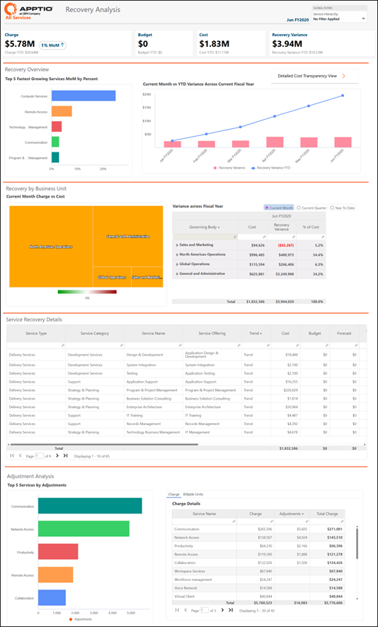

Fig. n.º: Informe de análisis de recuperación en la norma de facturación

**Análisis de la tasa unitaria reportNotice: Instalado a través del componente « “BoIT- Units»**

- Objetivo: proporcionar una vista de la facturación por unidad de medida que realice un seguimiento del coste por unidad frente al cargo por unidad a lo largo del tiempo, de modo que se pueda evaluar la economía por unidad, la estabilidad de las tarifas y el rendimiento de la recuperación para las unidades de consumo clave (cuentas, buzones de correo, dispositivos, equipos de escritorio, etc.). Ayuda a determinar si las tarifas unitarias están fijadas adecuadamente, si se están desviando o si están generando un exceso o un déficit de recuperación, y vincula esas tarifas unitarias con el presupuesto, las previsiones y las unidades planificadas.
- Preguntas respondidas:
  - Para una unidad de medida seleccionada, ¿cómo han evolucionado el coste por unidad y el cargo por unidad a lo largo del tiempo?
  - ¿La diferencia entre el precio por unidad y el coste por unidad está aumentando o disminuyendo (presión de recuperación)?
  - ¿Cuál es el coste unitario medio actual y la tendencia del coste unitario es al alza o a la baja?
  - ¿Qué unidades de medida tienen el mayor coste por unidad o el mayor cargo por unidad en este momento?
  - Para cada unidad de medida, ¿cuáles son las unidades facturables y cómo se comparan con las unidades facturables previstas?
  - ¿Cuál es la variación de recuperación por unidad (sobre/subrecuperación por unidad) por unidad de medida?
  - ¿Cuál es el presupuesto por unidad y la previsión por unidad, y cómo se comparan con el coste y el cargo reales por unidad?
  - ¿Qué unidades muestran cambios anormales mes a mes que sugieren una actualización de precios, un cambio en la asignación o un problema con los datos?
  - ¿Debería ajustarse la tarifa de una oferta de servicio específica con precio por unidad (como «Cuenta de usuario» o «Buzón») en función de la economía unitaria sostenida?
- Usuarios objetivo: Propietario del servicio o producto, parte interesada, alto directivo, analista, administrador

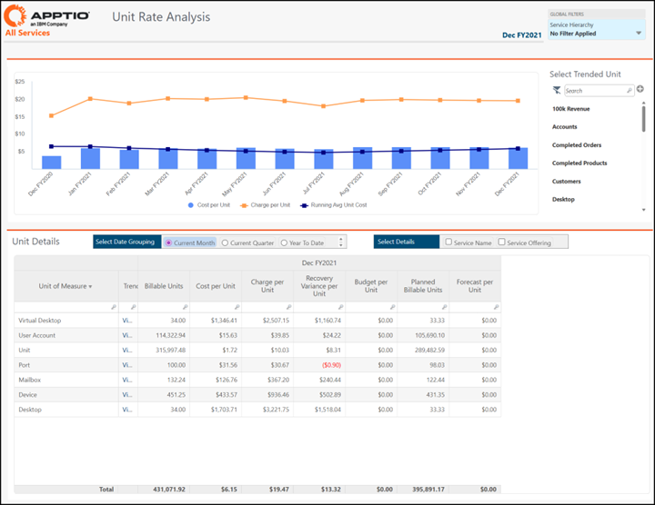

Fig. n.º: Informe de análisis de tarifas unitarias en la norma de facturación

**Informe de recuperación de aplicaciones**

Nota: Instalado a través del componente « “BoIT- o de aplicaciones»

- Objetivo: Proporcionar una visión de la recuperación centrada en las aplicaciones que compare los gastos con los costes de las aplicaciones (y sus servicios relacionados), destaque las tendencias de variación de la recuperación a lo largo del tiempo y ponga de manifiesto las aplicaciones que provocan una recuperación excesiva o insuficiente. Está diseñado para responder a las preguntas «¿estamos recuperando lo que cuesta proporcionar/operar esta aplicación y qué está cambiando?» Conversaciones, con filtros para atributos de aplicaciones y propietarios, y un enlace de desglose a una vista detallada de los costes.
- Preguntas respondidas:
  - ¿Cuál es el cargo total por solicitud para el período actual y cómo ha cambiado MoM?
  - ¿Qué son los cargos QTD y los cargos YTD para las aplicaciones?
  - ¿Cuál es la variación presupuestaria (actual y acumulada en el año) para los gastos de solicitud (cuando se completa el presupuesto)?
  - ¿Qué aplicaciones contribuyen más a la variación mensual de la recuperación (las 5 principales + gráfico de tendencias por encima/por debajo)?
  - ¿La recuperación de aplicaciones está mejorando o empeorando con el tiempo, y qué aplicaciones impulsan esta tendencia?
  - Para una aplicación específica (o fragmento de aplicación), ¿cuáles son las unidades facturables y la unidad de medida que respaldan el cargo?
  - Para cada aplicación, ¿cuáles son el coste, el cambio en el coste, el cargo, el cambio en el cargo y la variación en la recuperación resultante?
  - ¿Qué aplicaciones muestran un aumento de los costes sin un cargo equivalente, lo que indica una recuperación insuficiente emergente?
  - ¿Cómo varía la recuperación según el propietario de la aplicación (quién es responsable del problema de recuperación)?
  - ¿Cómo cambian los resultados al filtrar por tipo de aplicación, ciclo de vida, jerarquía o importancia crítica para el negocio?
  - ¿Qué servicios están vinculados a cada aplicación y cómo influyen en el resultado de la recuperación de la aplicación?
  - ¿Dónde debo perforar a continuación para validar las asignaciones y los factores de coste (enlace a la vista detallada de transparencia de costes)?
- Usuarios objetivo: Propietario del servicio o producto, parte interesada, alto directivo, analista, administrador

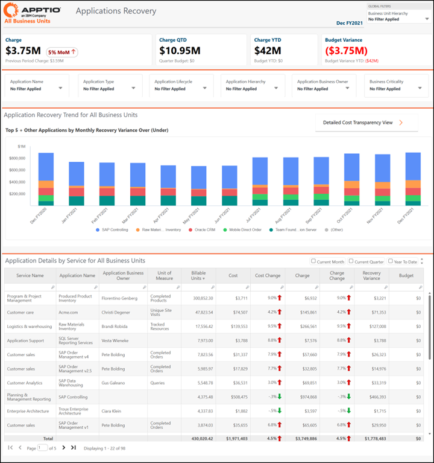

Fig. n.º: Informe de recuperación de aplicaciones en el estándar de facturación

**Informe de recuperación en la nube**

Nota: Instalado a través del componente « “BoIT- Cloud»

- Objetivo: Proporcionar una vista específica de la nube en cuanto a recuperación y transparencia que le permita analizar los cargos por consumo de los proveedores de nube pública (y la recuperación relacionada) según dimensiones clave de la nube, como el proveedor, el producto, la ubicación, el tipo de instancia y la jerarquía de servicios, con la capacidad de analizar tendencias y desglosar los cargos a lo largo del tiempo, así como inspeccionar los detalles subyacentes de cada partida.
- Preguntas respondidas:
  - ¿Qué consumo de proveedores de servicios en la nube se incluye en el ámbito para el período y la organización seleccionados (a través de la jerarquía de unidades de negocio)?
  - ¿Cómo se desglosan los cargos por servicios en la nube según una dimensión seleccionada (por ejemplo, ubicación, proveedor, producto o tipo de instancia)?
  - ¿Cómo evolucionan los cargos por la avería seleccionada a lo largo del tiempo (comparación de cargos a lo largo del tiempo)?
  - ¿Qué combinaciones específicas de ubicación + producto + proveedor + tipo + artículo están generando cargos?
  - ¿Existen factores inesperados «nuevos» o «puntuales» que influyen en los costes de la nube cuando se cambian los filtros (proveedor/producto/tipo de instancia)?
  - ¿Cómo cambian los cargos por uso de la nube cuando se filtra a una agrupación específica de jerarquías de servicios en la nube?
  - ¿Qué productos o servicios en la nube parecen no tener consumo/cargos (señal de calidad de datos cuando los gráficos muestran ceros)?
  - ¿Cuál es la descripción detallada de las partidas del proveedor que se encuentran detrás de las vistas resumidas de los cargos?
- Usuarios objetivo: Propietario del servicio o producto, parte interesada, alto directivo, analista, administrador

**Proyectos Informe de recuperación**

Nota: Instalado a través del componente « “BoIT- Proyectos»

- Objetivo: Proporcionar una visión de la recuperación centrada en los proyectos que compare los costes de los proyectos con los gastos de los mismos y destaque la recuperación insuficiente y excesiva por proyecto y por los servicios que financian dichos proyectos. Se utiliza para responder a las siguientes preguntas: «¿Qué proyectos estamos subvencionando (o de los que estamos obteniendo beneficios), cuál es la tendencia y qué proyectos o carteras de proyectos debemos ajustar, detener o revalorizar?»
- Preguntas respondidas:
  - ¿Cuáles son los totales actuales del coste del proyecto, el cargo del proyecto, el presupuesto y la variación de recuperación (y sus valores acumulados hasta la fecha)?
  - ¿Los proyectos están recuperando menos o más de lo debido, y en qué medida?
  - ¿Cómo evolucionan los gastos y los costes del proyecto a lo largo del tiempo (mes a mes)?
  - ¿Qué proyectos presentan las mayores brechas de recuperación (mayor recuperación insuficiente o recuperación excesiva)?
  - ¿Qué carteras de proyectos están generando más recuperación insuficiente o recuperación excesiva?
  - Para un proyecto determinado, ¿quién es el director del proyecto y cuál es su estado (general, calendario, alcance), junto con el resultado de la recuperación?
  - ¿Cómo varía la recuperación según el tipo de proyecto, el ciclo de vida, la iniciativa empresarial o el tipo de gasto?
  - ¿Qué servicios están asociados con la recuperación del proyecto (vista Recuperación del proyecto por servicio) y cuáles son su cargo, coste, variación de recuperación y porcentaje de recuperación?
  - ¿Contribuyen los problemas presupuestarios (variación presupuestaria y porcentaje de variación presupuestaria) cuando se rellena el presupuesto?
  - ¿Dónde debo perforar a continuación para validar las asignaciones y los factores de coste (enlace a la vista detallada de transparencia de costes)?
- Usuarios objetivo: Propietario del servicio o producto, parte interesada, alto directivo, analista, administrador

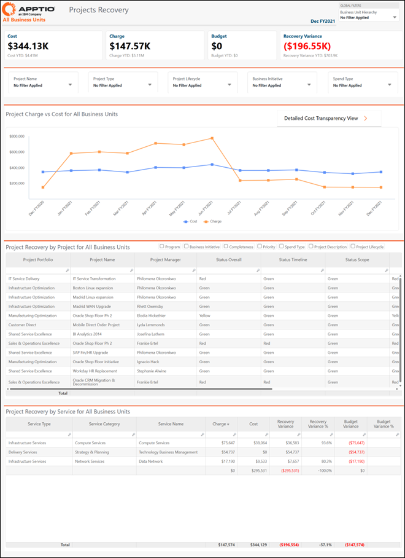

Fig. n.º: Informe de recuperación de proyectos en la norma de facturación

**Informe sobre precios de transferencia entre empresas y cargos cruzados**

Nota: Instalado a través del componente « “BoIT- Inter Company Transfer Pricing» (Gestión de la transferencia de precios entre empresas)

- Objetivo: Proporcionar visibilidad sobre los cargos modificados creados por las normas de precios de transferencia y los cargos cruzados, de modo que los responsables financieros y tecnológicos puedan comprender qué parte de la factura se ajusta en función de las necesidades contables de las entidades jurídicas y las ubicaciones (por ejemplo, impuestos, liquidaciones entre empresas y cargos cruzados internos), y cómo evolucionan esos ajustes a lo largo del tiempo.
- Preguntas respondidas:
  - ¿Cuánto cargo existe antes de cualquier ajuste en los precios de transferencia?
  - ¿Cuál es el importe del precio de transferencia y los impuestos que se aplican al precio de transferencia?
  - ¿Cuál es el cargo modificado después de los precios de transferencia y cuál es el cargo modificado acumulado en lo que va del año?
  - ¿Qué entidades jurídicas generan precios de transferencia e impuestos, y en qué cuantías?
  - ¿Cómo han evolucionado los cargos modificados entre empresas durante los últimos 13 meses?
  - ¿Cómo cambian los resultados al filtrar por ubicación del proveedor, gestor de servicios o nombre del servicio?
  - ¿Qué servicios o gestores de servicios son los principales impulsores de los cargos modificados entre empresas?
  - ¿Qué importe de precio de transferencia + impuestos se aplica en el nivel interno seleccionado (por ejemplo, por entidad jurídica o ubicación)?
  - ¿Cómo han evolucionado los cargos modificados dentro de la empresa durante los últimos 13 meses por unidad de negocio u otro nivel seleccionado?
  - ¿Qué unidades de negocio (u otro nivel seleccionado) están impulsando la mayor actividad de cargos cruzados?
  - ¿Los cargos cruzados son estables mes a mes o hay picos que sugieren cambios en las políticas o en la asignación?
  - Para un nombre de servicio determinado, ¿qué parte de sus cargos se modifica mediante la lógica de cargos cruzados?
- Usuarios objetivo: Analista, Administrador

\* Accesible desde el informe de inicio, pero forma parte de la recopilación de informes «Calidad de los datos de facturación».

A excepción del informe «Distribución», se puede acceder al resto de informes de la colección «Calidad de los datos de facturación» a través de TBM Studio. Otros informes de la colección de informes «Calidad de los datos de facturación» son:

**Informe resumido de configuración**

- Objetivo: Realiza comprobaciones clave en todo el proceso de publicación mensual de facturación, actualidad de los datos, calidad de los datos, calidad del modelo y distribución, de modo que el operador pueda confirmar rápidamente que el modelo está listo para su publicación, detectar problemas y solucionarlos antes de que se envíen las facturas.
- Preguntas respondidas:
  - ¿Cumplen mis reglas de actualidad de datos, o hay algo obsoleto o que falte para este periodo?
  - ¿Qué comprobaciones de frescura no tienen resultados o están fallando?
  - ¿Tengo que revisar el feed de consumo antes de publicarlo? ¿Cuántas filas hay?
  - ¿Tengo que revisar la biblioteca de servicios antes de publicar? ¿Cuántas filas hay?
  - ¿Qué factura tuvo el mayor cambio porcentual en el cargo este mes y cuál fue el importe/porcentaje del cambio?
  - ¿Tengo cargos netos no asignados (cosas no asignadas o no recuperables) y a cuánto ascienden?
  - ¿Las facturas están configuradas para distribuirse y cuántos nombres de facturas aparecen en la lista de facturas de los destinatarios?
  - ¿Existe actualmente un conjunto de mensajes globales que aparecerá con las facturas distribuidas?
- Usuarios objetivo: Administrador, Analista

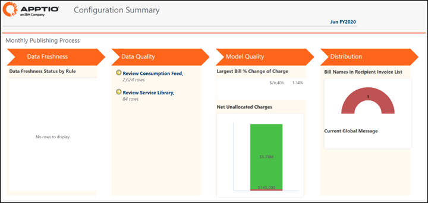

Fig. n.º: Informe resumen de configuración en el estándar de facturación

**Informe sobre la actualidad de los datos**

- Objetivo: Inventar los conjuntos de datos que alimentan el modelo y mostrar si cada uno de ellos es lo suficientemente reciente para el ciclo de facturación actual, basándose en la fecha de la última actualización y en las reglas de vigencia o caducidad configuradas, de modo que se puedan detectar los datos obsoletos antes de publicar y distribuir las facturas.
- Preguntas respondidas:
  - ¿Cuándo se actualizó por última vez?
  - ¿De qué tipo es (datos API frente a tabla editable) y qué categoría admite?
  - ¿Cuál es el sistema de origen (por ejemplo, XLSX, Apptio, etc.)?
  - ¿Existe una regla de frescura y cuál es?
  - ¿Cuál es su fecha de caducidad? ¿Está configurado para no caducar nunca?
  - ¿El conjunto de datos ha caducado en este momento?
  - ¿Se ha actualizado en el mes actual?
  - ¿Hay algún conjunto de datos pendiente de aprobación?
  - ¿Cuál es el recuento de filas? ¿Parece sospechosamente bajo o alto en comparación con las expectativas?
- Usuarios objetivo: Administrador, Analista

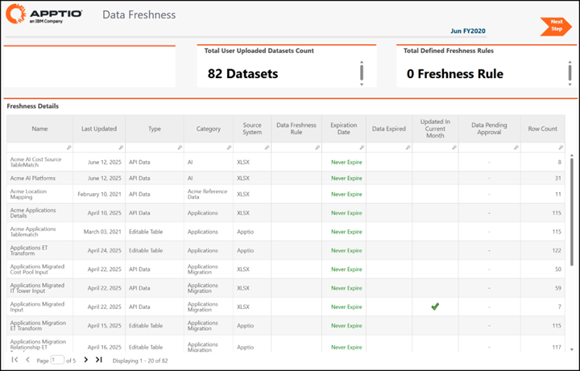

Fig. n.º: Informe sobre la actualidad de los datos en la norma de facturación

**Informe sobre la calidad de los piensos para consumo**

- Objetivo: Ayuda a los administradores a validar que los registros de consumo que generan unidades facturables y cargos sean estructuralmente correctos antes de que se publiquen o distribuyan las facturas, específicamente mediante la supervisión de la estabilidad del volumen de suministro, la coherencia de las unidades de medida y si faltan o no se han publicado campos clave (lo que puede dar lugar a tarifas erróneas, unidades mezcladas o facturas confusas).
- Preguntas respondidas:
  - ¿El consumo ha cargado la cantidad de datos prevista este mes? (tendencia del recuento de filas en los últimos 13 períodos)
  - ¿Hay picos o caídas en el volumen de consumo que sugieran la pérdida de un archivo, una carga duplicada o una ruptura en la asignación?
  - ¿Se están reportando las unidades facturables en la unidad de medida correcta para cada servicio?
  - ¿En qué aspectos difieren la unidad de medida «Servicios empresariales» y la unidad de medida «Consumo»?
  - ¿Qué servicios y ofertas de servicios presentan discrepancias en las unidades de medida que podrían generar tarifas o cargos efectivos incorrectos?
  - ¿Qué registros están fallando en la validación en este momento (indicadores de estado) y cuál es el impacto (cargos, unidades facturables)?
  - ¿Hay algún campo sin publicar o que falte que impida que se muestren los detalles esperados de la factura?
  - ¿El porcentaje de campos no publicados está aumentando (una degradación de la calidad a cámara lenta)?
  - ¿Qué ID/registros de servicio específicos se ven afectados para que pueda enviar las correcciones al propietario adecuado (gestor de servicio, propietario de los datos)?
- Usuarios objetivo: Administrador, Analista

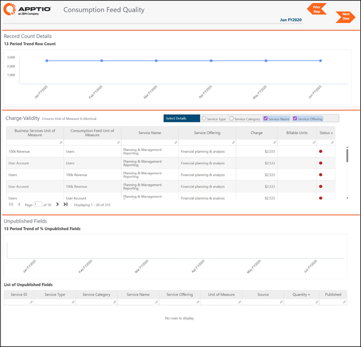

Fig. n.º: Informe sobre la calidad de la alimentación en la norma de facturación

**Informe de calidad de la biblioteca de servicios**

- Objetivo: comprueba que la jerarquía de servicios sea estructuralmente válida y que los campos de servicio requeridos estén completos, de modo que Billing Standard pueda calcular precios y unidades de forma coherente, agrupar los servicios correctamente y generar facturas claras y justificables (sin servicios huérfanos, sin relaciones rotas, sin metadatos requeridos faltantes).
- Preguntas respondidas:
  - ¿Todos los servicios tienen relaciones 1:1 válidas en todas las capas de la jerarquía de servicios (ID de servicio, nombre de servicio, oferta de servicio), o hay duplicados/huérfanos?
  - ¿Qué ID de servicio tienen errores de relación y cuántos errores hay por ID de servicio?
  - ¿Hay algún campo obligatorio sin rellenar en alguno de los registros de servicio?
  - ¿Cuántos campos en blanco hay por campo obligatorio (ID del servicio, unidad de medida, tipo de servicio, categoría de servicio, oferta de servicio, nombre del servicio, descripción)?
  - ¿Qué registros de servicio específicos tienen campos obligatorios que faltan, para que pueda corregirlos (y quién es su propietario)?
  - ¿Hay servicios que no se publicarán o que provocarán imprecisiones en la facturación debido a la falta de identificadores clave o de información de facturación ( UoM )?
  - ¿Tenemos definiciones de servicio inconsistentes que podrían fragmentar los informes, como el mismo nombre de servicio vinculado a múltiples ofertas de forma incorrecta (o viceversa)?
  - ¿Estamos tendiendo hacia una «muerte por mil cortes» en la higiene del servicio (aumento del número de errores mes a mes, si se observa la tendencia en otros ámbitos o mediante revisiones repetidas)?
- Usuarios objetivo: Administrador, Analista

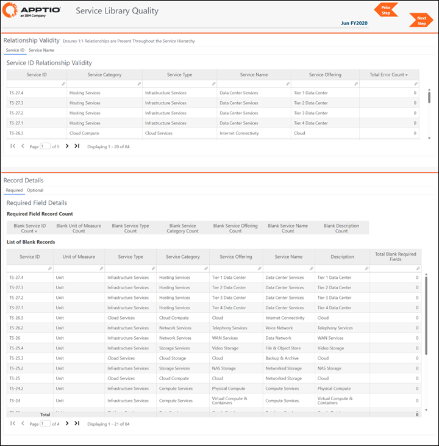

Fig. n.º: Informe de calidad de la biblioteca de servicios en la norma de facturación

**Informe sobre la calidad del modelo**

- Objetivo: muestra si su modelo de asignación está funcionando correctamente: si los cargos, los costes, los presupuestos, las previsiones y las unidades se están asignando a los objetos correctos con un mínimo de importes sin asignar, y si hay alguna fluctuación inesperada de un mes a otro que deba investigarse antes de publicar las facturas.
- Preguntas respondidas:
  - ¿Qué proporción de mis datos está asignada frente a la no asignada (y está mejorando o empeorando con el tiempo)?
  - ¿Qué objeto está perdiendo valor (mayor cargo, coste, presupuesto, previsión o unidades sin asignar)?
  - ¿Cuál es el porcentaje asignado por objeto y qué objetos están por debajo del umbral aceptable?
  - ¿Han cambiado los importes no asignados con respecto al último periodo y en qué medida?
  - ¿Qué asignaciones configuradas específicas están impulsando el modelo y qué están haciendo (objeto de origen, objeto de destino, método, filtros, estrategia, valor)?
  - ¿Hay alguna asignación que se comporte como una trampa de «No asignar hacia arriba», dejando cargos sin asignar debido a la falta de asignaciones de referencia?
  - ¿Por dónde debo empezar a solucionar el problema, basándome en el objeto que tiene el valor más sin asignar?
  - ¿Qué servicios tienen la mayor variación mensual en los cargos (mayor variación porcentual absoluta)?
  - ¿Se trata de una gran variación provocada por un cambio real o por un problema de modelado/configuración, según la tabla detallada « MoM » (cargo actual frente a cargo anterior, variación absoluta)?
  - ¿Las mayores variaciones se concentran en un tipo/categoría/oferta de servicio específico, lo que sugiere un problema sistémico (como un cambio en la fuente de datos o una interrupción en la asignación)?
- Usuarios objetivo: Administrador, Analista

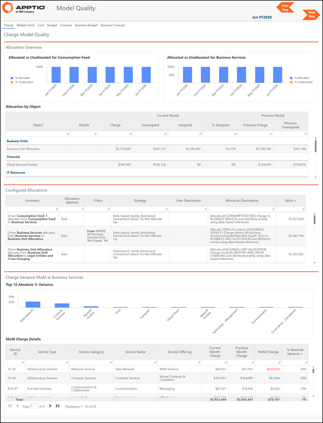

Fig. n.º: Informe de calidad del modelo en el estándar de facturación
