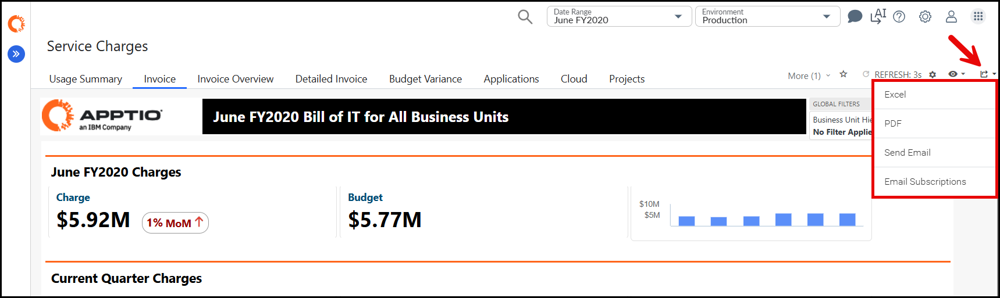

# Tareas comunes de los informes y patrones de uso

Independientemente de la edición, los usuarios suelen realizar las mismas acciones básicas en los informes de facturación. Esta subsección se centra en los patrones más que en controles específicos de la interfaz de usuario.

## Filtrado y enfoque

Tareas comunes:

- Filtrar a un solo período o a un rango pequeño de períodos.
- Filtrar por un consumidor específico (por ejemplo, una unidad de negocio).
- Filtrar por una oferta o servicio específico.
- Combinar filtros (por ejemplo, un consumidor y un servicio a lo largo de tres meses).

Consejos de uso:

- Empiece por lo general y luego vaya reduciendo el ámbito de interés a medida que surjan preguntas.
- Guarde las combinaciones de filtros que utilice con frecuencia si la interfaz admite vistas guardadas o marcadores.

## Desglose y trazabilidad

Los usuarios a menudo necesitan profundizar desde un resumen hasta los detalles:

- Desde el cargo total por consumidor hasta la lista de servicios que generan ese cargo.
- Desde el total del servicio hasta las partidas subyacentes o el desglose a nivel de dominio (por ejemplo, cuentas en la nube, aplicaciones o dispositivos).
- Desde una perspectiva del periodo actual hasta periodos anteriores para comprender las tendencias.

Consejos de uso:

- Utilice acciones de simulación para evitar exportaciones innecesarias.
- Para investigaciones repetidas (por ejemplo, siempre perforando en un servicio concreto), considere documentar esa ruta en los procedimientos locales o en la formación interna.

## Comparación de períodos

Los informes de facturación se utilizan con frecuencia para responder a la pregunta «¿qué ha cambiado este mes?»

Enfoques típicos:

- Utilizar columnas comparativas en el mismo informe:
  - Período actual frente al período anterior.
  - Periodo actual frente al mismo periodo del año anterior.
- Utilice vistas de gráficos o tablas que muestren varios periodos en el mismo eje.
- Exportar dos periodos y compararlos externamente cuando sea necesario.

Consejos de uso:

- Céntrate en los movimientos significativos por valor o por porcentaje, no en los pequeños ruidos.
- Utilice la facturación en combinación con el cálculo de costes cuando los cambios se deban a modificaciones en el modelo de costes subyacente.

## Exportación de datos

Las exportaciones se utilizan para:

- Análisis local (hojas de cálculo, gráficos personalizados).
- Compartir con personas que no inician sesión en la interfaz.
- Alimentación de herramientas externas o sistemas financieros.

Patrones comunes de exportación:

- Exportar informes tipo factura para:
  - Consumidores individuales.
  - Grupos de consumidores con un gestor común.
- Exporta informes detallados cuando se requiera un análisis más profundo o un pivote personalizado.
- Exportar informes de diario con el formato exacto requerido por Finanzas.

Fig. #: Menú de exportación que muestra las opciones para exportar el informe de facturas a Excel, PDF, correo electrónico y suscripción por correo electrónico.

Consejos de uso:

- Mantenga un pequeño conjunto de diseños de exportación «oficiales» que Finanzas espera y evite crear múltiples variantes ligeramente diferentes.
- Si se encuentra exportando la misma vista personalizada repetidamente, considere añadir un informe dedicado o una vista guardada.

## Conciliación con Costing y Finanzas

Los informes de facturación suelen ocupar un lugar central en el trabajo de conciliación:

- **A Costing**
  - Suma los cargos de facturación por consumidor y compáralos con el coste recuperable de Costing.
  - Investigar las deficiencias:
    - Intencional (por ejemplo, subsidio o margen planificado).
    - No intencionado (por ejemplo, consumo perdido o tarifas incorrectas).
- **Para financiar**
  - Compare el resultado del diario de facturación con los asientos contables contabilizados.
  - Asegúrese de:
    - Los totales coinciden.
    - Coincidencia de segmentos de consumidores o centros de coste.
    - Cualquier tratamiento de divisas o FX cumple con las reglas acordadas.

Documentar los pasos de la conciliación ayuda a evitar repetir las mismas investigaciones cada mes.
