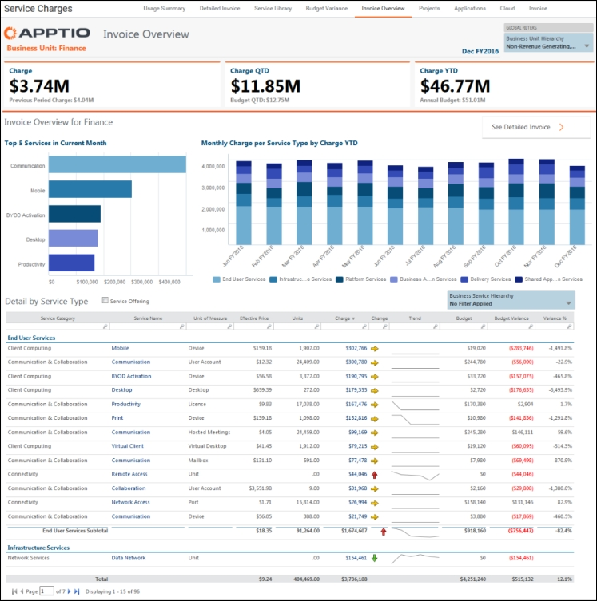
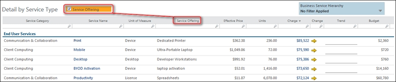
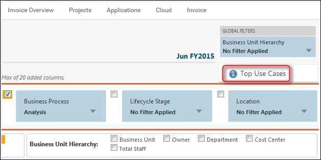

# Informes de consumo de las empresas

Los consumidores empresariales están interesados en:

- Resúmenes de alto nivel de los cargos.
- Revisar las tarifas mensuales de los servicios que ha utilizado su unidad de negocio.
- Si sus gastos han cambiado, determine por qué lo han hecho.
- Comparación de los gastos corrientes con el importe presupuestado para dichos gastos.

**Ver la factura mensual**

Para ver un resumen de sus gastos mensuales, consulte su factura de TI. Para ver el proyecto de ley:

1. En el menú **Aplicación**, haga clic en **Billing Standard** (véase el [menú Billing Standard](getting_started/boit-menu.html)  ).
2. En la sección Empresario, haga clic en **Factura mensual**.
3. En la barra de la parte superior de la página, haga clic en el informe **Resumen de uso**.

Utilice la parte superior del informe para:

1. Revisar los gastos del mes, compararlos con los del mes anterior y con el presupuesto.
2. Revise los gastos del trimestre en curso.
3. Revisar la variación del presupuesto.

**Determinar por qué han cambiado las tarifas**

Si hay cambios significativos en los cargos, utilice las siguientes secciones del informe para determinar por qué se han producido esos cambios:

- Servicios añadidos y suprimidos
- Cambios de precios
- Cambios en las tarifas unitarias
- Cambios en el consumo
- Cambios en la asignación

**Revisar las tarifas mensuales de cada servicio**

Para revisar los cargos mensuales de cada servicio, abra el informe Resumen de facturas. La siguiente imagen muestra un informe para la unidad de negocio Finanzas.

1. En el menú **Aplicación**, haga clic en **Billing Standard** (véase el [menú Billing Standard](getting_started/boit-menu.html)  ).
2. En el menú **de recogida de informes**, haga clic en **Cargos por servicio**.
3. En la barra de la parte superior de la página, haga clic en el informe **Resumen de facturas**.
4. Utilice los **filtros globales** de la esquina superior derecha para seleccionar su unidad de negocio específica.

Utilice los gráficos de la parte superior del informe para obtener un resumen rápido de las tarifas de los cinco servicios principales y de los principales tipos de servicios.

Utilice la tabla **Detalle por tipo de servicio** para ver los cargos por categoría de servicio desglosados por nombre de servicio. Puede profundizar más haciendo lo siguiente.

- Agregue la columna Oferta de servicios marcando la opción **Oferta de servicios**.   
  
- Inicialmente, la tabla se ordena por orden descendente en la columna **Cargo**. Puede ordenar la tabla por cualquiera de las columnas haciendo clic en la cabecera de la columna.
- Para ver un informe detallado sobre un servicio, haga clic en el nombre del servicio en la columna **Nombre del servicio**.
- Para ver las tendencias de tarifas y unidades de un servicio durante un periodo de 12 meses, haga clic en la tarifa de la columna **Tarifas**.

**Obtener información detallada sobre las tasas**

Para obtener información detallada sobre los gastos, consulte el informe **Factura detallada** :

1. En el menú **Aplicación**, haga clic en **Billing Standard** (véase el [menú Billing Standard](getting_started/boit-menu.html)  ).
2. En el menú **de recogida de informes**, haga clic en **Cargos por servicio**.
3. En la barra de la parte superior de la página, haga clic en el informe **Factura detallada**.
4. Utilice los controles de la parte superior del informe para añadir columnas, aplicar filtros y seleccionar un periodo de tiempo. Para un análisis más detallado, puede exportar la tabla a Excel haciendo clic con el botón derecho del ratón en el área en blanco situada debajo de la tabla y haciendo clic en **Abrir en Excel**.
5. Consulte [el contenido Personalizar los principales casos de uso](top-use-cases.html "(se abre en una pestaña o una ventana nueva)") para obtener información adicional.

