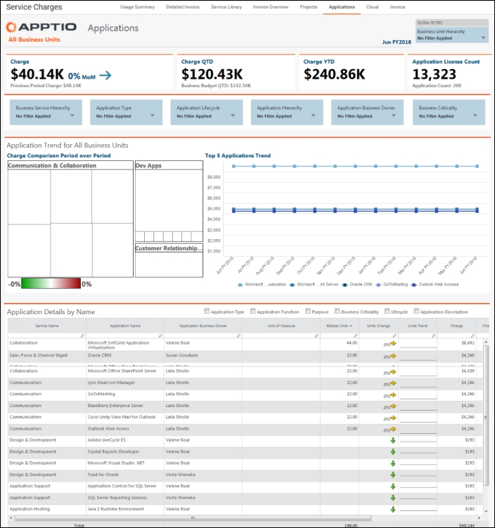
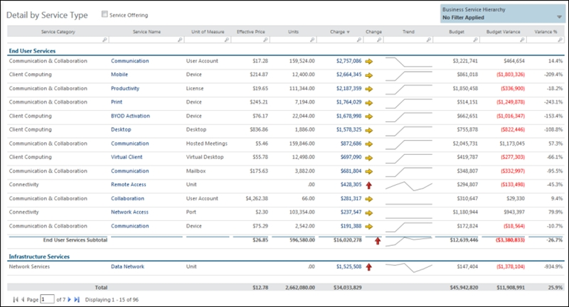

# Informes del gestor de relaciones comerciales

A los gestores de relaciones comerciales les interesa comprender el consumo de las empresas e identificar soluciones alternativas.

**Entender el consumo empresarial**

Para comprender el consumo empresarial, utilice el informe **Resumen de uso**.

1. En el menú **Aplicación**, haga clic en **Billing Standard** (véase el [menú Billing Standard](getting_started/boit-menu.html)  ).
2. En el menú **de recogida de informes**, haga clic en **Cargos por servicio**.
3. En la barra de la parte superior de la página, haga clic en **Resumen de uso**.

Vea las unidades de negocio en su conjunto o filtre el informe para una unidad de negocio específica.

- Comparar la actividad con el plan mediante el **resumen de servicios**.
- Detecte cambios drásticos en el consumo con la **Tendencia de 13 periodos**.
- Compare el consumo con la demanda prevista utilizando la tabla **Todos los servicios**.
- Revise las tendencias de los gastos de servicio utilizando el gráfico y la tabla de **gastos de servicio**.
- Revise las desviaciones presupuestarias utilizando el mapa de árbol de **desviaciones presupuestarias**. Amplíe las áreas presupuestarias para comprender a qué se debe el exceso.
- Identifique los valores atípicos más importantes ordenando la tabla de **Desviación Presupuestaria**.

**Identificar soluciones alternativas**

Para identificar soluciones alternativas, utilice el informe **Resumen de facturas**.

1. En el menú **Aplicación**, haga clic en **Billing Standard** (véase el [menú Billing Standard](getting_started/boit-menu.html)  ).
2. En el menú **de recogida de informes**, haga clic en **Cargos por servicio**.
3. En la barra de la parte superior de la página, haga clic en **Resumen de facturas**.

El cuadro inferior ofrece detalles por tipo de servicio. Utilice los valores de la columna **Precio efectivo** para identificar los servicios que son rentables.
