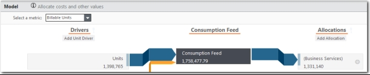
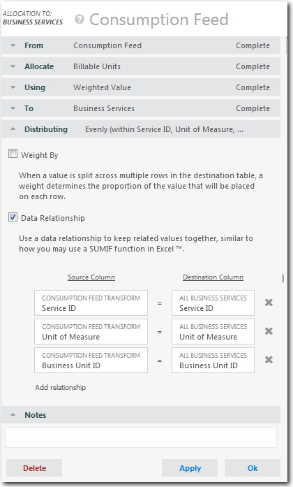
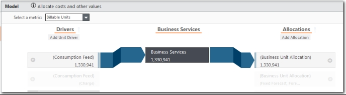
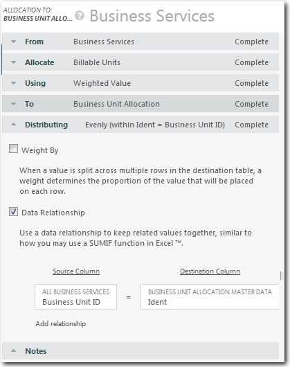
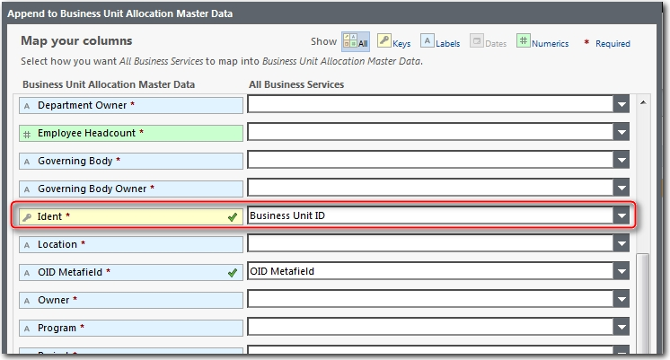

# Definir las asignaciones del modelo de unidades facturables (métricas)

Si el componente Billing Standard Units está instalado, debe definir las asignaciones de la Alimentación de Consumo a los Servicios Empresariales, y de la tabla de Servicios Empresariales a la tabla de Datos Maestros de Asignación de Unidades Empresariales. Utilice los ajustes que se muestran en las siguientes imágenes. Asegúrese de seleccionar la métrica Unidades facturables.

Para establecer la relación de datos, asigne la columna ID de unidad de negocio de la tabla Todos los servicios empresariales a la columna Ident de la tabla Datos maestros de asignación de unidades de negocio, como se muestra a continuación.

