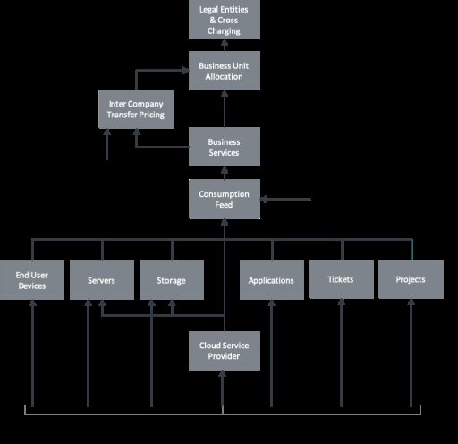
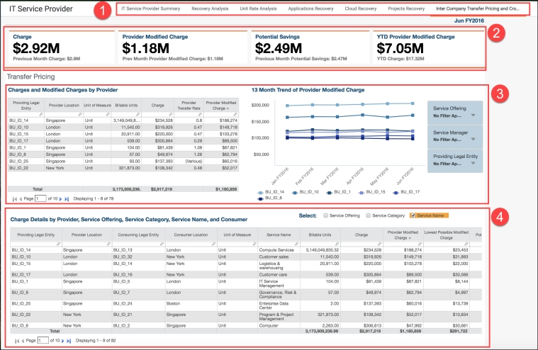

# Informe sobre precios de transferencia

◆ Se aplica a: Billing Standard en TBM Studio 12.6 y posteriores

Para obtener información detallada sobre precios de transferencia, consulte [Configurar precios de transferencia](configure-transfer-price.html).

El componente Precios de transferencia añade dos nuevos objetos al modelo:

- El objeto **Inter Company Transfer Pricing** le ofrece una ubicación para modelar sus cargos y abonos, o le proporciona la capacidad de aplicar un ratio por el que ajustar el precio de un servicio. El objeto incluye todos los datos de los Datos maestros de todos los servicios empresariales y añade las siguientes columnas:
  - Entidad jurídica proveedora
  - Proveedor Ubicación
  - Persona jurídica consumidora
  - Ubicación del consumidor
  - Velocidad de transferencia
  - Tasa de transferencia ajustada
- El objeto **Personas jurídicas e imputación cruzada** es un duplicado del objeto Unidad de negocio y del conjunto de datos maestros, por encima del objeto Unidad de negocio para cargos y unidades de negocio en los conjuntos de datos Servicios empresariales y Unidades de negocio. Este objeto permite redistribuir los cargos por servicio a niveles inferiores de la jerarquía de unidades de negocio una vez que se ha incurrido en el cargo inicial.   
   Un ejemplo de entidad jurídica puede ser una unidad de negocio, una unidad funcional o un centro de costes.

Los gastos pueden imputarse directamente en el objeto Imputación BU o pueden pasar por el objeto Precios de transferencia antes de imputarse. Si hay servicios a los que no se puede aplicar un precio de transferencia, puede utilizar una combinación de estas dos vías.

El flujo general para la fijación de precios de transferencia es:

1. Un proveedor de servicios informáticos establece una estrategia de precios de transferencia.
2. Esa carga se asigna al objeto de Precios de Transferencia, donde se ajusta a tanto alzado o en proporción, dependiendo de la estrategia.
3. El coste se imputa a la unidad de negocio.
4. Una vez que se produce el primer cargo, la empresa puede utilizar el objeto Persona jurídica y Cargo cruzado para localizar ese cargo en diferentes departamentos dentro de la misma unidad de negocio.

**NOTA** : Un filtro en la asignación de Servicios Empresariales a Precios de Transferencia entre Compañías se basa en la Tasa de Transferencia (si la Tasa de Transferencia = 0, los valores fluirán hasta la Asignación de la BU, si la Tasa de Transferencia no = 0, los valores fluirán a través de Precios de Transferencia entre Compañías).

Ejemplos

**Caso práctico 1** - Big Bank tiene seis entidades jurídicas, o unidades de negocio:

- Banca de Inversión UK LLC
- Banca de Inversión Francia LLC
- Banca de inversión Alemania
- Banca comercial Reino Unido
- Banca comercial Francia
- Banca comercial Luxemburgo

Aunque estas seis unidades de negocio funcionan por separado en la organización del Gran Banco, una única organización de TI del Gran Banco da soporte a las seis. En esta situación, TI actúa como un proveedor de servicios interno (o proveedor externo) para prestar servicios tecnológicos a cada unidad de negocio y cobrar por los servicios prestados.

**Caso práctico 2:** Otras organizaciones pueden dividirse en "centros de excelencia" o centros regionales de TI que prestan un servicio específico a los demás centros de la organización. Supongamos que una organización cuenta con los siguientes centros de TI:

- Gestión de redes - Reino Unido
- Informática de gama media - España
- Comunicación y colaboración - Francia

Cada centro cobra a los demás por sus servicios específicos. Se aplica un precio de transferencia a cada cargo, y suele ser único para cada cargo de centro a centro. En este caso, la tasa de transferencia tiene un valor "de-a" que es diferente para cada país y servicio, de modo que la organización puede cargar y asignar con precisión los costes entre las diferentes unidades de negocio, permitiendo esencialmente que cada centro de coste haga cargos cruzados a otro. Además, es posible que algunos gastos deban redistribuirse a niveles inferiores de la jerarquía de unidades de negocio.

**Visualizar el informe de Precios de Transferencia**

1. En el **menúAplicación**, haga clic en**Billing Standard** (véase el [menúBilling Standard](getting_started/boit-menu.html)  ).
2. En el menú **Recopilación de informes**, haga clic en **Proveedor de servicios de TI**.
3. En la barra de la parte superior de la página, haga clic en **Transferencia entre empresas y tarificación cruzada**.

El informe contiene los siguientes elementos:  
 

**(1) Colección de informes** : La colección de informes contiene los siguientes informes:

- Resumen del proveedor de servicios informáticos
- Análisis de la recuperación
- Análisis de la tasa unitaria
- Recuperación de aplicaciones
- Recuperación en la nube
- Recuperación de proyectos
- Precios de transferencia entre empresas e imputación cruzada (descritos en este documento)

**(2) KPI** : los KPI brindan una visión de alto nivel de su gasto de desarrollo y otras métricas.

- **Tarifa** - Tarifa básica de un servicio determinado.
- **Cargo modificado por el proveedor** - Importe del cargo una vez aplicada la estrategia de precios de transferencia.
- **Ahorro potencial** - El coste del servicio con la estrategia de precios que introduce la mayor evitación de costes.
- **Cargo modificado del proveedor YTD** - El importe del cargo ajustado YTD.

**(3) Cargos y cargos modificados por proveedor -** Esta sección le ayuda a comprender la tasa de transferencia para una combinación determinada de proveedor-consumidor, así como el cargo resultante que se factura y el recuento de unidades facturables. Preguntas contestadas:

- ¿Cuáles son mis tarifas de transferencia y los gastos resultantes?
- ¿Qué porcentaje de servicios se facturan de forma cruzada?
- ¿Cuál es la evolución de los servicios de tarificación cruzada?
- ¿Cuál es la distribución de las tasas por destino?

**(4) Detalles de los cargos -** Esta tabla proporciona una visión de la relación de cada transacción entre la entidad jurídica proveedora y la entidad jurídica consumidora, y el impacto financiero de cada transacción. Esta información le ayuda a comprender y anticipar el beneficio global, las pérdidas y la carga fiscal de su estrategia de precios de transferencia. Preguntas contestadas:

- ¿Cuál es el impacto de nuestra estrategia de precios de transferencia?
- ¿Cuál es el impacto de la facturación cruzada entre entidades jurídicas?
- ¿Cuál es el origen y el destino de mis gastos, por unidad de negocio?
