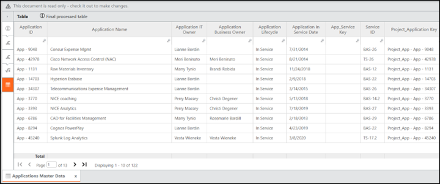
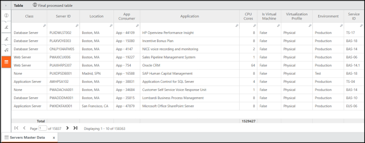
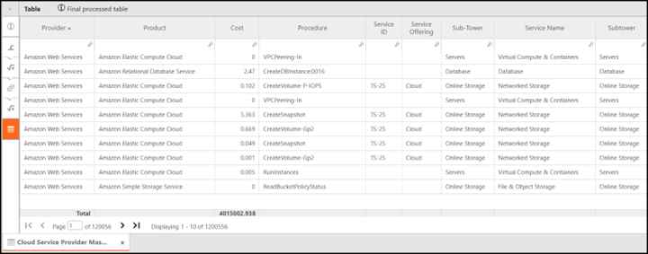

# Preenchimento dos dados mestre do domínio

Os mestres de domínio ativam os relatórios padrão de faturamento que dividem as cobranças por aplicativo, infraestrutura, nuvem, projeto e entidade jurídica.

## Aplicativos

- Carregar ou alinhar dados mestre do aplicativo:
  - ID do aplicativo, nome, proprietário, status do ciclo de vida, criticidade.
- Aplicativos de mapas para:
  - Serviços ou ofertas.
  - Consumidores (se as aplicações forem tratadas como consumidores).
  - Projetos, se o trabalho do projeto for centrado em aplicativos.

Fig. #: Tabela de dados mestre de aplicativos visualizada no TBM Studio

## Servidores, armazenamento e dispositivos do usuário final

- **Servidores**
  - Certifique-se de que cada servidor (ou grupo de servidores) tenha ID, tipo, ambiente, plataforma, proprietário e mapeamento para serviços ou consumidores.
- **Armazenamento**
  - Manter pools ou camadas de armazenamento, capacidade e mapeamentos para consumidores ou serviços.
- **Dispositivos do usuário final**
  - Manter o tipo de dispositivo (laptop, desktop, VDI, etc.), usuário ou grupo e regras de alocação.

Fig. #: Tabela de dados mestres dos servidores visualizada a partir do TBM Studio

## NUVEM

- Padrão padrão:
  - Carregue os dados de faturamento do provedor em uma tabela consolidada de uso da nuvem.
  - Mantenha uma tabela de mapeamento de tags ou contas que vincule:
    - Provedor e ID da conta.
    - Tags (por exemplo, aplicativo, proprietário, centro de custos).
    - IDs de serviço e consumidor resultantes.

Fig. #: Tabela de dados mestres do provedor de serviços em nuvem visualizada no TBM Studio

## Projetos

- Preencha os dados mestre do projeto com:
  - ID do projeto, nome, tipo, proprietário.
  - Link para serviços, produtos ou aplicativos.
  - Identifique quais projetos, se houver, são tratados como consumidores faturáveis.

**Pessoas jurídicas e interempresarial**

- Se os preços de transferência estiverem dentro do escopo:
  - Manter uma tabela de pessoas jurídicas com atributos fiscais e regulatórios.
  - Mapeie consumidores, serviços e infraestrutura para pessoas jurídicas.
  - Configure a lógica de emparelhamento entre empresas (de entidade para entidade).
