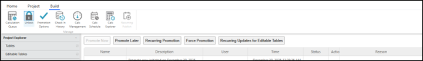

# Bloqueio da preparação e promoção para produção

Antes de promover alterações para a produção, o ambiente de preparação deve ser **bloqueado** para evitar que novos check-ins gerem compilações adicionais.

Sequência típica:

1. **Bloqueio de preparação**
   - Impede que novas compilações sejam criadas no Staging.
   - Garante que o controle de qualidade seja realizado em uma compilação de teste estável.
2. **Executar controle de qualidade na fase de preparação**
   - Validar:
     - Os modelos de faturamento funcionam corretamente.
     - Os relatórios de faturamento abrem e exibem os dados conforme o esperado.
     - Os principais casos de uso do faturamento (faturas, visualizações detalhadas, diários) funcionam corretamente.
3. **Promover para produção**
   - Após a conclusão do controle de qualidade, a compilação aprovada do Staging é promovida para Produção.
   - A promoção pode ser:
     - Executado imediatamente.
     - Programado para ocorrer após a conclusão de uma compilação ou durante uma janela de manutenção definida.
4. **Desbloquear preparação**
   - Assim que a produção estiver em execução na versão aprovada, o ambiente de teste poderá ser desbloqueado.
   - O trabalho de desenvolvimento pode ser retomado e novas construções podem fluir para o Staging.

Fig. #: Ambiente de teste bloqueado com o botão Desbloquear na faixa de opções Build exibindo “Desbloquear”.

Pontos principais:

- Sempre teste o comportamento do faturamento no ambiente de teste antes de promover para a produção.
- O bloqueio de preparação é essencial para evitar testar acidentalmente uma compilação e promover outra diferente.
