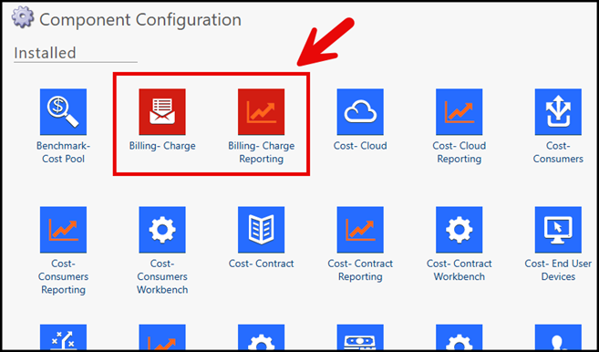

# Arquitetura do Billing Essentials

O Billing Essentials é implementado dentro do mesmo projeto que executa o Costing Essentials. Não há um endpoint separado para o Billing Essentials. Todo o conteúdo é fornecido como componentes adicionais e coleções de relatórios dentro desse projeto.

Observação: aplica-se apenas ao Billing Essentials.

Elementos essenciais:

- **Componentes**
  - Cobrança - Encargo
  - Faturamento - Relatórios de cobrança
- **Onde eles instalam**
  - Instalado pela TAS ou por um parceiro no projeto Costing Essentials usando o TBM Studio.
  - Adicione modelos, tabelas, métricas e definições de relatórios que suportem o processo de faturamento.
- **Como os usuários veem isso**
  - Exibido como uma **coleção de relatórios de “Faturamento”** no front-end do Costing Essentials.
  - Os usuários acessam os relatórios do Billing Essentials da mesma forma que acessam outros relatórios do Costing Essentials.

Fig. #: Componentes “Cobrança” e “Relatórios de cobrança” destacados

Dependências e pressupostos:

- O projeto Costing Essentials já está implementado e recebendo dados de custos e consumo.
- As tabelas essenciais de faturamento obrigatórias são preenchidas com:
  - Catálogo de ofertas faturáveis.
  - Identificadores do consumidor.
  - Unidades e taxas.
- Os usuários que precisam acessar os relatórios do Billing Essentials recebem acesso front-end ao projeto e à coleção de relatórios de faturamento.
