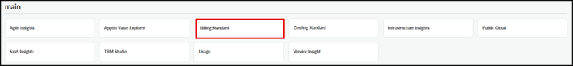

# Arquitetura padrão de faturamento

O Billing Standard amplia a mesma arquitetura com um endpoint adicional e um conjunto maior de componentes.

Observação: aplica-se apenas ao padrão de faturamento.

Elementos essenciais:

- **Componentes**
  - BoIT- Fundação

    Necessário para o padrão de faturamento. Ele instala os modelos básicos de faturamento, tabelas e estruturas de relatórios, incluindo relatórios no estilo de faturas que resumem os encargos por serviço e consumidor.
  - BoIT- Unidades

    Adiciona visualizações baseadas em unidades nos relatórios de faturamento. Ele introduz unidades faturáveis para cada oferta de serviço, calcula taxas unitárias efetivas dividindo os encargos pelas unidades e, quando o Cost Variance também está instalado, permite comparações entre taxas unitárias baseadas em custos e baseadas em preços.
  - BoIT- Aplicações

    Adiciona visualizações de faturamento centradas no aplicativo. Inclui relatórios que mostram cobranças e licenças ou unidades de uso por aplicativo para públicos empresariais, além de visualizações de recuperação que comparam as cobranças com o custo tecnológico subjacente de cada aplicativo para destacar recuperações excessivas e insuficientes.
  - BoIT- Servidores

    Adiciona relatórios centrados no servidor ao Faturamento. Ele apresenta relatórios e guias que detalham os custos e encargos relacionados ao servidor, mostrando como a infraestrutura do servidor contribui para os serviços e aplicativos que são cobrados.
  - BoIT- Armazenamento

    Adiciona relatórios centrados no armazenamento ao Faturamento. Ele apresenta relatórios e guias que detalham os custos e encargos relacionados ao armazenamento, mostrando como os níveis e pools de armazenamento se refletem nos serviços e aplicativos que aparecem nas faturas.
  - BoIT- Dispositivos do usuário final

    Adiciona visualizações de faturamento no nível do dispositivo. Ele integra os dados dos dispositivos do modelo de custos e fornece relatórios para prestadores de serviços e consumidores empresariais com foco na alocação de dispositivos, padrões de consumo e cobranças associadas aos dispositivos dos usuários finais.
  - BoIT- Nuvem

    Adiciona relatórios focados em infraestrutura em nuvem ( IaaS ). Inclui relatórios que mostram as cobranças dos serviços em nuvem por provedor, conta e serviço para o público empresarial, bem como visualizações de recuperação que comparam as cobranças em nuvem com o custo de fornecimento desses serviços em nuvem para destacar a recuperação excessiva e insuficiente.
  - BoIT- Projetos

    Adiciona visualizações de faturamento centradas no projeto. Inclui relatórios que mostram os custos do projeto e os serviços subjacentes consumidos, juntamente com visualizações de recuperação e variação que combinam recuperação acima/abaixo do esperado, variação orçamentária e status do projeto em um único local.
  - BoIT- Preço

    Permite expor preços explícitos aos usuários finais. Os preços são definidos na Biblioteca de Serviços e aplicados nos modelos de faturamento; quando vários ajustes ou combinações de preços se aplicam a um serviço, o preço unitário efetivo mostrado nos relatórios pode diferir do preço base da Biblioteca de Serviços.
  - BoIT- Variação de custos

    Compare os encargos de faturamento com o custo real da prestação dos serviços. Ele adiciona relatórios, normalmente direcionados a proprietários de serviços e funções semelhantes, que mostram custos, cobranças e variações nos níveis de serviço e domínio para apoiar decisões de recuperação e preços.
  - BoIT- Variação do plano

    Apresenta comparações entre orçamento e previsão. Ele permite relatórios que comparam despesas com o orçamento e custos com o orçamento, além de adicionar dimensões de variação do orçamento/previsão às visualizações de faturamento existentes para uma análise mais clara do desempenho em relação ao planejado.
  - BoIT- Preços de transferência entre empresas

    Oferece suporte à modelagem e geração de relatórios sobre encargos em todas as entidades jurídicas. Permite uma lógica de alocação e cobrança que rastreia o impacto financeiro do consumo de serviços entre entidades jurídicas ou centros de custo, suportando cenários de cobrança cruzada em organizações tecnológicas descentralizadas ou com várias entidades.
- **Onde eles instalam**
  - Instalado no **projeto Padrão de** Custeio usando o TBM Studio.
  - Adicione modelos, tabelas, métricas e definições de relatórios que abranjam vários domínios tecnológicos e visões financeiras.

- **Como os usuários veem isso**
  - Exibido aos usuários por meio de um **endpoint separado do Padrão de Faturamento**, além do endpoint do Padrão de Custeio.
  - As coleções de relatórios dentro do endpoint Padrão de faturamento se alinham a domínios como:
    - Serviços e consumidores
    - Unidades e taxas unitárias
    - NUVEM
    - Aplicativos
    - Infraestrutura (servidores, armazenamento, dispositivos do usuário final)
    - Projetos
    - Variação e preços
    - Preços de transferência e pessoas jurídicas

Fig. #: Página inicial do Frontdoor com o endpoint Billing Standard destacado

Dependências e pressupostos:

- Um projeto de Padrão de Custeio é implementado com um modelo de custos estável.
- IBM provisionou um **endpoint Padrão de Faturamento** e o vinculou ao projeto Padrão de Custeio apropriado.
- Os componentes do Padrão de Faturamento são instalados e configurados de forma que:
  - As tabelas de dados mestre do domínio são preenchidas (Aplicativos, Servidores, Armazenamento, Nuvem, Projetos, Dispositivos do Usuário Final, Pessoas Jurídicas).
  - São definidas as relações com os consumidores, os serviços e as tabelas de preços.
- Os usuários que precisam de relatórios padrão de faturamento têm acesso ao endpoint padrão de faturamento e às coleções de relatórios relevantes.
