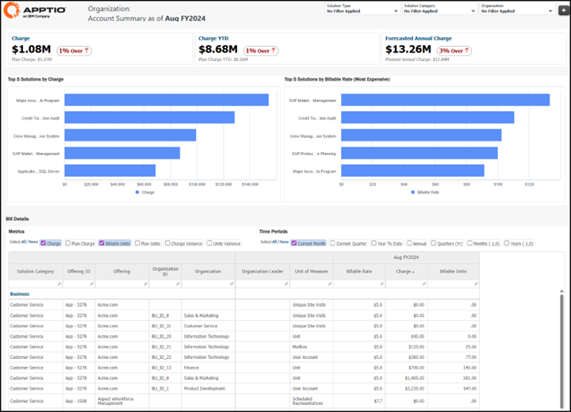
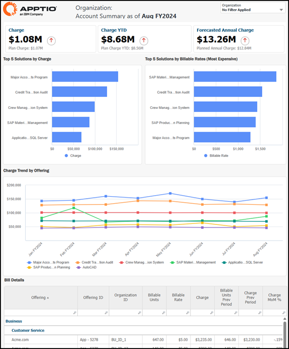
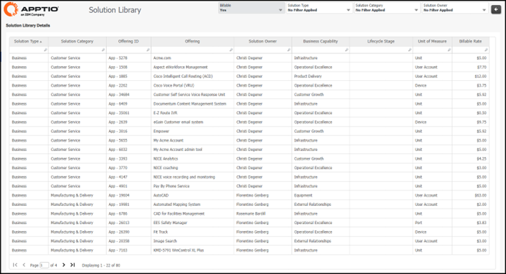
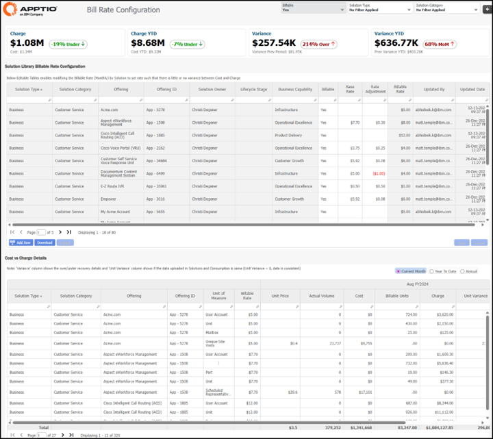
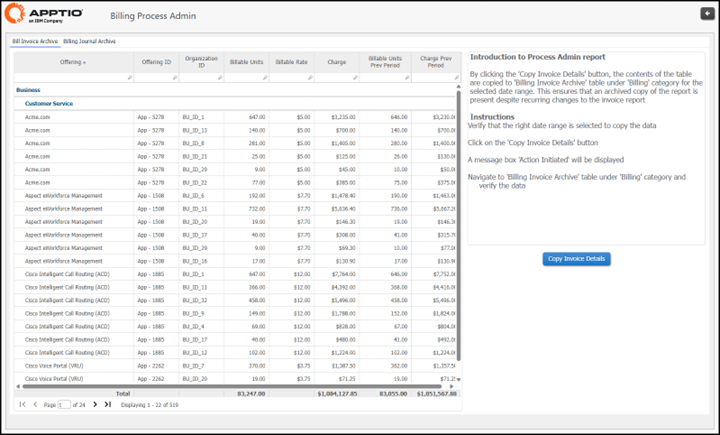
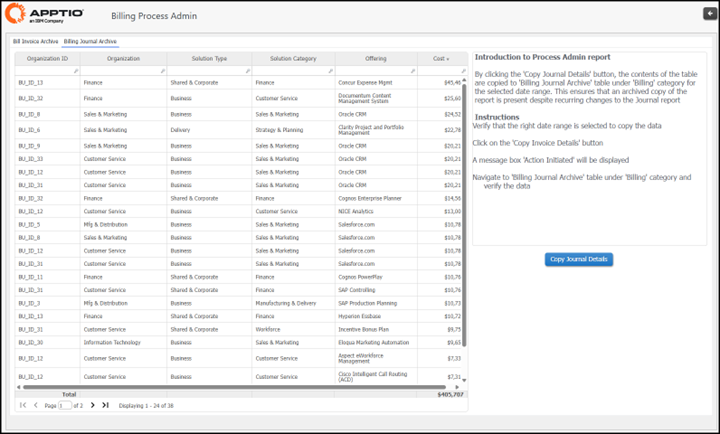
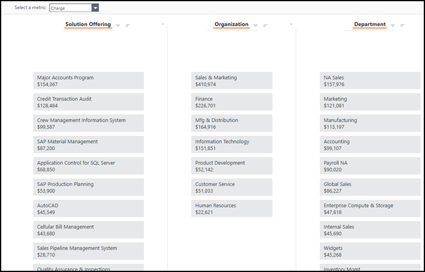

# Relatórios de faturamento no Billing Essentials

O Billing Essentials inclui um pequeno conjunto específico de relatórios instalados através do componente “Relatórios de cobrança”:

Observação: aplica-se apenas ao Billing Essentials.

## Relatório detalhado da conta

- Objetivo: Inspecionar cobranças, unidades e taxas por organização que oferece e recebe soluções, ao longo do tempo (mês atual, trimestre, ano até o momento, ano), e comparar os valores reais com os planejados para explicar as variações.
- Perguntas respondidas:
  - Qual é o valor total da minha cobrança para o período selecionado e como ele se compara ao plano?
  - Quais são os meus encargos acumulados no ano e os encargos anuais previstos (e estamos acima ou abaixo do planejado)?
  - Quais soluções/ofertas estão gerando mais receita para esta organização?
  - Quais soluções têm a maior taxa faturável?
  - Para uma determinada oferta, quais foram as unidades faturáveis, a unidade de medida e a taxa utilizadas para calcular o custo?
  - Quais organizações estão sendo cobradas por uma determinada oferta?
  - Onde temos variação de cobrança em relação ao plano, e ela é determinada pela taxa ou pelas unidades?
  - Onde temos variação das unidades em relação ao plano (aumento ou diminuição do consumo)?
  - Existem cobranças com unidades zero (ou unidades com cobrança zero), indicando um problema de dados ou preços?
  - Como as cobranças e unidades mudam quando alterno entre as visualizações Mês atual, QTD, YTD, Anual ou Tendências?
- Usuários-alvo: Consumidores, analistas, proprietários de serviços ou produtos.

Fig. #: Relatório detalhado da fatura no Billing Essentials

## Relatório de faturas

- Objetivo: Agrupa os encargos da organização e do período selecionados, destaca os maiores fatores de custo e as taxas unitárias mais caras, mostra a tendência e fornece os itens da fatura (oferta, unidades, taxa, encargo e diferenças de MoM ) para que a organização receptora possa revisar e validar a fatura rapidamente.
- Perguntas respondidas:
  - Qual é o custo total desta organização para o período atual e como ele se compara ao planejado?
  - Qual é a cobrança acumulada no ano da organização e estamos acima ou abaixo do planejado no acumulado do ano?
  - Qual é a taxa anual prevista e como ela se compara à taxa anual planejada?
  - Quais são as principais soluções/ofertas que geram mais receita para esta organização?
  - Quais soluções têm as taxas faturáveis mais altas, mesmo que não sejam as que mais gastam?
  - Como as taxas das principais ofertas têm evoluído ao longo do tempo?
  - Para cada item da fatura, quais foram as unidades faturáveis, a taxa faturável e o custo resultante?
  - Quais itens tiveram a maior variação mensal em unidades ou cobranças?
  - Existem anomalias, como unidades sem cobranças ou cobranças sem unidades, que sugiram problemas com os dados ou preços?
- Usuários-alvo: Proprietários de serviços ou produtos, analistas, consumidores.

Fig. #: Relatório de faturas em Billing Essentials

## Relatório da Biblioteca de Soluções

- Objetivo: lista cada solução com os metadados essenciais necessários para faturá-la e controlá-la, como tipo e categoria da solução, ID e nome da oferta, proprietário, capacidade comercial, estágio do ciclo de vida, unidade de medida e taxa faturável. Na prática, é a referência “o que estamos vendendo internamente, quem é o proprietário e quanto cobramos”.
- Perguntas respondidas:
  - Que soluções/ofertas existem atualmente em nosso catálogo de faturamento?
  - Quais soluções são faturáveis e quais não são?
  - Qual é a taxa cobrável para cada solução e qual unidade de medida é utilizada?
  - Quais soluções se enquadram em um determinado tipo ou categoria de solução?
  - Quem é o proprietário da solução para cada oferta e o que cada proprietário “possui” de ponta a ponta?
  - Quais soluções oferecem suporte a uma capacidade de negócios específica (e qual é a cobertura do catálogo por capacidade)?
  - Em que estágio do ciclo de vida as soluções se encontram (e quais delas podem ser candidatas a serem descontinuadas ou terem sua cobrança encerrada)?
  - Onde temos padrões de preços inconsistentes, como ofertas semelhantes com taxas ou unidades muito diferentes?
  - Quais ofertas estão sem metadados essenciais para a governança, como proprietário, capacidade, estágio do ciclo de vida, unidade de medida ou taxa?
  - Quais são os IDs das ofertas das soluções para que eu possa reconciliar contas, feeds de uso ou itens de fatura com o catálogo?
- Usuários-alvo: Proprietários de serviços ou produtos, liderança financeira e tecnológica.

Fig. #: Relatório da biblioteca de soluções no Billing Essentials

## Relatório de gestão de taxas

- Objetivo: Definir, controlar e ajustar as taxas cobráveis para as soluções e, em seguida, validar se essas taxas estão recuperando os custos. Ele combina uma tabela de preços editável (preço base mais ajustes que são incorporados ao preço faturável) com uma análise da variação entre custo e cobrança, para que você possa reduzir a sub ou sobrecobrança e manter as faturas justificáveis.
- Perguntas respondidas:
  - Qual é a taxa faturável atual para cada solução e como ela é calculada (taxa base vs. ajuste de taxa)?
  - Quais soluções são faturáveis e quais não são, e quem é o proprietário delas?
  - Onde estamos recuperando menos ou mais do que o esperado (variação) neste mês e no acumulado do ano?
  - Quais soluções apresentam os maiores fatores de variação entre custo e cobrança?
  - Para uma determinada oferta, o custo e a cobrança estão alinhados quando você analisa o volume real, as unidades faturáveis, o preço unitário e a variação unitária?
  - Quais unidades de medida estão sendo cobradas para cada solução (e elas estão de acordo com a intenção da tabela de preços)?
  - Quem atualizou uma taxa pela última vez e quando (trilha de auditoria)?
  - Se eu alterar uma taxa, qual será o impacto na recuperação esperada (variação tendendo para baixo ou para cima)?
  - Existem soluções com taxas definidas, mas sem volume, ou volume com comportamento de taxa zero ou ausente que precisam ser limpas?
  - Onde temos várias unidades de medida faturadas sob a mesma oferta e isso cria inconsistência nos preços?
- Usuários-alvo: Proprietários de serviços e produtos, líderes seniores, finanças, analistas.

Fig. Relatório de gerenciamento de taxas de conta no Billing Essentials

## Relatório administrativo do processo de faturamento

- Guia Arquivo de Faturas
  - Objetivo: Revisar e criar uma cópia arquivada dos detalhes da fatura para um período fiscal específico, que pode ser consultada para fins de auditoria ou outras necessidades.
- Guia Arquivo de Diário de Contas
  - Objetivo: Revisar e criar uma cópia arquivada dos detalhes do diário para um período fiscal específico, que possa ser consultada para fins de auditoria ou outras necessidades.
- Perguntas respondidas:
  - Já arquivamos os detalhes da fatura para o mês ou intervalo de datas selecionado?
  - Quais ofertas foram cobradas, a quais organizações e por quanto?
  - Quais foram as unidades faturáveis e as taxas faturáveis utilizadas para cada organização e oferta?
  - Quais foram as unidades faturáveis e os encargos do período anterior (para uma comparação rápida entre períodos)?
  - Qual é a composição histórica das linhas da fatura para uma determinada organização, oferta ou ID de oferta?
  - Qual é o registro histórico do diário de faturamento para o mesmo período (custo e dimensões relacionadas)?
  - As saídas de faturas e as saídas de diários coincidem para um período e onde é que diferem?
  - Quais organizações ou ofertas estão gerando os maiores custos no instantâneo arquivado?
  - Se alguém contestar uma fatura posteriormente, o que publicamos realmente na altura (a verdade arquivada)?
  - Após uma alteração no modelo/taxa/configuração, isso afetou a visualização atual, mas não o instantâneo arquivado (como esperado), e qual período foi afetado?
- Usuários-alvo: Finanças, Analistas.

Fig. #: Guia Arquivo de Faturas do relatório de Administração do Processo de Faturamento

Fig. #: Guia Arquivo do Diário de Faturamento do relatório de Administração do Processo de Faturamento

## Relatório do modelo de custos de faturamento

- Objetivo: Uma maneira rápida e interativa de ver de onde vêm as cobranças faturadas e onde elas se encaixam nas principais dimensões de faturamento. Ele permite basear a visualização em uma métrica selecionada (cobrança, cobrança do plano e impacto do ajuste de taxa) por oferta de solução, organização e departamento, para que você possa validar os resultados do modelo de faturamento, identificar concentrações e descobrir rapidamente “quem/o que gerou essa fatura”.
- Perguntas respondidas:
  - Quais ofertas de soluções estão gerando os maiores custos neste período?
  - Quais organizações estão recebendo a maior parte das cobranças?
  - Quais departamentos são os maiores consumidores e quanto estão sendo cobrados?
  - Se eu escolher uma oferta de solução específica, quais organizações e departamentos serão mais afetados?
  - As taxas estão concentradas em algumas ofertas ou amplamente distribuídas?
  - Quais são os principais fatores por trás do aumento nas cobranças, por oferta, organização ou departamento?
  - Os resultados parecem estruturalmente corretos (por exemplo, os departamentos certos estão sendo cobrados pelas ofertas certas) ou há algo claramente mapeado de forma incorreta?
  - Quais combinações de oferta + organização + departamento são as que mais contribuem para o custo total?
  - Se um líder empresarial contestar sua fatura, quais são os principais itens que determinam seus encargos sem entrar em detalhes sobre os itens da fatura?
- Usuários-alvo: Proprietários de serviços e produtos, finanças, analistas.

Fig. #: Relatório do modelo de custos de faturamento no Billing Essentials
