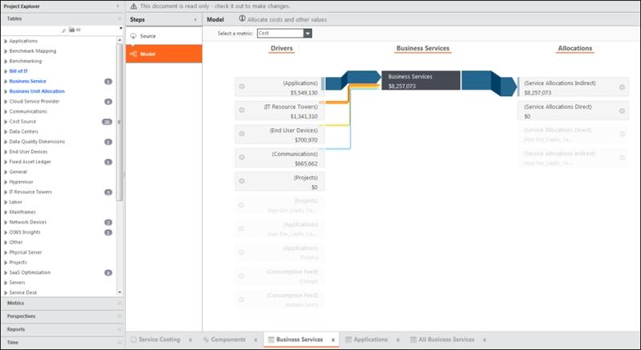
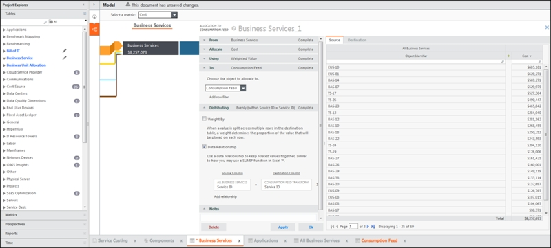

# Definir alocações do modelo de custos

Execute esta etapa se você ainda não tiver alocado valor ao objeto do modelo Business Services no modelo Cost.

Para definir as alocações do modelo de custo, use a Transparência de custos para alocar seus custos.

Para usar as cobranças baseadas em custo, use as etapas a seguir para fornecer informações de custo ao modelo de cobrança.

1. Se você ainda não adicionou dados ao Feed de consumo, consulte [Adicionar dados de consumo para cálculos de Preço x Quantidade](add-consumption-data.html "Use os dados de consumo quando quiser cobrar das unidades de negócios com base no consumo de serviços, em vez de alocações de custos baseadas em fatores como o número de funcionários. Se nenhum dado de consumo adicional for conhecido, use uma lista das IDs de serviço, que pode ser fornecida anexando os dados brutos da biblioteca de serviços. Não anexe a tabela da biblioteca de serviços em si; no entanto, é permitido anexar os dados anexados à biblioteca de serviços."). Se você não pretende fornecer quantidades, anexe uma lista de suas IDs de serviço usando as mesmas etapas.
2. No **Project Explorer**, clique na etapa **Model** na tabela Business Services.
3. Certifique-se de que a métrica **Custo** esteja selecionada.
4. Adicione uma nova alocação clicando em **Adicionar alocação**.
5. Defina a alocação para alocar a métrica Custo para serviços comerciais usando o Valor ponderado, distribuindo por meio de um relacionamento de dados baseado na ID do serviço.

   
6. Consulte [Definir as alocações do modelo de cobrança](define-charge-price.html) para obter instruções sobre como preencher a cobrança baseada em custo.
