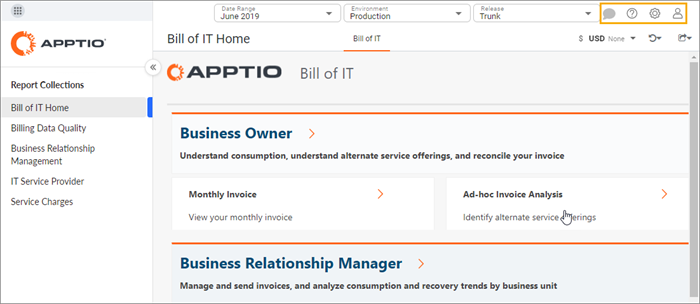
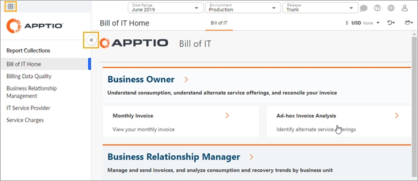

# Encontre seu caminho

## Billing Standard Barra de ferramentas

**Barra de ferramentas**

| Tipo | Descrição | Ação |
| --- | --- | --- |
| img | Comentário | Você pode colaborar com outros usuários, definir notificações e deixar anotações para si mesmo. |
| img | Ajuda | Será possível:  - pesquisar na Central de Ajuda - enviar feedback |
| img | Configurações do aplicativo | Será possível:  - ir para a administração do aplicativo - exibir detalhes do aplicativo, como a versão e o ambiente |
| img | Configurações de perfil | Será possível:  - gerenciar seu perfil - fazer-se passar por outro usuário  Os administradores podem querer fazer isso para verificar as permissões de um usuário ou para solucionar problemas.  - efetuar logout - mudar para Navegação clássica |

## Billing Standard navegação

| Tipo | Descrição | Ação |
| --- | --- | --- |
| img | Todos os produtos | Navegar para outro produto Apptio |
| img img | Maximizar / Minimizar | Maximizar / minimizar a navegação |
