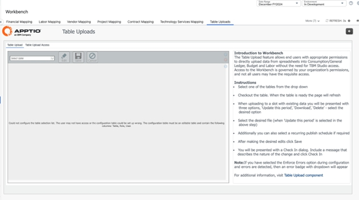
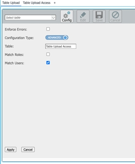
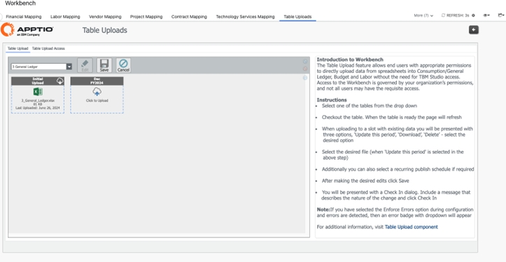

# Table Upload

The  Table Upload  component allows end users with appropriate
permissions to directly  upload  data from spreadsheets into tables without
the need for TBM Studio access. Table Uploads report consists of two tabs: Table Upload and Table
Upload Access.

Table Uploads tab

Table Uploads tab will help the users directly upload data into the Consumption/General Ledger,
Budget and Labor without the need for TBM Studio access.

Navigate to Workbench > Table Uploads > Table Upload as shown:

The table upload component offers two configuration options -  [Simple
configuration](../../studio/reports/table-report-upload-component.html)  &  [Advanced configuration](../../studio/reports/table-report-upload-component.html)  . In this example, it is equipped with Advanced
Configuration, allowing user matching in the Table Upload Access tab.

Table Upload Access tab

Table Uploads Access tab will help the admins manage access to who can directly upload data into
the Consumption/General Ledger, Budget and Labor without the need for TBM Studio access.

Navigate to Workbench > Table Uploads > Table Upload > Table Upload Access as shown:

Grant table upload access by specifying the table name and the corresponding user details to
allow them to upload data into the designated table as shown below.

*\*\* Tab visibility can be customized based on the customer's requirements to control which user
roles have access to the "Table Upload Access" tab in the Table Upload report.*

For more information, see  [Table Upload](../../studio/reports/table-report-upload-component.html)  .
