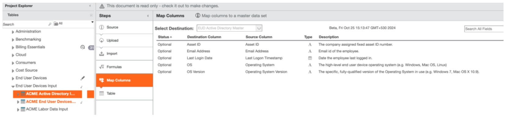
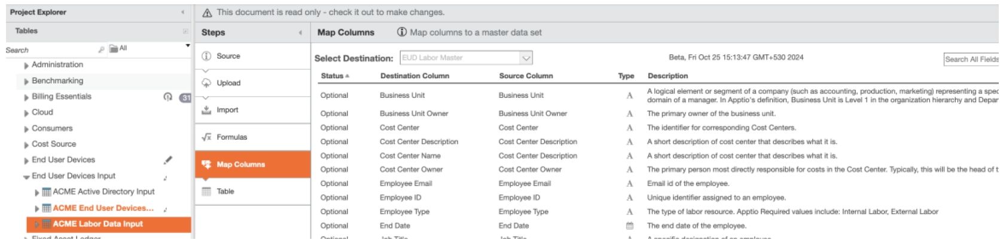
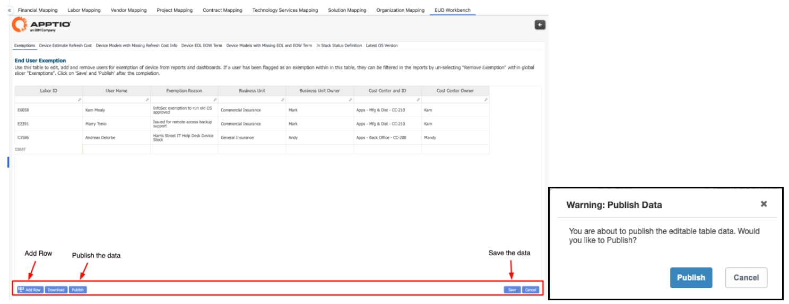
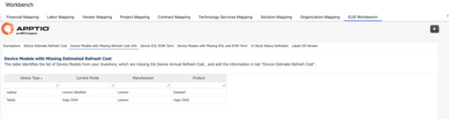
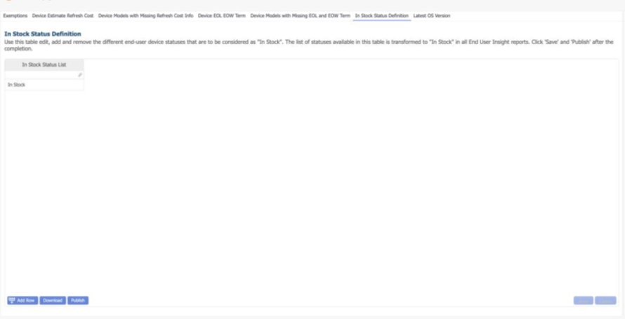
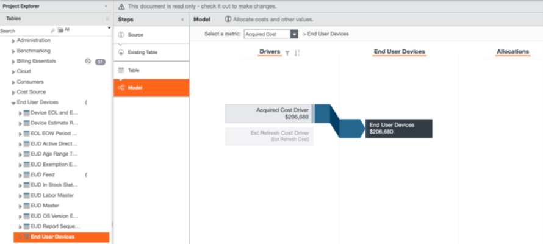
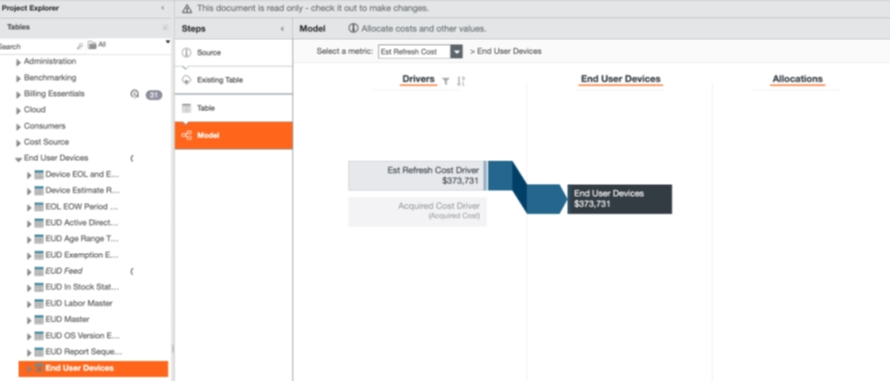
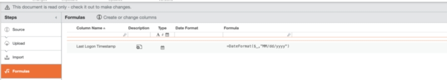
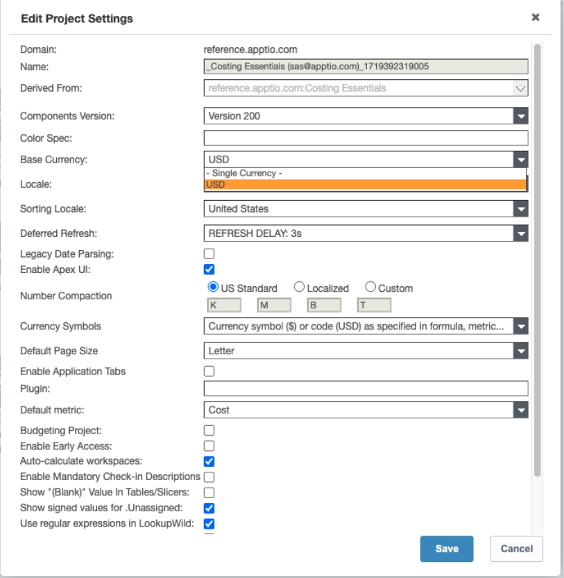

# End User Devices Configuration

Complete these steps to start using End User Devices

**Install the End User Devices component**

(TBM Studio): Create a Project.

1. (TBM Studio): End User Devices support Multi-currency. Click
    [here](#multi-cu "(Opens in a new tab or window)")  for the configuration
   details.
2. (TBM Studio): Configure Time Settings and check-in the changes.
3. (TBM Studio): Install  **Cost- End User Devices**  component
   in the project.

What’s in the component?

1. (TBM Studio): Create three input tables to ensure that relevant
   details are uploaded.

Active Directory

End User Devices

Labor Data

Sample for Reference - Name of the tables can be customer specific.

1. (TBM Studio): Save and check-in the changes.
2. (TBM Studio): Refer to the  [Appendix](#appendix "(Opens in a new tab or window)")  section for a review of transformation formulas used in
   the reference project.
3. (TBM Studio): Map the following tables to the corresponding
   Master and Feed tables:

EUD Active Directory Master (Active directory table)

EUD Labor Master (Labor data)

EUD Feed (End User Devices)

1. (TBM Studio): Save and check-in the changes.

If there are any changes, please upload the input table on an
adhoc/monthly basis to ensure the accuracy of the reports.

Use the 'MM/dd/yyyy' date format for all data uploads and transformations to avoid formula
changes in the Master tables.

**EUD Workbench**

1. (Report View): Navigate to Workbench > EUD Workbench > Exemptions

Use this table to edit, add and remove users for exemption of device
from reports and dashboards.

Click on Save and then press Publish to propagate to all reports and
models, “EUD Exemptions ET Transform”

1. (Report View): Navigate to Workbench > EUD Workbench > Device Estimate Refresh Cost

Use this table to edit, add and remove the details of the Estimated
Device Refresh Cost for device models in your inventory 

Click on Save and then press Publish to propagate to all reports and
models, ‘Device Estimate Refresh Cost ET Transform’.

1. (Report View): Navigate to Workbench > EUD Workbench > Device Models with Missing
   Refresh Cost Info

Verify the list of Device Models from your Inventory, which are missing
Est Device Annual Refresh Cost.

1. (Report View): Navigate to Workbench > EUD Workbench > Device EOL EOW Term

Use this table to edit, add and remove the End of Life and End of
Warranty terms in years for device models in your inventory.

Click on Save and then press Publish to propagate to all reports and
models, ‘Device EOL and EOW Term ET Transform’.

1. (Report View): Navigate to Workbench > EUD Workbench > Device Models with Missing
   EOL and EOW Term

This provides the list of Device Models from your Inventory, which are
missing End of Life and End of Warranty Term information and add the information in tab
‘Device EOL EOW Term’.

1. (Report View): Navigate to Workbench > EUD Workbench > In Stock Definition

Use this table edit, add and remove the different end-user device
statuses that are to be considered as "In Stock". The list of statuses available in this table
is transformed to "In Stock" in all End User Insight reports

Click on Save and then press Publish to propagate to all reports and
models, ‘EUD In Stock Status Definition ET Transform’.

1. (Report View): Navigate to Workbench > EUD Workbench > Latest OS Version

Use this table to edit, add and remove Operating Systems and
corresponding latest version details, to flag non-compliant OS devices.

Click on Save and then press Publish to propagate to all reports and
models, ‘EUD OS Version ET Transform’.

1. (TBM Studio): Open End User Devices Model and verify the cost
   allocations

**Acquired Cost**

**Est Refresh Cost**

Both the screenshots are for reference purpose and the cost allocations
may vary as per the data

**Appendix**

Formulas applied to transform the reference input data to meet the requirements of the EUD
Master and EUD Feed.

The formulas listed below are intended solely for reference data.
Customers may update these formulas to align with their specific data and industry standards.

Appended snapshot of the formulas applied to the

**ACME Active Directory Input**

**ACME End User Devices Input**

**ACME Labor Data Input**

**Multi-Currency**

If customer uses Multi-currency this would be a good time to set that up. Multi-currency is
the same in Costing Essentials as in CT projects. You can reference
the  [Multi-currency
configuration](../../multi-currency/home.html)  in Help Center.

However – if your customer uses a non-Gregorian calendar, the newer version of MCC doesn’t
support non-gregorian. If your customer requires a non-Gregorian Calendar, follow the Legacy
Multi-currency configuration  [here](../../studio/admin/configure-multi-currency.html)  .

Select the preferred  **Base Currency**  .

