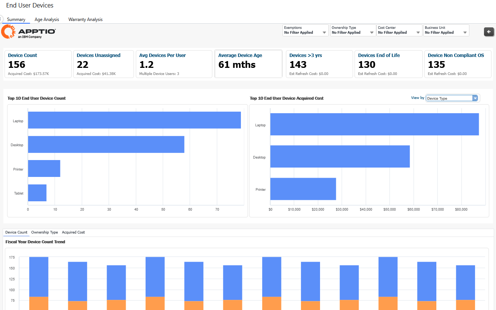
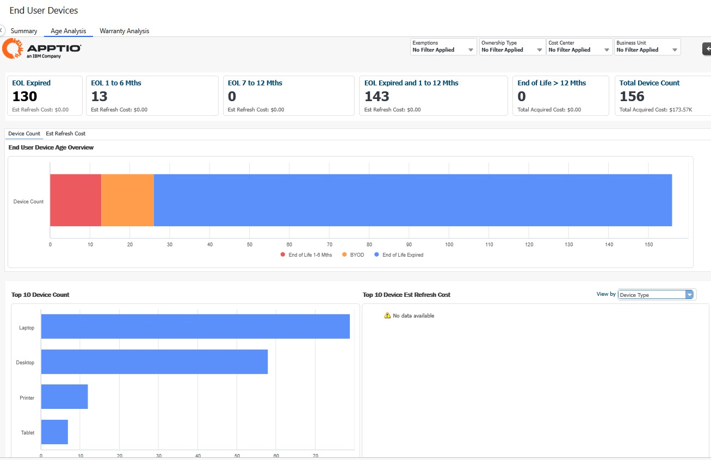
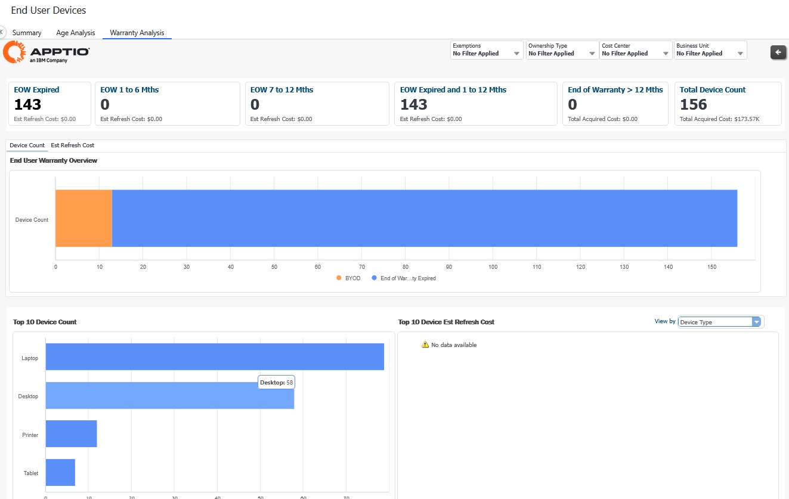

# End User Devices reports

End User Devices (EUD) displays the following reports.

[Learn how to configure End User Devices](ce-eud.html)

Summary Report

View an executive summary of the entire end user device fleet, including:

- assignments and consumption profiles
- makes, models and locations
- end-of-life aging and non-compliance, including estimated refresh costs

**Age Analysis**

Monitor the aging and estimated refresh cost of devices by end of life. This allows you to plan
and forecast effectively for device updates or replacements.

Warranty Analysis

Monitor the aging and estimated refresh cost of devices by end of warranty. This allows you to plan and forecast effectively for device updates or replacements.

