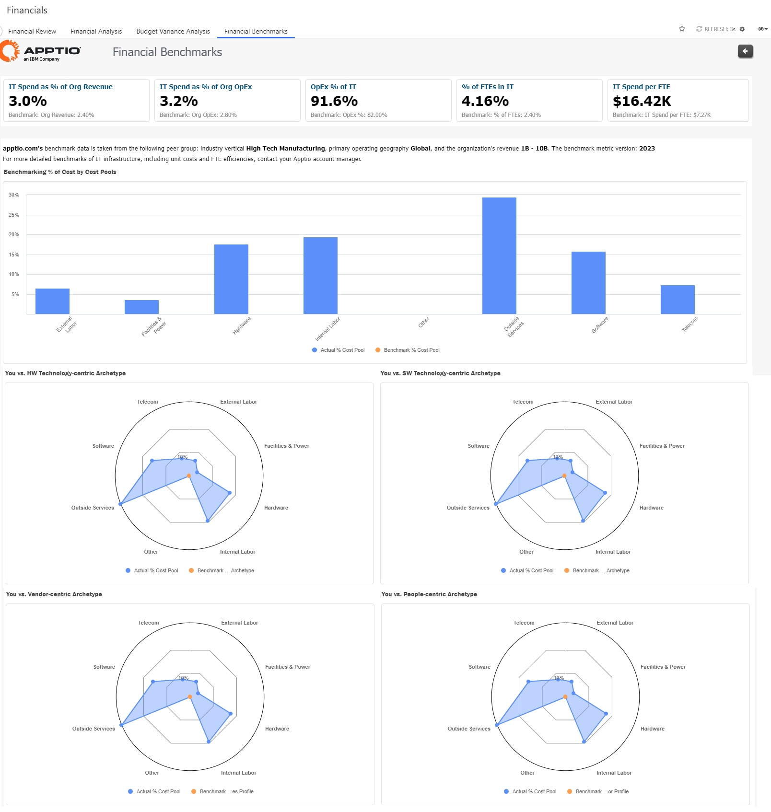

# IT Benchmarking Review

The Benchmarking addresses the what , but not the why , how or what’s next . You can use your
organization’s costs, compare them with the benchmark metrics and research/rationalize your
actuals to determine the why and how. You can then use this understanding to create actionable
next steps, outcomes, and deliver value. You can even work with third party consultants to
help interpret the comparisons and provide advice/recommendations.

Cost Pool Benchmark provides insights for IT Leadership and IT Finance in support of
strategic investment decisions regarding the role of IT in the business and the current IT
operating model and sourcing strategies. Benchmarks can be used to understand cost structure
of current strategy and to justify or adjust current investment and sourcing approaches.

Compare IT spend to industry benchmarks (e.g. IT Spend as a % of Revenue)

## IT OpEx metrics

The IT OpEx benchmark metrics provide a high level directional guidance on the enterprise’s
OpEx characteristics.

|  |  |
| --- | --- |
| Target audience | IT Leadership |
| Purpose | Use IT OpEx metrics to understand the organization’s spend profile at both financial and IT Infrastructure levels. Companies have investment strategies that determine their extent of spend in specific aspects of IT. These metrics help call out their spend profiles and provide the ability to evaluate their perspective in comparison to the  Benchmark profiles. This will help drive strategic decisions on continuing or changing their profile. |
| Usage | Semi-annual reviews |
| Guidance | These metrics are the next level detail on IT Spend (after the initial IT Spend metrics evaluation). The two spend distributions, cost pool and IT tower, should be used in conjunction as they are related.  In the initial use phase, use the IT OpEx metrics to help validate spend characteristics at both the financial and infrastructure level. Doing so helps catch inconsistencies like high percentage spend on data center tower when facilities and power percentage spend is low.  Use the archetype spend characteristics to check on your organization’s perspective of your spend profile. For example, if a company thinks of itself as a heavily outsourced company, they can validate their spend profile against typical outsourced benchmark metrics.  Subsequent uses of these metrics are to help track progress to help drive and track decisions on spend characteristics. For example, let’s say a company has decided they need to invest more in-house and reduce outsource spend. The IT OpEx metrics can help monitor these spend distributions. |

The metrics provided include:

| Metric | How to interpret – outcomes and questions to consider |
| --- | --- |
| OpEx by Cost Pool Distribution | - Understand IT operating model’s overall cost structure - Compare to alternative cost structures for different IT operating models (that   is, archetypes) - Align to the TBM Taxonomy and check quality of allocations |
| OpEx by Resource Tower Distribution | - Justify or adjust IT budget - Set target percentage investment metrics - Align to the TBM Taxonomy and check quality of allocations |
| Spend Archetypes | - Validate the organization’s spend profile with the archetypes and determine   investment direction. |

1. OpEx by Cost Pool Distribution– These metrics provide
   characteristics at the financial layer by comparing the enterprise’s OpEx with the
   distribution of OpEx split by Cost Pool percentages based on Apptio Community Data (ACD)
   samples.
2. OpEx by Resource Tower Distribution  – These metrics provide
   characteristics at the Infrastructure layer by comparing the enterprise’s OpEx with the
   distribution of OpEx split by Resource Tower percentages based on Apptio Community Data
   (ACD) samples.

Spend Archetypes – There are four cost pool profiles driven by their dominant spend
characteristics at the financial layer. An enterprise can compare its cost pool spend
characteristics with these four archetypes to determine if their spend pattern is aligned to
one of them and if it meets their perspective on the enterprise spend. . The archetypes are
also described and used in the IT Economics report.

These archetypes are derived from the Apptio Community Data (ACD). ACD is anonymized
aggregated Apptio opted-In customer data. The four archetypes are:

- Vendor centric  –These companies tend to spend more on Outside
  Services (including Consultants, Managed Service Providers, and Cloud Service Providers)
  instead of on Labor or Technology (Hardware or Software). Outside Services is higher;
  Internal Labor, External Labor, Hardware and Software are lower.
- People centric  –These companies favor spending more on Internal
  Labor, and less on External Labor and Software. Internal Labor is higher; External Labor and
  Software are lower.
- Technology-centric  – In this category, we found two
  “sub-archetypes” of companies that favor spending on either  Hardware
   or  Software  .
  - Hardware-centric  – Higher Hardware spend associated with lower
    Labor, Outside Services and Software spend. Hardware is higher; Internal Labor, External
    Labor, Outside Services, and Software are lower
  - Software-centric  – Higher Software and Internal Labor spend
    displaces External Labor and Outside Services spend. Software and Internal Labor are
    higher; External Labor and Outside Services are lower.
