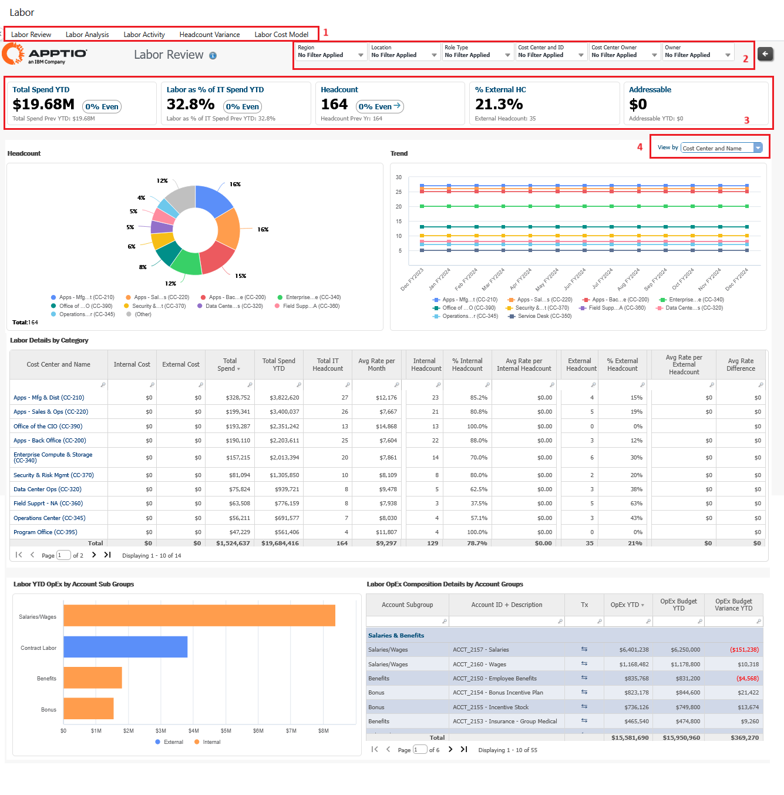
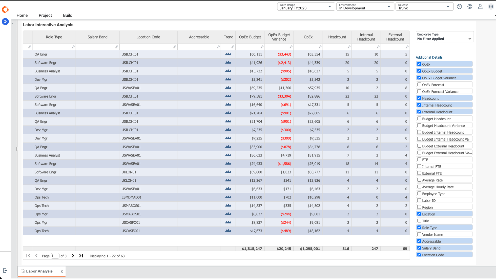
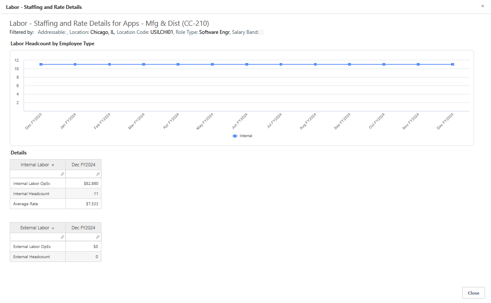
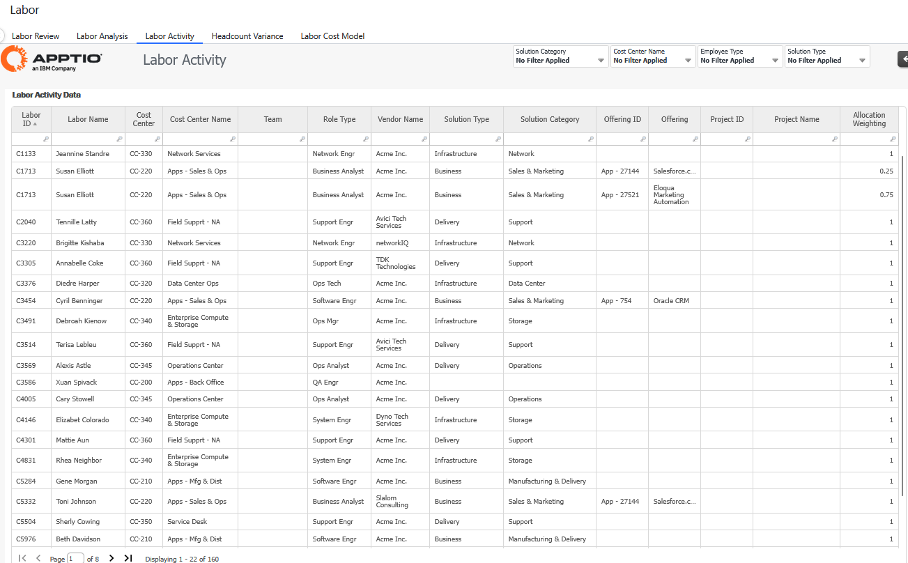
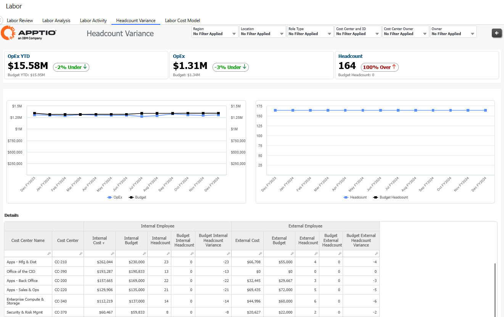
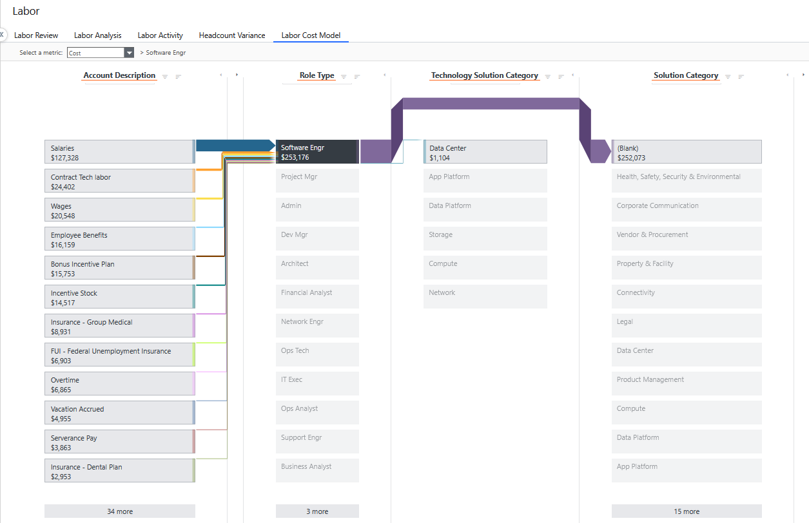

# Labor Review

This report provides high-level metrics related to the cost and headcount of internal
labor and external contractors, including the number and nature of open positions, the balance of
internal versus external labor, and the percentage of labor spend.

Labor cost (the total cost of labor) is one of the most substantial operating costs for every IT
organization. Monthly reviews of internal and external headcount are essential for eliminating
budget variances. The Labor Review report helps you understand the drivers of those variances.

When you use this report to understand the drivers of your external labor variance, you can
incorporate those factors into your quarterly forecasts and executive reviews, identify
opportunities to reconcile your budget, and plan more effectively for key initiatives.

## Use Cases

This report solves the following use cases:

- Compare staffing to headcount plan
- Analyze labor spend and rates by employee type, role, location, and vendor
- Analyze labor costs by account classification
- Analyze labor assigned tech offerings and run vs. change activities

## Personas

This report is designed for the following roles:

- IT leadership, for an aggregate view so you can control costs
- Resource managers, so you can track where and how labor is handled
- Cost Center Owners and Budget Owners (CIO -1), so you can manage your people and their
  budgets

## Questions Answered

- Are we meeting our hiring and spending plan for labor?
- What skills and roles are supporting my applications? How many are DBAs, developers, etc.?
- Where are my labor costs coming from---internal FTEs, contractors, or some other service
  provider?
- What is the composition of our labor costs?
- How do the costs of similar skillsets vary by region and contractor?
- What is the mix of internal and external labor that supports each IT function?
- Which GL accounts contribute to the labor for a given role (such as system administrator)?
- Which departments have the highest number headcount openings in the hiring plan? Which ones
  exceed the headcount plan?

## Visualization

The report contains the following elements:

| Key element | Description |
| --- | --- |
| (1) Report Collection | This report collection provides the details you need to review your labor resources:  • Labor Review  • Labor Analysis  • Labor Activity |
| (2) Slicers | Use the slicers to refine the data in your report. Slicers in this report let you see your labor data by region and organizational accountability, including cost center and ID , cost center owner, and owner (for example, CIO -1).  The following roles can use the slicers in this report for a more personalized view:  • IT Financial Controller or CIO: Without setting any slicers, you can see the overview of the spend of each cost pool across the organization. You can drill down into cost pools, cost center owners, and individual accounts.  • Cost Center Owner or CIO -1: Set the Cost Center or Cost Center Owner slicers to filter for your areas of responsibility.  • Financial Analyst: Set the Cost Center slicer for areas you support or set a specific account group to enable a detailed, cross-organizational category spend analysis. |
| (3) KPIs | KPIs provide a high-level view of your labor spending:  • Total Spend YTD: This KPI expresses your labor spend as a percentage of the overall IT spend YTD and compares it to the previous YTD.  • Labor as % of IT Spend YTD: This KPI compares your labor costs YTD with the previous YTD.  • Headcount: This KPI compares your current headcount to the previous year, with the percentage of change.  • % External HC : This KPI displays the number of current external positions and the percentage of those positions against total headcount.  • Addressable: This KPI compares your addressable cost YTD with the previous YTD. |

## Labor Review

|  |  |
| --- | --- |
| Headcount by [Cost Center, Name] | Use these charts to view your labor spend by owner, cost center owner, and Cost Center and Name:  • Labor by Category: Use the donut chart to compare the percentage of labor spending per owner or cost center. If you select Cost Center Owner, for example, the charts will show the top 10 centers with the highest headcount. Use the Trend chart to see labor spend month-by-month. You will see spikes when large numbers of new employees join the organization, or the opposite when a team is ramping down. Evaluate this information to ensure that it's what you expect. You can see more information in the Labor Analysis report where actuals are compared to plan.  You can remove individual data points from either chart by clicking the itemized list below the charts. Select any bar in the donut chart to open Labor Details dialog with more information about the item you selected.  Image |
| Headcount by Role | Use these charts to view your labor spend by role. This data can help a resource owner or executive look at roles across all cost centers or per location while considering a long-term labor strategy.  • Labor by Role: Use the donut chart to compare the percentage of labor spending per role. Use the Trend chart to see labor spend month-by-month.  Select a bar in the donut chart to open a Labor Details dialog with more detail about the item you click. The reports available from the dialog are the same as for Labor by Category (above), except the data is per role.  Image |
| Labor YTD OpEx by Account Sub Groups | Image |
| Labor OpEx Composition Details by Account Groups | Image |

## Labor Analysis

This table contains a complete view of labor spend across all cost centers per role, internal and
external headcount, OpEx, OpEx budget, budget variance, and average rate by default. In the table,
the following codes are used:

- (E-xxx) = Employee
- (C-xxx) = Contractor
- (CC-xxx) = Planned headcount budget per department

Select additional items in the elements (1) and (2) to customize the table with the metrics you
want to see.

In the Trend column, select to open a dialog with month-over-month detail
for the item you click.

## Labor Activity

This table contains all the data related to labor activities. You can use the slicers to filter
the desired data.

## Headcount Variance

## Labor Cost Model

