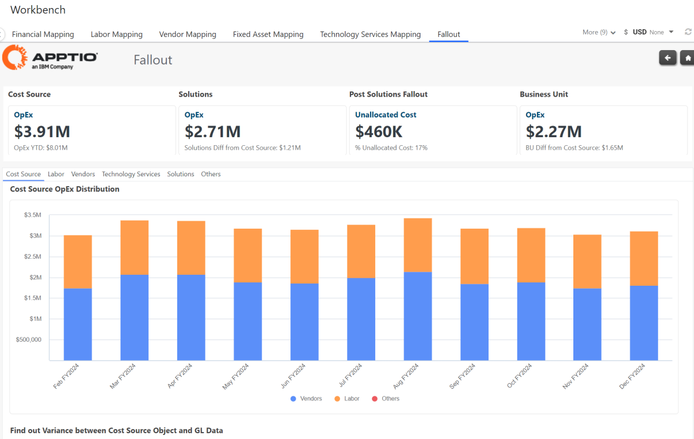
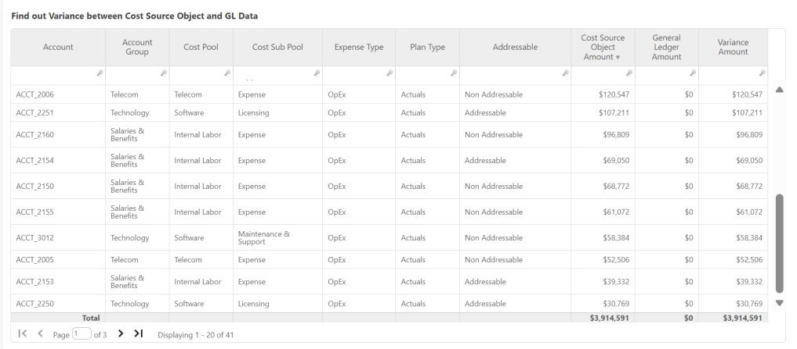
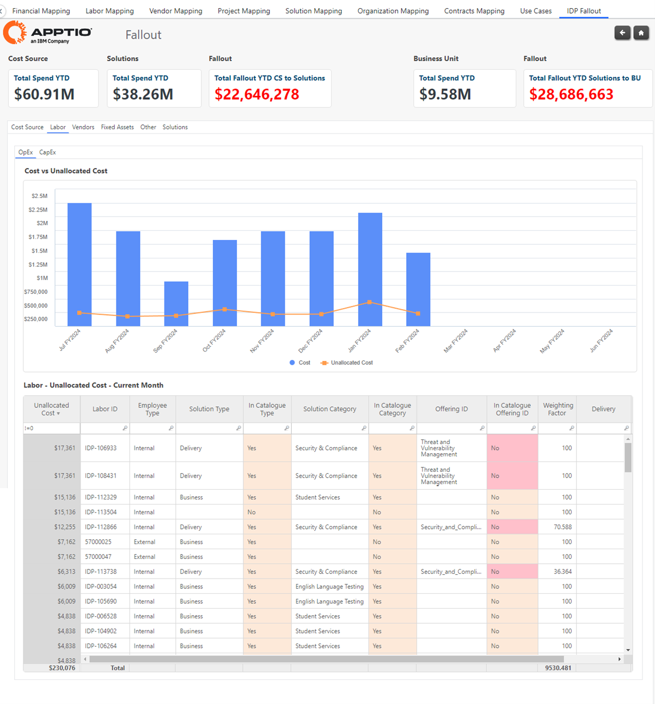
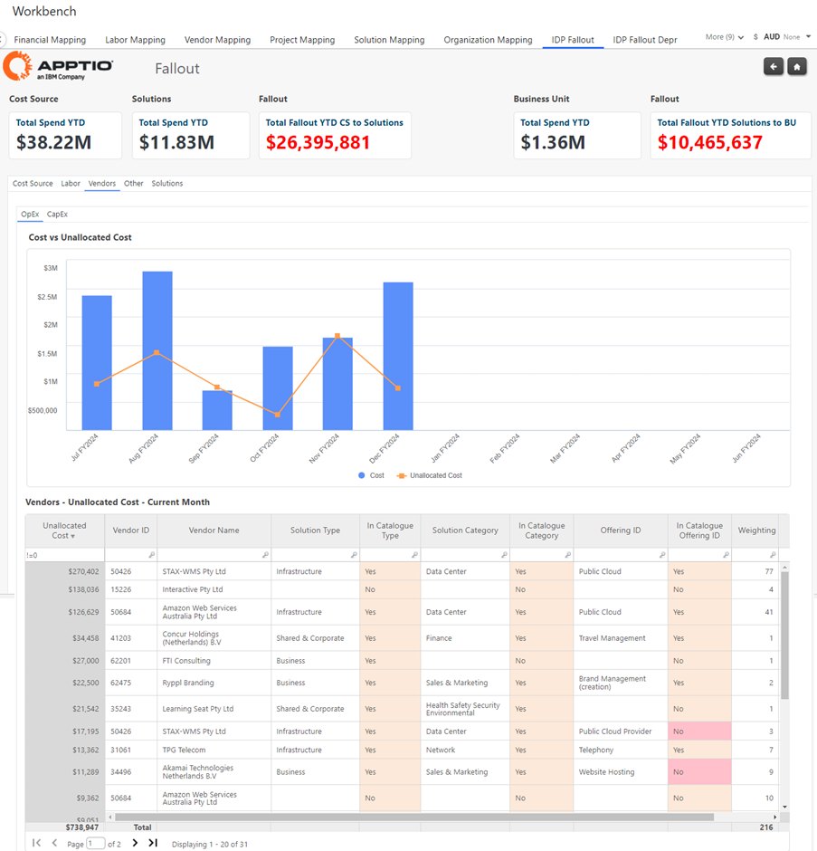
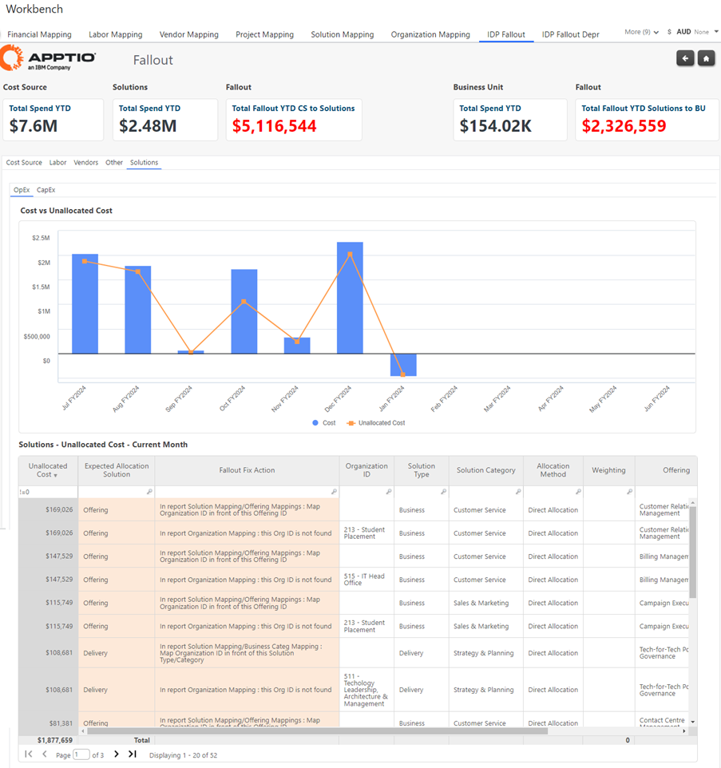
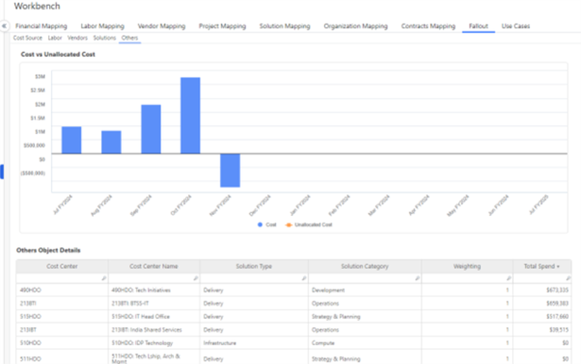

# Fallout

The Fallout Dashboard readily highlights the costs – both OpEx and CapEx – in your
Costing Essentials model that have fully allocated or not allocated (fallout).

## KPIs

Provides an overview of the full cost at each level in the model. A fully allocated model will
show the same total cost in each KPI.

Example:

- Cost Source – Total Spend YTD = $100
- Solutions – Total Spend YTD = $80
- Business Unit – Total Spend YTD = $50

## Cost Source

Use this report to view the OpEx Distribution (Labor, Vendors, Other) by period and ensure that
your GL Transactions match with the Cost Source object within ACM.

As per design, there is an allocation sending all remaining cost into Other – i.e. cost which has
not been allocated to Vendor or Labor –. Therefore, there is no fallout from Cost Source, and to
ensure the cost flowing via Other is legitimate, we display the misallocated cost in a table below
the chart. “Misallocated” means that this cost sent to Other, should have been sent to Vendor or
Labor, but was failing due to unmatching Relationship.

Examples:

- On a given GL Actual, Cost Pool is Internal Labor for the Account, but we cannot find any Labor
  HC associated to the same Cost Center in Labor Data.
- On a given GL Actuals, a Vendor ID has been mapped, but we cannot find this Vendor ID in the
  Vendors Master List (which could be the case if the Vendor has been removed from the Vendors Master
  List used for the Month selected)

## Labor

Use this report to view any unallocated labor costs that are expected to allocate to Solutions.
To fix any fallout, user should utilize the ‘Labor Mapping’ tables to allocate a Labor resource to
individual Solution Offerings.

## Vendors

Use this report to view any unallocated vendor costs that are expected to allocate to Solutions.
To fix any fallout, user should utilize the ‘Vendor Mapping’ tables.

Note: when Lookup columns [In Catalogue Type], [In Catalogue Category], [In Catalogue Offering
ID] are highlighted in red, it means the data mapped in the Workbench is not found anymore in the
Service Catalogue. This can occur when the Service Catalogue is updated without updating the
Resource mappings to align to the new Service Catalogue.

## Solutions

Use this report to view any unallocated Solution costs that are expected to allocate to
Organizations (Consumers). To fix any fallout, user should utilize the ‘Solution Mapping’ or
‘Organization Mappings’ tables as per advised in column “Fallout Fix Action”.

## Others

Cost out of Other is always allocating since it works as “Send Remaining” cost allocation. The
below snapshot indicates details of this allocated cost.

