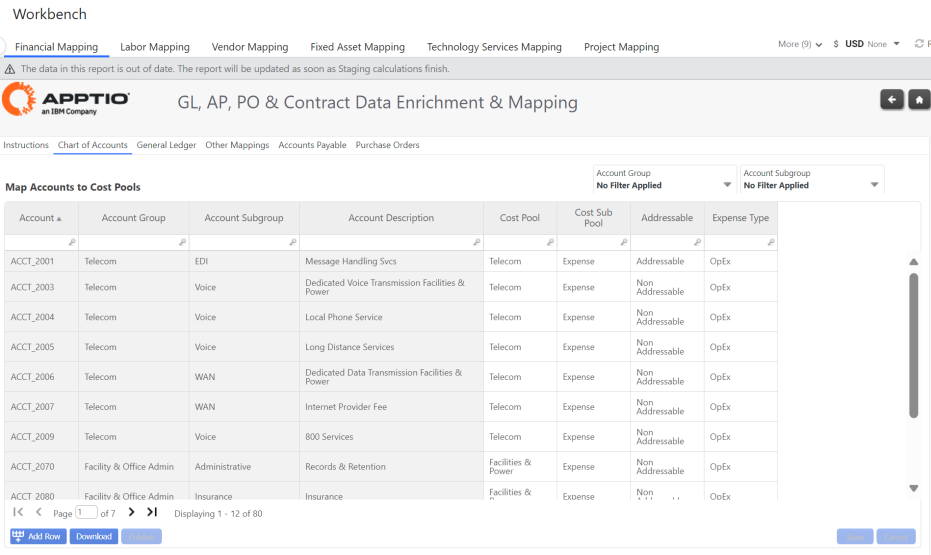
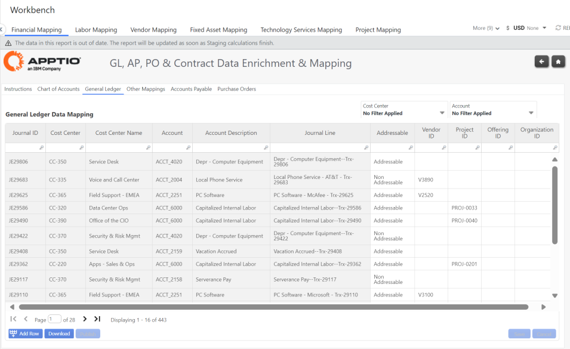
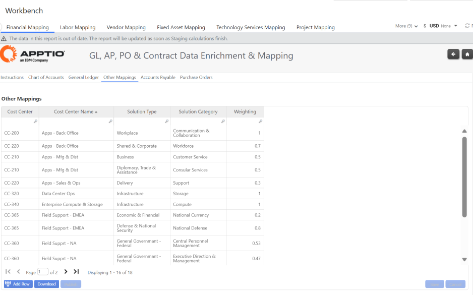
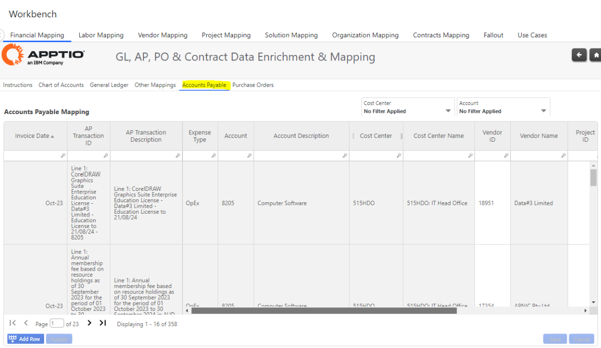
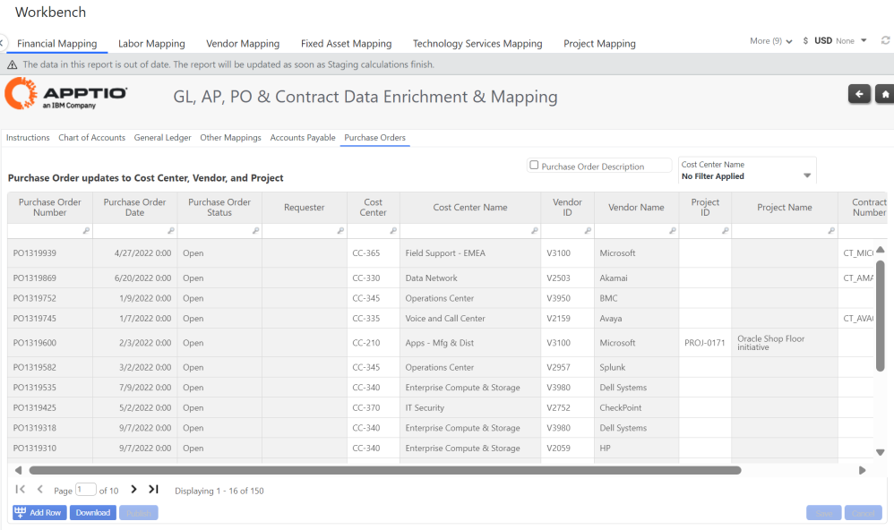

# Financial Mapping

## Chart of Accounts

Users can map their Chart of Accounts to following dimensions, to aid in expense categorization
and reporting analysis:

- Cost Pool
- Cost Sub Pool
- Addressable
- Expense Type

## General Ledger

Users can map General Ledger Transactions to the following dimensions to improve accuracy of
allocation and reporting insights:

- Vendor ID
- Project ID
- Offering ID
- Organization ID

## Other Mappings

The Other Mappings table provides the ability to map expenses within designated Cost Centers
directly to Solution Types and Solution Categories together with an allocation weighting.

- Solution Type and Solution Category
- Weighting
- Maybe 100% allocation (insert ‘1’), or split across multiple Solution Types/Categories
- All expenses with the source Cost centers will be allocated to the target Solution
  Types/Categories, based on the define weighting(s)
- The cost received by each Service Type/Category, will in turn be even spread to their
  *child* service offerings

## Accounts Payable

Provides ability to map Transactions in the Accounts Payable (AP) sub ledger (ie. Invoices) to:

- Vendor ID
- Project ID
- PO Number

This mapping enables the relationship of Vendor Purchase Orders to Accounts Payable invoices.

## Purchase Orders

This table provides the user the ability to map Purchase Orders to:

- Cost Centers
- Vendor ID
- Project ID
- Contract Number

This mapping enables the relationship of Vendor Contracts to their associated PO’s.

