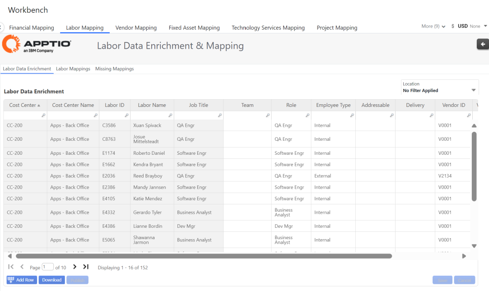
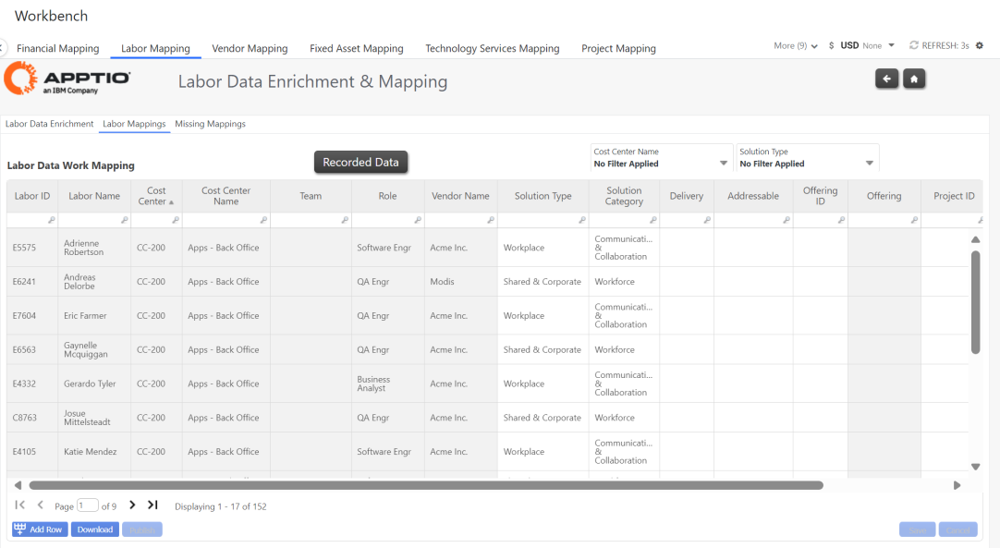
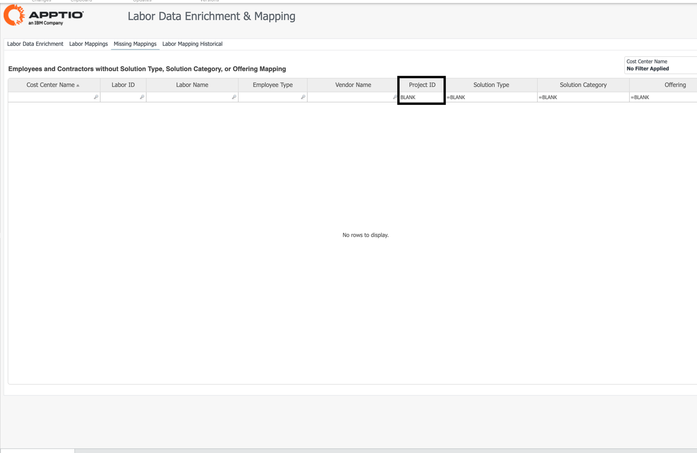

# Labor Mapping

## Labor Data Enrichment

Provides ability to improve the metadata for the Internal and External Labor resources, ingested
from IDP’s workforce data, and enable richer analysis of your Workforce spend:

- Team (Example: Squads)
- Role
- Employee ID
- Vendor ID (if applicable)
- Location

## Labor Mappings

Users can update their Labor roster by mapping a Labor resource to:

- Solution Type and Solution Category
- Addressable
- Project ID
- Offering ID
- Allocation Weighing
- Provides the ability to determine which Solution Type/Solution Category/Project the resource
  works on. The default weighting is 1 (100%) for each employee; however, users can adjust or split
  the resources percentages into their appropriate areas.

## Missing Mappings

Identifies labor resources that have not been mapped to Solutions.

