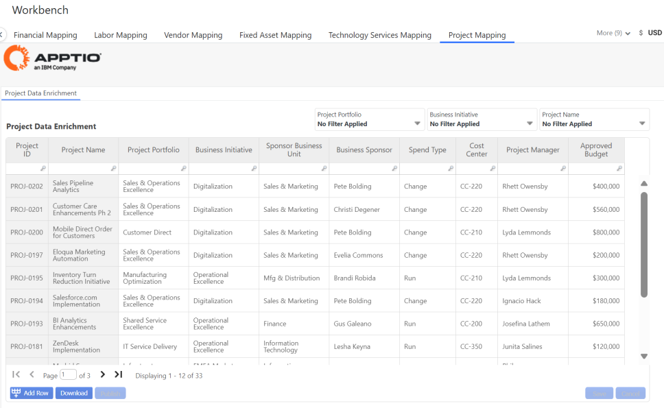

# Project Mapping

## Project Data Enrichment

Provides ability to complete data enrichment for your IT Projects, and enable richer analysis of
your spend relative to your Project Portfolio. Includes metadata such as :

- Project Portfolio
- Business Initiative
- Sponsor Business Unit and Business Sponsor
- Spend Type (CTB, GTB, RTB)
- Cost Center
- Project Manager
- Approved Project Budget

