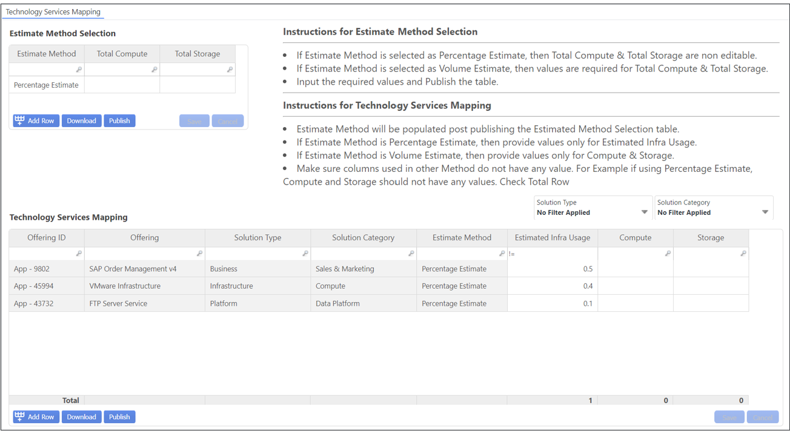

# Technology Service Mapping

Use the top ET to select the Estimate Method ​

- Percentage
- Volume

Use the bottom ET to fill in values accordingly :​

- Estimated Infra Usage : % ​
- Compute : Nb. against Total​
- Storage : Nb. against Total

Weighting in Percentage must be entered in Decimals.​

This mapping will impact the Solutions TCO, as it will redistribute the Technology Services cost
amongst different Offering IDs.​

Technology Services cost is determined from all cost where resources (Vendor/Labor/Other) has
been mapped to Solution Types Infrastructure or Platform​

Technology Services cost can get allocated towards Offering IDs under any Solution Type (Infra,
Platform and others: Business, Delivery, Shared & Corporate, Workplace)​

In above example, Technology Services cost will allocate 40% to Vmware (under Infra), 10% to FTP
Server (under Platform) and 50% to SAP Order Management v4 (under Business)
