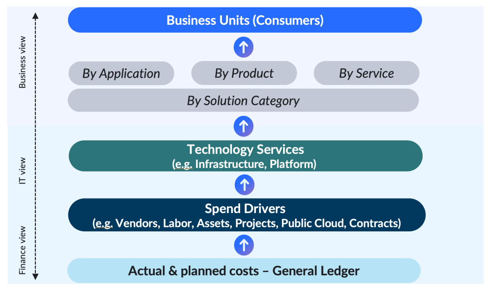

# Introducción a los fundamentos del cálculo de costes de « IBM »

## Acerca del Costing Essentials

Costing Essentials combina datos financieros y organizativos asociados a los gastos de TI en un modelo unificado, clasificando y asignando automáticamente los principales impulsores del gasto para ofrecer visibilidad y transparencia a las organizaciones. Costing Essentials ofrece la oportunidad de utilizar los recursos de forma más eficiente, optimizar los costes, mejorar la alineación empresarial y aprovechar con mayor rapidez las cambiantes condiciones y oportunidades del mercado. Las áreas de cobertura y enfoque incluyen mano de obra, proveedores, proyectos, nube y contratos, a la vez que proporcionan vistas de las aplicaciones, servicios y unidades de negocio. Costing Essentials utiliza un modelo de costes simplificado que permite a los usuarios asignar los costes de TI a las unidades de negocio, servicios o aplicaciones basándose en los efectivos u otras estrategias de asignación similares (de tipo no consuntivo).

