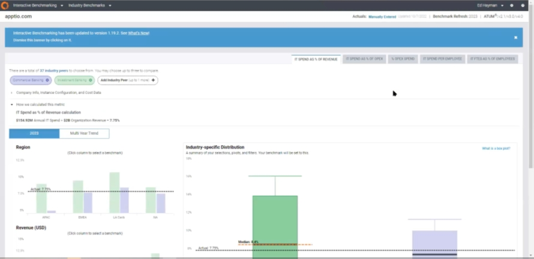
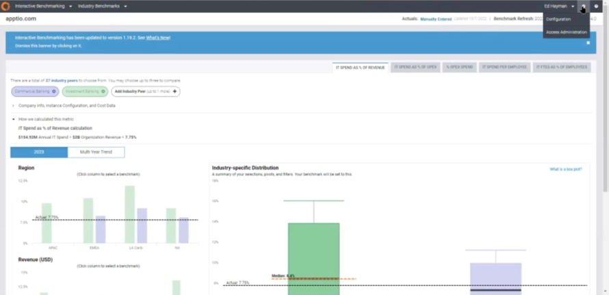
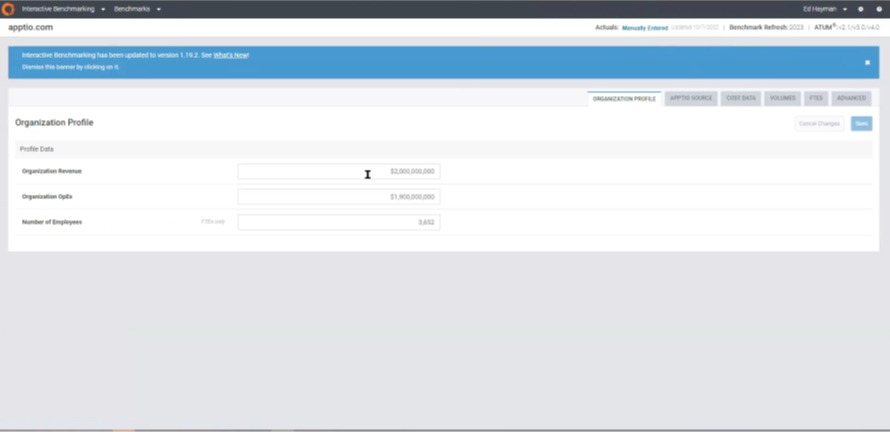
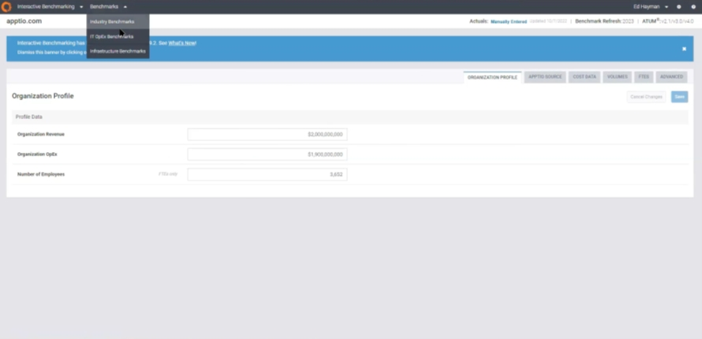
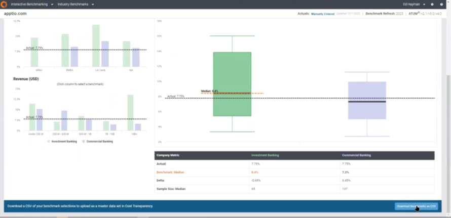
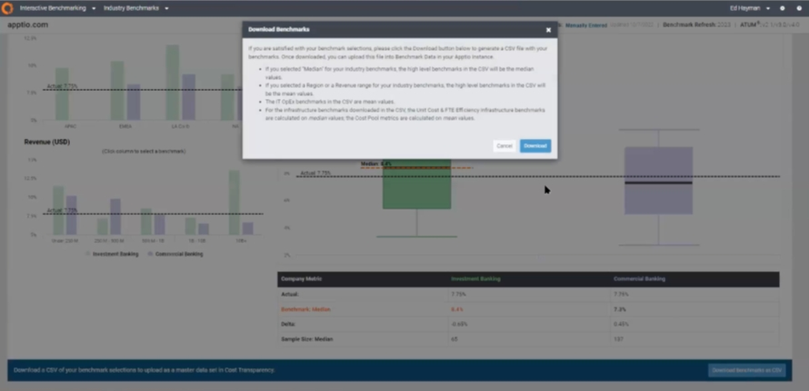
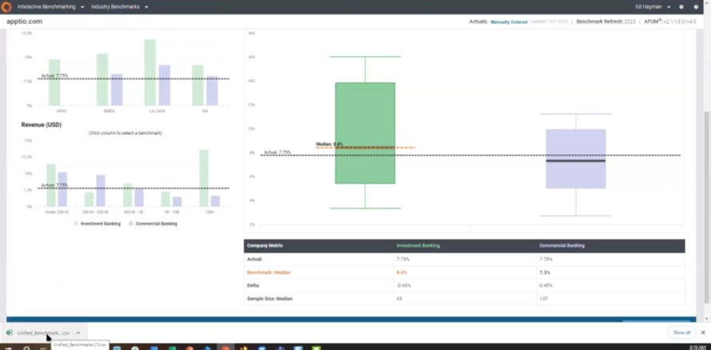
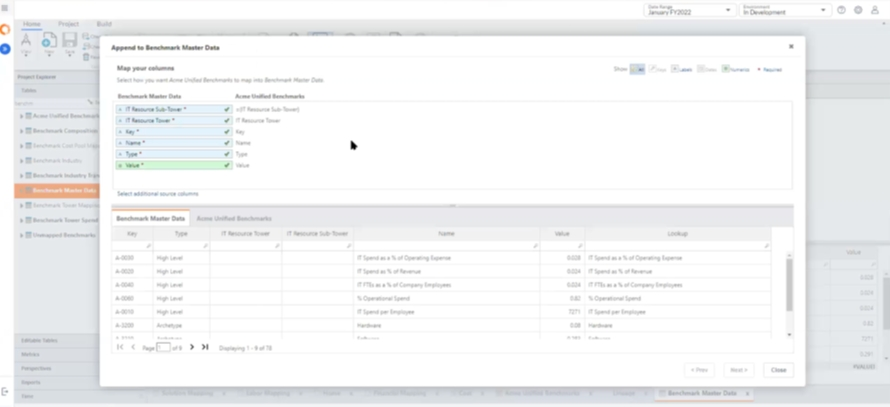

# Configuración de la evaluación comparativa de costes

Requisitos previos

El COE o cualquier persona con un acceso equivalente debe iniciar sesión en un producto ITBMX (Interactive Benchmarking) general y actualizar el perfil de la empresa cliente (ingresos, OpEx gastos, etc.).

1. Conectarse a ITBMX

   
2. Haz clic en el icono de la rueda dentada (ajustes) en la parte superior derecha de la pantalla y selecciona "Configuración".

   
3. En la sección "Perfil de la organización", introduzca los números deseados en "Ingresos de la organización", "Organización OpEx’ " y "Número de empleados" sec1on.

   

   Nota: Asegúrese de que los números introducidos en las 3 secciones son válidos con la marca de verificación verde antes de continuar.
4. Haga clic en el menú desplegable "Puntos de referencia" situado en la parte superior izquierda de la pantalla.

   
5. Desplácese hasta la parte inferior de la pantalla y haga clic en el botón "Descargar Benchmarks como CSV".

   
6. Haga clic en el botón "Descargar" del cuadro de mensaje "Descargar Benchmarks" y compruebe que se ha descargado el archivo '.csv'.

   

   
7. Vuelva a la instancia de cliente deseada y vaya a TBM Studio.

   Carga y configuración de datos
8. En TBM Studio, cargue el archivo '.csv' descargado en el proyecto. Realice las transformaciones necesarias si procede.
9. Asigne el conjunto de datos cargado a Benchmarking Feed.

   
