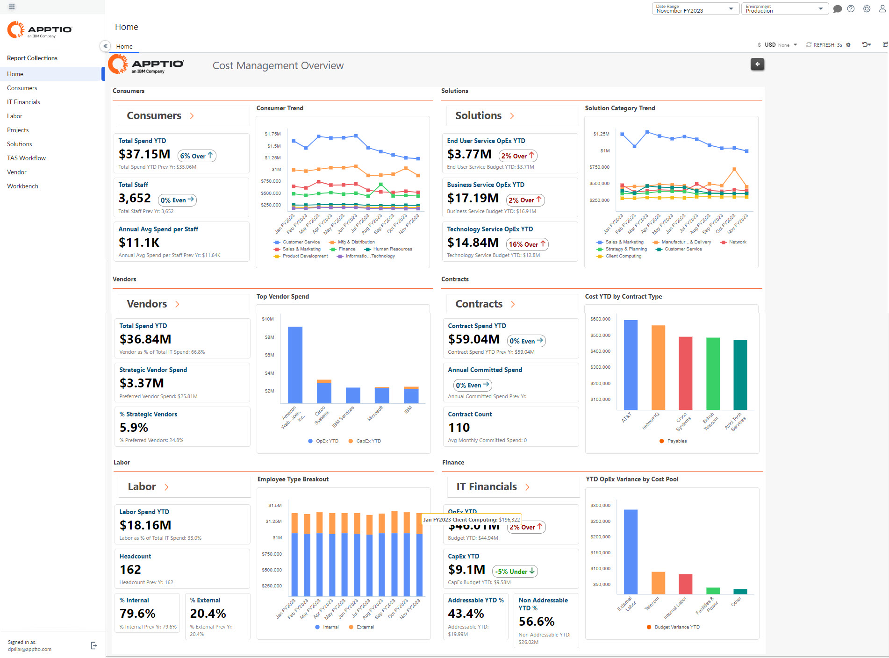
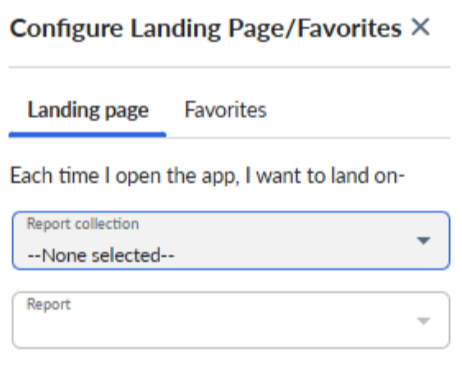

# Guía para IBM Apptio Costing’s Navigation

Este tema ofrece una descripción general de cómo se organiza la navegación de costes de IBM Apptio, basada en el actual TBM Report Studio. Esta navegación será diferente si utiliza el Nuevo Estudio de Informes.

Nota: Los elementos del menú que se muestran dependen de sus permisos de usuario y de la configuración.

1. **Página de inicio** - Al acceder a IBM Apptio Costing, la página de inicio da acceso a las distintas colecciones de informes disponibles en la aplicación IBM Apptio Costing. Los informes están organizados por áreas de interés y revelan información financiera relevante para los perfiles clave.

   

   Haga clic en un encabezado para abrir el informe resumido de alto nivel de una colección de informes.
2. **Botones de navegación por los informes** : estos botones de navegación le permiten desplazarse rápidamente por los informes. El icono Atrás te lleva a la página anterior, mientras que el icono Inicio te lleva directamente a tu página de inicio principal.

   

## Menú lateral de navegación

El menú lateral izquierdo sirve como centro de navegación principal. Agrupa sus colecciones de informes y proporciona acceso a Mi página de inicio, Recientes y Favoritos, lo que le permite localizar y volver de forma eficaz a la información más importante.

**Mi página de inicio** : mi página de inicio le proporciona un punto de partida personalizado en la aplicación. Seleccione el informe que prefiera y desígnalo como su página de destino preferida, lo que le permitirá reanudar rápidamente su trabajo sin tener que navegar por múltiples menús.

**Recientes** : muestra una lista de los elementos que ha abierto más recientemente. Esta vista le permite volver fácilmente a los informes más recientes y más consultados sin necesidad de buscarlos de nuevo.

**Favoritos** : Favoritos proporciona una ubicación centralizada para los elementos que ha marcado como importantes. Al añadir informes a tus favoritos, podrás acceder a ellos de forma rápida y sistemática desde una única ubicación.

## Menú de navegación superior

La barra de navegación superior proporciona acceso rápido a ajustes clave, herramientas de navegación, centro de ayuda y conectividad con otras soluciones de IBM Apptio.

1. **IBM Apptio Logotipo** : cuando se contrae la barra lateral de navegación, aparece el logotipo de IBM Apptio. El logotipo de IBM Apptio le permite cambiar entre las aplicaciones IBM Apptio disponibles en su organización. IBM Apptio Costing admite el inicio de sesión común y la administración de usuarios a través de Frontdoor.
2. **Icono de Chevron** : expande o contrae el panel de navegación izquierdo.
3. **Búsqueda de informes** : utilice el icono de la lupa para buscar rápidamente el informe que necesita.
4. **Intervalo de fechas** : IBM Apptio El cálculo de costes tiene en cuenta el tiempo. Seleccione y establezca el intervalo de fechas al navegar por sus informes.
5. **Entorno** - IBM Apptio Costing le ofrece tres entornos: producción, ensayo y desarrollo. Dentro de Desarrollo, cada persona tendrá su propio espacio de trabajo. Al navegar, asegúrese de haber seleccionado el entorno correcto. Nota: Se pueden establecer permisos para denegar el acceso a determinados entornos, como el de desarrollo.
6. **Lanzamiento** - IBM Apptio Costing le ofrece opciones de gestión de lanzamientos. Aunque la mayor parte del trabajo y las publicaciones se realizan en el tronco, también se puede trabajar en una rama, que luego se puede fusionar de nuevo con el tronco. Hotfix es una tercera opción dentro de la gestión de lanzamientos.
7. **Comentarios y colaboración** : el panel Comentarios le permite colaborar directamente en un informe añadiendo contexto, haciendo preguntas o compartiendo comentarios con otros usuarios. Puedes dejar comentarios públicos visibles para todos los espectadores o comentarios privados para personas o equipos específicos. También puedes responder a comentarios existentes y utilizar menciones para notificar a los usuarios e incluirlos en la conversación. Esto ayuda a mantener el debate centrado en los datos, lo que mejora la claridad, la trazabilidad y la toma de decisiones.
8. **Ayuda** : abra el Centro de ayuda, envíe comentarios sobre el producto, consulte las notas de la versión o acceda a la comunidad IBM.
9. **Configuración** : la sección Configuración proporciona a los administradores acceso a opciones de configuración clave que controlan el comportamiento de la aplicación en su organización. Desde este menú, puede gestionar las preferencias del sistema, ajustar la configuración del proyecto, configurar la multidivisa y acceder a herramientas como Data Advisor, aplicaciones de referencia y seguridad a nivel de fila. Estas opciones le permiten adaptar el entorno a sus requisitos operativos, de seguridad y de generación de informes, lo que garantiza una experiencia de usuario coherente y controlada. La página «Acerca de» proporciona información detallada sobre las versiones actuales de su cliente y servidor, lo que le ayuda a verificar la configuración de su entorno y garantizar la compatibilidad con las actualizaciones y funciones del producto.
10. **Configuración del perfil** : gestiona tu perfil de usuario; los administradores pueden suplantar a los usuarios.
11. **Menú de aplicaciones** : cambie entre las aplicaciones IBM Apptio disponibles en su organización. IBM Apptio Costing admite el inicio de sesión común y la administración de usuarios a través de Frontdoor.
12. **Actualizar** - Seleccione la frecuencia de actualización. Por defecto, está configurado en 3 segundos, pero se puede cambiar a manual según sea necesario.
13. **Vistas guardadas y restablecer** : este menú le permite gestionar cómo se muestra un informe y volver rápidamente a la configuración preferida. Puede guardar su configuración actual utilizando Guardar vista o Guardar como, conservando los filtros, segmentadores y opciones de diseño para su uso futuro. Si necesita empezar de cero, puede restablecer todos los segmentadores, restablecer los filtros globales o restaurar el informe a su estado predeterminado original. Estas opciones le ayudan a personalizar su análisis, al tiempo que le permiten volver fácilmente al informe de referencia.
14. **Exportación y uso compartido de informes** : estas opciones le permiten exportar y distribuir la información de los informes en el formato que mejor se adapte a sus necesidades. Puede descargar el informe como archivo Excel o PDF para analizarlo sin conexión o para mantener registros. La opción Enviar correo electrónico le permite compartir el informe actual directamente con otros usuarios, mientras que Suscripciones por correo electrónico le permite programar envíos automáticos de informes a intervalos regulares. En conjunto, estas funciones facilitan una colaboración fluida y una comunicación oportuna en toda su organización.

**Multidivisa** - Si la función multidivisa está habilitada, utilice el menú de divisas para cambiar la vista a una divisa diferente.
