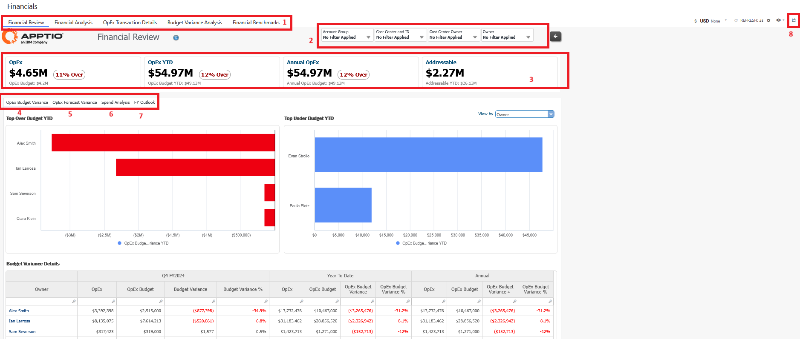

# Revisión financiera de TI

Este informe ofrece una visión ejecutiva de la variación global del presupuesto de OpEx y de los gastos de OpEx de su organización. El informe desglosa los costes de TI por grupo de costes y propietario para que pueda determinar qué propietarios de TI son responsables del mayor gasto en TI. Varios gráficos del informe también le ayudan a determinar si las desviaciones son reales o se deben a una categorización errónea.

## Casos de uso

Este informe resuelve los siguientes casos de uso:

- Comparar los datos reales del proyecto OpEx y CapEx con el plan del proyecto, identificar los factores que provocan las desviaciones y explicarlas.
- Analizar las desviaciones de los gastos a nivel de centro de costes y de cuenta; ofrecer puntos de vista a nivel ejecutivo y proporcionar comentarios para explicar los valores atípicos.
- Analice y compare los costes imputables/no imputables de OpEx desglosados por cuenta y centro de coste.
- Analice los costes globales de TI por grupos de costes estándar y compare la distribución con la de sus homólogos.
- Revisar las partidas del libro mayor en las áreas de desviación o de mayor gasto.
- Revisar el gasto total por centro de coste y cuenta para identificar las áreas de mayor gasto y revisar las tendencias a lo largo del tiempo.

## Personajes

Este informe está diseñado para ser utilizado por las siguientes funciones:

- CIO -1 (Oficina TBM)
- Propietarios de centros de coste
- IT Analistas financieros

## Preguntas contestadas

- ¿Dónde hay desviaciones significativas entre los gastos y el plan?
- ¿Qué centros de coste están generando desviaciones entre los gastos y el plan y quién es responsable de esos centros de coste?
- ¿La desviación es real o se debe a una categorización errónea de un gasto?
- ¿A qué se destina la mayor parte de nuestro gasto en TI? ¿Por pool de costes? Por propietario de TI (por ejemplo, CIO -1))? ¿Por propietario del centro de coste?
- ¿Se producen cambios significativos en los gastos de un período a otro?
- ¿Qué partidas de gastos contribuyen al coste de una función informática?

## Visualizaciones

El informe IT Financial Review incluye las siguientes visualizaciones:

| Elemento clave | Descripción |
| --- | --- |
| (1) Recogida de informes | Esta colección de informes proporciona los detalles financieros de TI que necesita para revisar las desviaciones del gasto y la precisión de las previsiones:  Revisión financiera (vista por defecto)  Análisis financiero  Análisis de la variación presupuestaria  Referencias financieras |
| (2) Cortadoras | Utilice los divisores locales/globales para refinar los datos de su informe. Los separadores de este informe le permiten ver sus datos de costes por grupo de cuentas, centro de costes e ID, propietario del centro de costes y propietario. Las siguientes funciones pueden utilizar los divisores de este informe para obtener una vista más personalizada:  - Controlador financiero de TI o CIO: Sin necesidad de configurar ningún cortador, puede ver el resumen de los gastos en todos los centros de coste de la organización. Puede desglosar los grupos de costes, los propietarios de los centros de costes y las cuentas individuales.  - Propietario del Centro de Coste o CIO -1 : Configure los cortadores de Centro de Coste o Propietario del Centro de Coste para filtrar por sus áreas de responsabilidad.  - Analista financiero: Establezca el rebanador del centro de costes para las áreas a las que presta asistencia o establezca un grupo de cuentas específico para permitir un análisis detallado de los gastos por categorías en toda la organización. |
| (3) Indicadores clave de rendimiento | Los KPI proporcionan una visión de alto nivel de su gasto en OpEx :  - OpEx: Estos dos KPI muestran su presupuesto global de OpEx comparado con el gasto de OpEx para el mes en curso. El porcentaje de varianza se muestra a la derecha.  - OpEx YTD: Estos dos KPIs muestran su gasto en OpEx comparado con el presupuesto YTD. El porcentaje de varianza se muestra a la derecha.  - Anual OpEx: Estos dos KPIs muestran su gasto anual OpEx comparado con el presupuesto YTD. El porcentaje de varianza se muestra a la derecha.  - Dirigibles: Estos KPI le ayudan a determinar la agilidad de su gasto en TI analizando la proporción de gastos fijos y variables del ejercicio. |
| (4) OpEx Variación presupuestaria | Seleccione una métrica (grupo de costes, grupo de cuentas, propietario, propietario del centro de costes o ID del centro de costes) de la lista Ver por para rellenar los gráficos Top Over Budget YTD y Top Under Budget YTD. Esta información le ayudará a priorizar dónde buscar oportunidades de reducción.  Seleccione una barra en cualquiera de los gráficos para abrir un cuadro de diálogo Detalle de la desviación que muestra el resumen del presupuesto, la desviación y el porcentaje de desviación de OpEx para todos los elementos de la métrica seleccionada en función de los periodos de tiempo que seleccione encima de la tabla. |
| (5) OpEx Variación de las previsiones | Seleccione una métrica (grupo de costes, grupo de cuentas, propietario, propietario del centro de costes o ID del centro de costes) de la lista Ver por para rellenar los gráficos Top Over Forecast YTD y Top Under Forecast YTD. Gráficos de tendencias con las partidas con mayor desviación del gasto con respecto al plan YTD y la tendencia del gasto en los seis meses anteriores.  Seleccione una barra en cualquiera de los gráficos para abrir un cuadro de diálogo Detalle de la desviación que muestra el resumen de la previsión OpEx para la métrica seleccionada en función de los periodos de tiempo que seleccione encima de la tabla. |
| (6) Análisis de gastos | Seleccione una métrica (grupo de costes, grupo de cuentas, propietario, propietario del centro de costes o ID del centro de costes) de la lista Ver por para rellenar los gráficos OpEx Spend YTD y OpEx Trend con los artículos con la mayor desviación del gasto respecto al plan YTD y la tendencia del gasto en los seis meses anteriores.  Seleccione una barra en cualquiera de los gráficos para abrir un cuadro de diálogo Detalle de la desviación que muestra los gastos mensuales, trimestrales y anuales para la métrica seleccionada en función de los períodos que seleccione encima de la tabla. |
| (7) Perspectivas financieras | Seleccione esta pestaña para ver la variación OpEx entre el presupuesto y la previsión.  Seleccione cualquier elemento de la columna izquierda para ver los detalles de la transacción desde su fuente financiera de registro (como su libro mayor). |
| (8) Icono de correo electrónico | El icono de correo electrónico sólo es visible para los analistas financieros con permisos de administrador. Seleccione el icono para abrir el informe de revisión de desviaciones financieras por correo electrónico. Véase el [informe por correo electrónico de la Revisión de las desviaciones financieras.](../../it-planning/reports-itfmf-ctv104/itfmf-ct_financialvariancereviewemail104.html) |
