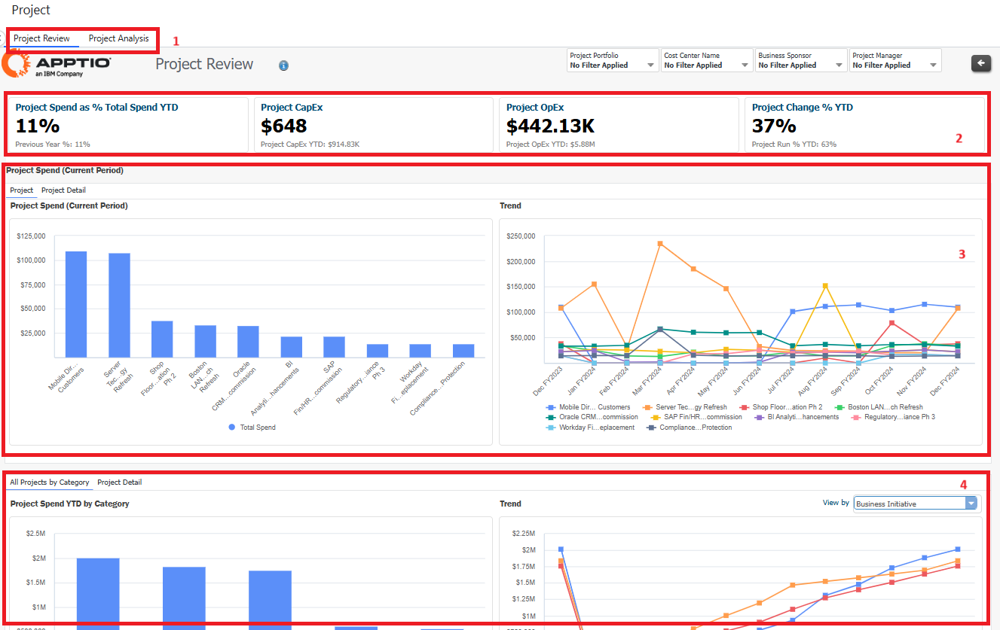
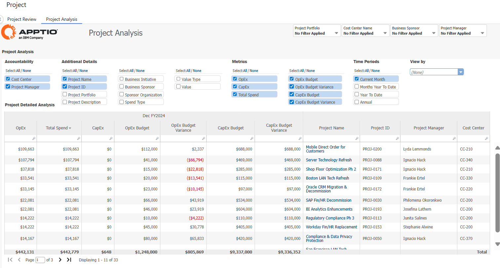
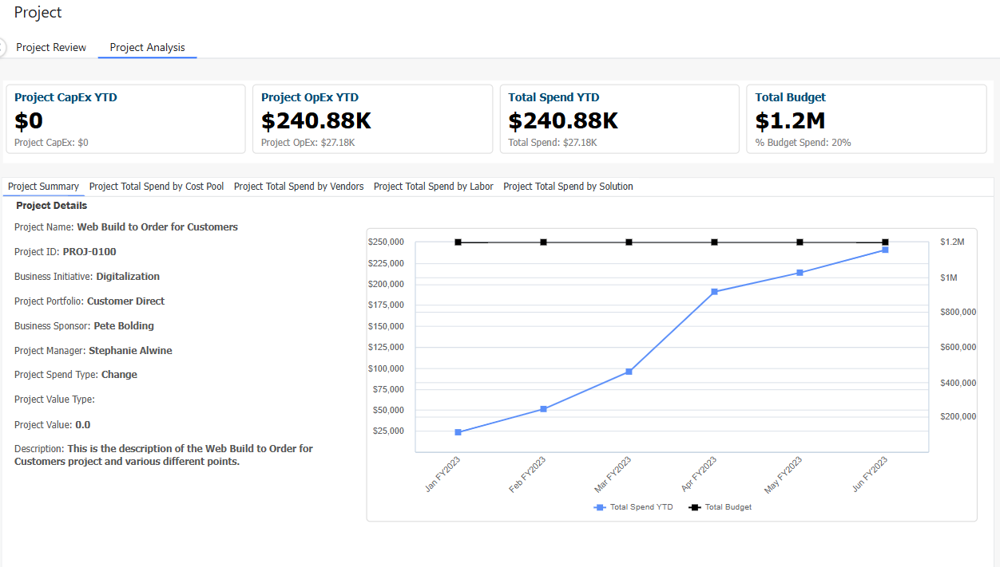

# Revisión de proyectos

Esta colección proporciona una vista única de los proyectos OpEx y CapEx, desglosada por mano de obra, proveedores y área de gasto para cada uno. Puede ver la inversión y el gasto del proyecto junto con el estado, la prioridad y el presupuesto. La inversión en proyectos está vinculada a las aplicaciones y unidades de negocio a las que dan soporte:

Importante: el contenido de esta sección está en proceso de elaboración.

## Casos de uso

Este informe resuelve los siguientes casos de uso:

- Analizar la iniciativa empresarial del proyecto y el impacto que ha tenido en la empresa
- Revisar la lista, los detalles, el estado, el rendimiento y los objetivos de todos los proyectos

## Personajes

- Todos los usuarios

## Preguntas contestadas

El informe responde a las siguientes preguntas:

- ¿Cuál es nuestra tendencia en comparación con el gasto presupuestario?
- ¿Cuánto gastamos en comparación con el gasto total?
- ¿Qué porcentaje de proyectos se iniciaron a tiempo y se completaron dentro del presupuesto?
- ¿Cuál es nuestro gasto anual en proyectos en función de la iniciativa empresarial?
- ¿Cuánto estamos gastando en todos los proyectos en comparación con el presupuesto aprobado?
- ¿Cómo se compararon los costes con el presupuesto aprobado?

## Visualización

| Elemento clave | Descripción |
| --- | --- |
| (1) Recogida de informes | Esta colección de informes ofrece los siguientes detalles del proyecto:  - Revisión del proyecto (vista por defecto) - Lista de proyectos |
| (2) Indicadores clave de rendimiento | Los KPI ofrecen una visión de alto nivel de los siguientes gastos del proyecto:  Gasto en proyectos como % del gasto total hasta la fecha Este KPI muestra el porcentaje del gasto total en proyectos para el año en curso, frente al porcentaje del año anterior.  - Proyectos CapEx: Este KPI muestra el gasto de su proyecto CapEx para el año en curso, frente al gasto YTD del proyecto CapEx para el año anterior.  - Proyectos OpEx: Este KPI muestra el gasto de su proyecto OpEx para el año en curso, frente al gasto YTD del proyecto OpEx para el año anterior.  - Cambio de proyecto % YTD: Este KPI muestra el porcentaje de cambio de proyecto YTD para el año en curso, frente al porcentaje de ejecución del proyecto para el año anterior. |
| (3) Gastos del proyecto (periodo actual) | Analice lo siguiente:  - gastos de los proyectos, detalles de los proyectos y la tendencia del periodo en curso. |
| (4) Todos los gastos del proyecto | Puedes hacer lo siguiente:  - Revise todos los detalles del proyecto  - Comprender los detalles de todos los proyectos, incluido el presupuesto.  - Revisar todos los proyectos y la iniciativa empresarial para el proyecto  - Revisión del presupuesto aprobado con cargo al remanente presupuestario  - Revisar la tendencia de todos los proyectos por iniciativa empresarial, cartera de proyectos, patrocinador empresarial, tipo de gasto y gestor de proyecto. |

## Análisis de proyectos

Esta pestaña describe la lista de proyectos y sus detalles, como tipo de gasto, cartera, gestor, capex, opex y detalles presupuestarios. Seleccione el periodo de tiempo para personalizar la tabla con las métricas que desea ver.

Seleccione el enlace del proyecto que desee para ver los siguientes detalles.

