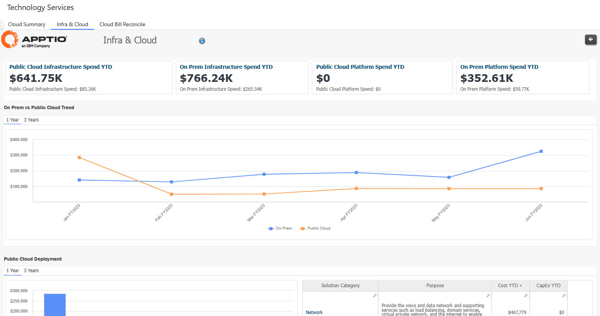
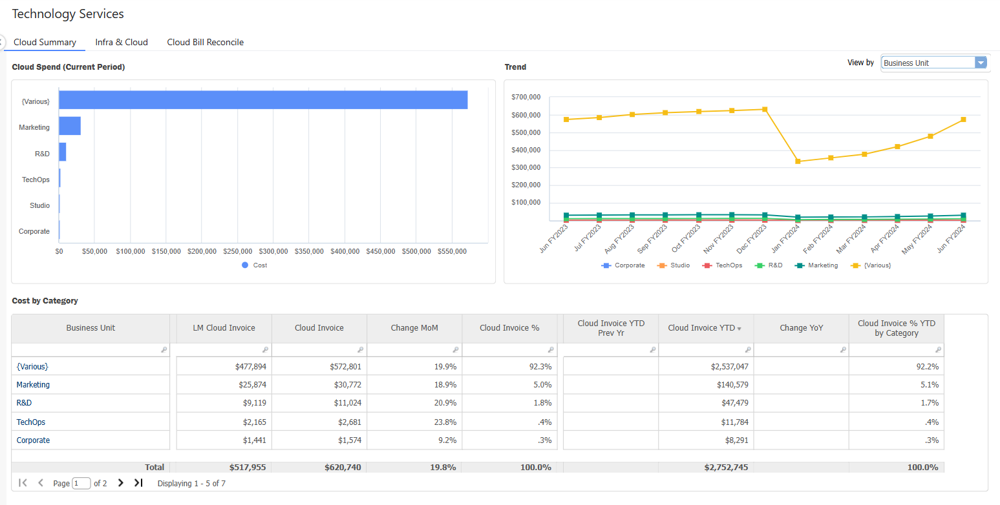
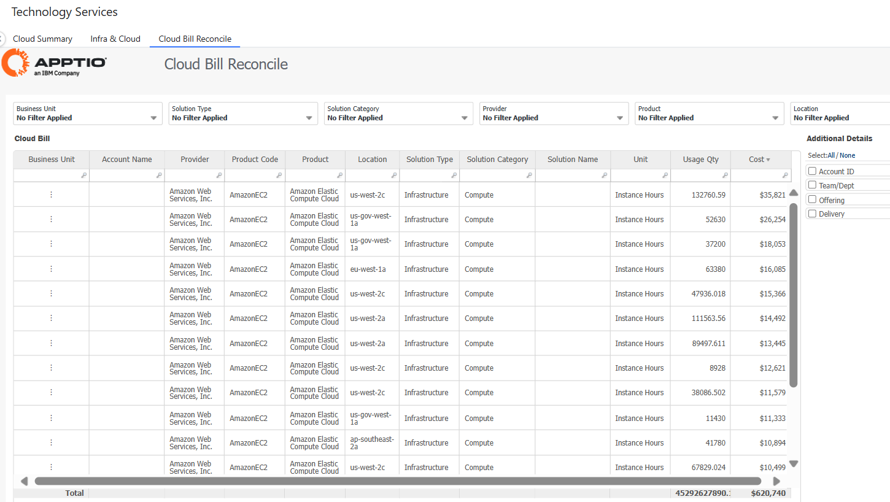

# Revisión de los servicios tecnológicos

Este informe revisa sus servicios en la nube y permite a las organizaciones visualizar qué aplicaciones y/o servicios (y tipos de servicio) están consumiendo la mayor parte del gasto.

## Visualización

## Infraestructura y nube

Este informe muestra los gastos de infraestructura y nube para lo siguiente:

- Gráficos de tendencias anuales y resumen de las implantaciones On Prem y Public Cloud
- Indicadores clave de rendimiento para infraestructuras y plataformas de nube pública/on prem

## Resumen de la nube

Este informe muestra el resumen de los gastos de la nube para lo siguiente:

- Gasto en nube y gráficos de tendencias
- Indicadores clave de rendimiento para OpEx Gastos interanuales para IaaS y PaaS. computación/almacenamiento/red en la nube
- Coste por categoría

## Conciliación de facturas en la nube

