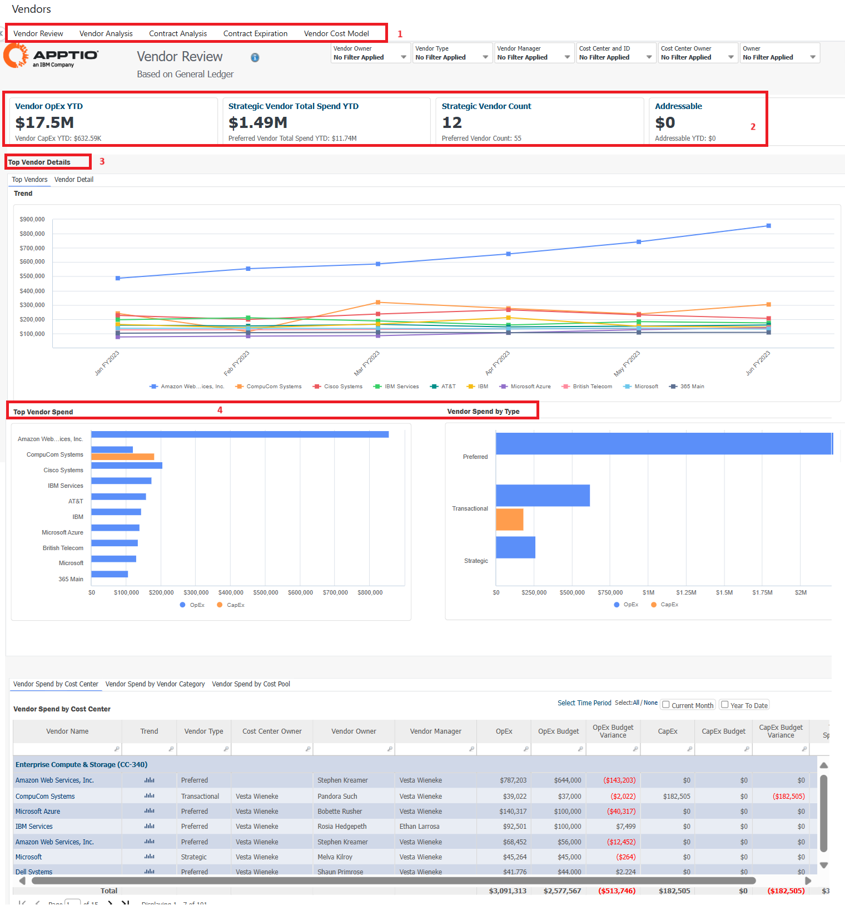

# Revisión de proveedores

Este informe revisa su cartera de proveedores y el gasto asociado a los proveedores estratégicos, preferentes y transaccionales.

## Casos de uso

Este informe resuelve los siguientes casos de uso:

- Comprender la cartera de proveedores. Identifique a los 10 principales proveedores y su gasto asociado.
- Clasifique a los proveedores por importancia estratégica.
- Seguimiento de los gastos comprometidos.
- Rastree y elimine a los proveedores que menos gastan.
- Seguimiento y control de los gastos de los principales proveedores.
- Asigne contratos de proveedores a ofertas tecnológicas.
- Identificar los contratos que expiran antes de su renovación.
- Clasifique y realice un seguimiento de los gastos de proveedores por importancia estratégica y función.

## Personajes

Este informe está diseñado para ser utilizado por las siguientes funciones:

- Propietario de la aplicación/plataforma
- Finanzas TI
- Vendedor / Proveedor / Responsable de compras

## Preguntas contestadas

El informe responde a las siguientes preguntas:

- ¿Qué proveedores le cuestan más dinero a mi organización?
- ¿Cómo puedo entender su impacto en OpEx y CapEx en toda mi organización?
- ¿Qué cambios debemos hacer para reequilibrar el gasto de los proveedores?
- ¿Hasta qué punto está fragmentado / concentrado el gasto entre proveedores?
- ¿Tenemos proveedores redundantes?
- ¿Dónde tenemos desviaciones en los gastos?

## Visualización

| Elemento clave | Descripción |
| --- | --- |
| (1) Recogida de informes | Esta colección de informes proporciona los detalles de proveedores que necesita para revisar sus desviaciones de gastos y la precisión de sus previsiones:  - Revisión de proveedores GL (vista por defecto) - Revisión de proveedores AP - Análisis de proveedores - Contratos - Órdenes de compra |
| (2) Indicadores clave de rendimiento | Los KPI ofrecen una visión de alto nivel de los siguientes aspectos:  - Proveedor OpEx YTD: Este KPI muestra el gasto de su Proveedor OpEx YTD vs el Proveedor CapEx YTD.  - Gasto en proveedores estratégicos: Este KPI muestra el gasto en proveedores estratégicos frente al gasto en proveedores preferentes.  - Recuento de proveedores estratégicos Este KPI muestra su recuento de proveedores estratégicos frente al recuento de proveedores preferentes.  - Direccionable: Este KPI le ayuda a determinar la agilidad de su gasto en TI observando la proporción de gastos fijos y variables para el año fiscal. |
| (3) Datos del vendedor principal | Analizar los detalles de los principales proveedores y los gastos anuales previstos. Analice también los gastos de los 10 principales proveedores y las tendencias de gasto. |
| (4) Detalles de los gastos de proveedores | Ver los detalles de los gastos de proveedor por centro de coste (vista por defecto), categoría de proveedor, grupo de costes y proyecto. Seleccione el periodo de tiempo para personalizar la tabla con las métricas que desea ver. |
