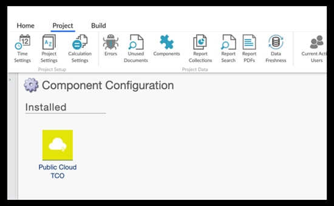
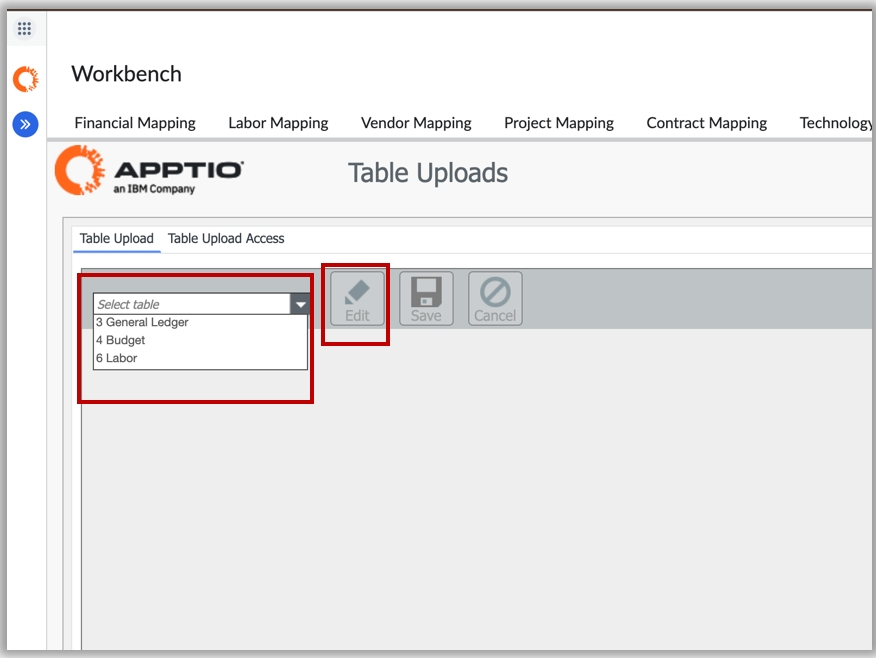
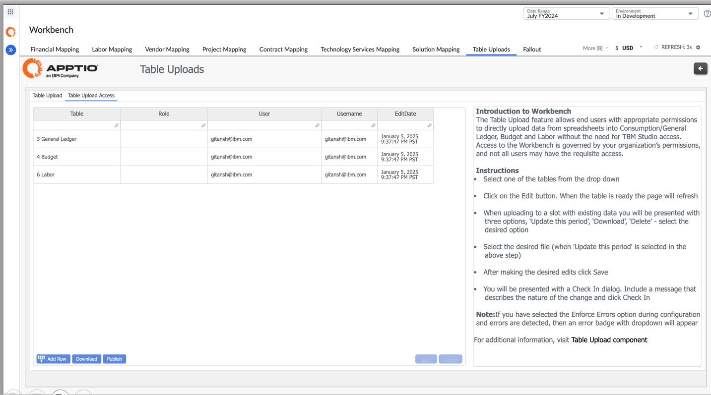
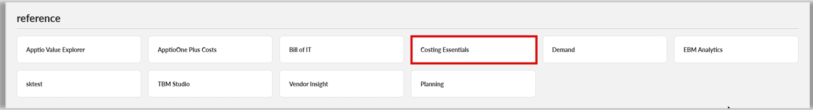

# Notas de la versión 2025

## Costing Essentials Mejoras (plantillas v200 ) - 15 de agosto de 2025

- Se han añadido nuevos campos en el informe «[Labor Missing Mapping](../workbench/labor-mapping.html) Workbench Report» (Informe de trabajo de mapeo faltante) y en el informe «[Vendor Missing Mapping](../workbench/vendor-mapping.html) Workbench Report» (Informe de proveedor de mapeo faltante).
- Se han añadido nuevos campos en el informe del entorno de trabajo [de asignación de organizaciones](../workbench/organization-mapping.html "Proporciona la capacidad de completar el enriquecimiento de datos para sus organizaciones de TI (unidades de negocio).").
- Se ha actualizado la fórmula de recuento de filas para TS Infrastructure y TS Platform.
- Se ha añadido la etiqueta «Aplicación» a los informes [de TCO de la nube pública](../../cost-transparency/reports/pub-cloud-tco-overview.html).
- Se ha añadido el nuevo campo «Código» en las tablas de datos maestros de integración de planificación.
- Se han añadido métricas de depreciación al modelo de servicios tecnológicos.

## Costing Essentials Mejoras ( v200 ) - 4 de julio de 2025

Se ha eliminado la opción «Global» de [todos los segmentadores](https://www.ibm.com/docs/en/apptio-commercial/costing-essentials/saas?topic=reports-labor-review "(se abre en una pestaña o una ventana nueva)") para aprovechar mejor las vistas guardadas, se han eliminado algunos [informes](https://www.ibm.com/docs/en/apptio-commercial/costing-essentials/saas?topic=started-end-user-devices-reports "(se abre en una pestaña o una ventana nueva)") avanzados sobre dispositivos de usuarios finales y se ha añadido una estrategia de asignación de personal a tiempo completo.

## Costing Essentials( v200 ) - 11 de abril de 2025

Esta versión incluye dos mejoras clave:

- Soporte en japonés para Public Cloud TCO.
- Public Cloud TCO añadido al proyecto Costing Essentials de referencia

## Public Cloud TCO para Costing Essentials ( v200 ) - 28 de febrero de 2025

La versión Public Cloud TCO para Costing Standard ( v120 ) y Costing Essentials ( v200 ) ofrece múltiples ventajas para los usuarios principales, principalmente los equipos financieros de TI. Esta versión ofrece una perspectiva financiera sencilla y transparente de los costes mensuales de la nube pública, lo que ayuda a evitar sorpresas desagradables en la factura. También permite a los equipos impulsar la responsabilidad y garantizar una eficiencia óptima de los servicios de nube pública, minimizando el desperdicio.

La nueva versión incluye la instalación de nuevos componentes, como TCOPublic Cloud en v120 y TCOPublic CloudPublic Cloud y TCO Reporting en v200. Los usuarios pueden conectarse a los datos en la nube y utilizar funciones como «Nombre de la cuenta», «Unidad de negocio» y «Tabla de asignación de torres en la nube» para personalizar los informes y obtener información sobre las prácticas de su organización en la nube. Con esta versión, los usuarios pueden evaluar si su organización está aplicando las mejores prácticas en materia de nube, incluyendo la cobertura de RI y las tasas de utilización, para optimizar sus servicios en la nube.

Para obtener más información sobre la configuración, consulte [aquí](../../cost-transparency/reports/public-cloud-config.html).

## Costing Essentials ( v200 ) - 28 de febrero de 2025

Los informes de resumen del modelo son una nueva función diseñada para proporcionar a los usuarios una visión completa de los flujos de costes dentro del modelo. Esta versión incluye informes sobre mano de obra, proveedores, soluciones, consumidores y modelos de costes, y está disponible para todos los usuarios con acceso a los informes. Los informes están diseñados para mejorar la transparencia y la claridad para los usuarios, proporcionando una visión clara y detallada de los flujos de costes dentro del modelo. La vista del modelo laboral se incluye en el componente Informes de costes y mano de obra, mientras que la vista del modelo de costes se encuentra en la colección Vista del modelo. Los informes sobre proveedores, soluciones y consumidores se encuentran en sus respectivas colecciones.

Los usuarios pueden hacer clic en los campos para seleccionarlos y ver cómo fluyen los costes entre los diferentes objetos, lo que proporciona una forma clara e intuitiva de navegar por los informes. Los informes son accesibles para cualquier persona con acceso a los informes, sin necesidad de TBM Studio acceso. Los principales usuarios de los informes de resumen del modelo son los administradores y los usuarios avanzados, que los utilizan para refinar la asignación de costes, tomar decisiones informadas y optimizar sus procesos de gestión de costes.

Para ver todos los modelos de costes de los informes, consulte [aquí](../out_of_the_box_reports/model-views-ce.html).

## Costing Essentials - 17 de enero de 2025

Esta versión ofrece las siguientes mejoras para optimizar la experiencia del usuario, el alcance global y la funcionalidad de las características.

- Compatibilidad con el idioma japonés: se ha añadido compatibilidad con el idioma japonés en los dispositivos de los usuarios finales y en los informes de evaluación comparativa para alcanzar un alcance global y mejorar la experiencia de los usuarios de habla japonesa.
- Función de carga de tablas : Se ha añadido un nuevo informe para la función de carga de tablas al Workbench, lo que proporciona a los usuarios una ubicación centralizada para gestionar y cargar datos.

  

  

  Para obtener más información, consulte [Carga de tablas](../admin/ce-tableupload.html).
- Benchmarking Disponibilidad general : Benchmarking ha pasado a estar disponible de forma general (GA), lo que supone un hito importante en el desarrollo de esta función.
- Actualizaciones del proyecto de referencia : Se han añadido dispositivos para usuarios finales y evaluaciones comparativas al proyecto de referencia, lo que proporciona una solución completa e integrada para nuestros clientes.

  
